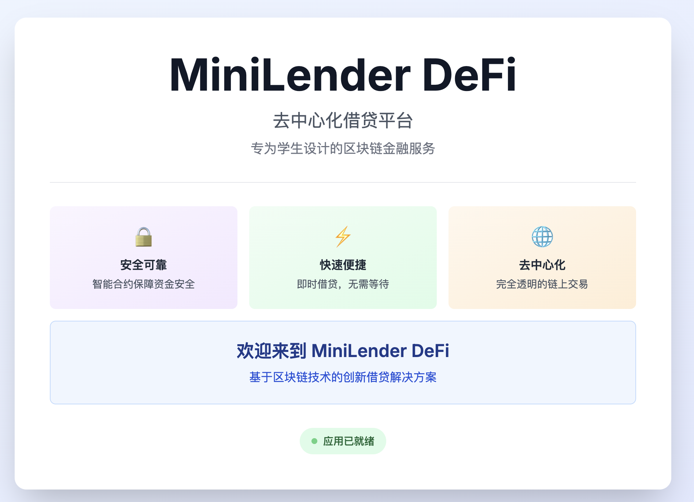

# European Call Option DeFi Project Design

## 1. Project Overview

### 1.1 Project Background
This project is a decentralized finance (DeFi) application based on Ethereum that implements on-chain trading and management of European call options. The option lifecycle is automated through smart contracts, including core functions such as creation, matching, premium payment, and exercise.

### 1.2 Core Features
- **Option Creation**: Users (Issuer) create options through the factory contract
- **Option Matching**: Users (Holder) can match created options
- **Premium Payment**: Holders pay premiums to activate options
- **Option Exercise**: Holders can exercise options to obtain underlying assets after expiration
- **Frontend Interaction**: Provides a user-friendly Web interface for option operations

### 1.3 Technical Architecture
- **Smart Contracts**: Solidity 0.8.19
- **Development Framework**: Hardhat
- **Test Network**: Sepolia Testnet
- **Frontend Framework**: Next.js 14 + React 18
- **Web3 Library**: Wagmi + Viem
- **UI Library**: Tailwind CSS

### 1.4 Web Interface


## 2. Project Structure

```
Blockchain-Group-Project/
├── contracts/                    # Smart contract directory
│   ├── EuropeanCallOption.sol    # European call option core contract
│   ├── OptionFactory.sol         # Option factory contract (creates and manages options)
│   └── mocks/
│       └── MockERC20.sol         # Mock ERC20 token (for testing and demonstration)
│
├── scripts/                      # Deployment and verification scripts
│   ├── deploy_factory.js         # Deploy factory contract to Sepolia
│   ├── deploy_option.js          # Deploy option contract and Mock tokens to Sepolia
│   └── verify_contract.js       # Verify contracts on Etherscan
│
├── test/                         # Test scripts
│   ├── EuropeanCallOption.test.ts        # Unit tests
│   └── EuropeanCallOption.integration.test.ts  # Integration tests
│
├── frontend/                     # Frontend application
│   ├── src/
│   │   ├── app/                  # Next.js App Router
│   │   │   ├── page.tsx          # Main page (option list and operations)
│   │   │   ├── create/
│   │   │   │   └── page.tsx       # Create option page
│   │   │   └── api/
│   │   │       └── deployment/
│   │   │           └── route.ts   # API route (reads deployment information)
│   │   └── components/           # React components
│   │       ├── WalletConnect.tsx  # Wallet connection component
│   │       ├── OptionList.tsx     # Option list component
│   │       ├── OptionDashboard.tsx  # Option dashboard component
│   │       └── OptionOperations.tsx  # Option operations component (pay premium, exercise, etc.)
│   └── package.json
│
├── deployments/                  # Deployment records
│   └── sepolia_option.json       # Sepolia network deployment information
│
├── docs/                         # Documentation directory
│   ├── demo_video_link.txt
│   ├── Presentation.pptx
│   ├── Project_Report.docx
│   ├── HOW_TO_GET_ETHERSCAN_KEY.md
│   ├── HOW_TO_GET_INFURA_KEY.md
│   └── knowledge-base
│
├── hardhat.config.ts             # Hardhat configuration
├── package.json                  # Project dependencies and scripts
├── start.sh                      # Startup script (testing, compilation, deployment, etc.)
└── README.md                     # Project documentation
```

## 3. Smart Contract Design

### 3.1 EuropeanCallOption Contract

#### Core Functions
- **Option Status Management**: Created → Active → Exercised/Expired
- **Premium Payment**: Holders pay premiums to activate options
- **Option Exercise**: Exercisable within 10 days after expiration
- **Status Queries**: Provides read-only functions to query option information

#### Key Parameters
- `underlyingAsset`: Underlying asset address (ERC20)
- `strikeAsset`: Strike asset address (ERC20)
- `strikePrice`: Strike price (denominated in strikeAsset)
- `expirationTime`: Expiration timestamp
- `contractSize`: Contract size (amount of underlying asset)
- `issuer`: Issuer address (seller)
- `holder`: Holder address (buyer)
- `factory`: Factory contract address

#### Main Functions
- `payPremium(uint256 premium)`: Pay premium to activate option
- `exercised()`: Exercise option (requires expiration and within 10-day window)
- `expireOption()`: Mark option as expired (anyone can call)
- `isExercisable()`: Check if option is exercisable
- `setHolder(address _holder)`: Set holder (only factory contract can call)

### 3.2 OptionFactory Contract

#### Core Functions
- **Create Options**: Create new option instances through factory pattern
- **Match Options**: Users can match created options (become holders)
- **Query Functions**: Get all options, matchable options, user-created options

#### Main Functions
- `createOption(...)`: Create new option
- `matchOption(address _optionAddress)`: Match option (become holder)
- `getAllOptions()`: Get all option addresses
- `getMatchableOptions()`: Get matchable option addresses
- `getUserCreatedOptions(address _user)`: Get all options created by user

## 4. Deployment Process

### 4.1 Environment Setup

#### Install Dependencies
```bash
npm install
```

#### Configure Environment Variables
Create `.env` file (refer to `.env.example`):
```env
# Sepolia network configuration
SEPOLIA_RPC_URL=https://rpc.sepolia.org
PRIVATE_KEY=your_private_key_here

# Etherscan API Key (for contract verification)
ETHERSCAN_API_KEY=your_etherscan_api_key_here

# Optional: Gas reporting
# REPORT_GAS=true
```

### 4.2 Local Testing

#### Run Tests
```bash
# Using startup script
./start.sh test

# Or directly using npm
npm run test
```

#### Test Coverage
- Unit tests: Test functionality of each function
- Integration tests: Test complete option lifecycle

### 4.3 Sepolia Deployment

#### Method 1: Using Startup Script (Recommended)

```bash
# Deploy factory contract
./start.sh deploy:factory

# Deploy option contract (includes Mock tokens)
./start.sh deploy:option

# Verify contracts on Etherscan
./start.sh verify

# Complete workflow (test → compile → deploy → verify)
./start.sh workflow
```

#### Method 2: Using npm Scripts

```bash
# Compile contracts
npm run compile

# Deploy option contract (automatically deploys factory contract)
npm run deploy:sepolia

# Verify contracts
npm run verify:sepolia
```

#### Deployment Process Description
1. **Deploy Factory Contract**: First deploy `OptionFactory` contract
2. **Deploy Mock Tokens** (if needed): Deploy `MockERC20` as underlying asset and strike asset
3. **Deploy Option Contract**: Deploy `EuropeanCallOption` through factory contract or directly
4. **Verify Contracts**: Verify contract source code on Etherscan for viewing and auditing

### 4.4 Frontend Deployment

#### Start Frontend Development Server
```bash
# Using startup script
./start.sh frontend

# Or directly enter frontend directory
cd frontend
npm install
npm run dev
```

#### Frontend Configuration
- Frontend runs on `http://localhost:3002`
- Frontend reads deployment information through API route `/api/deployment`
- Deployment information stored in `deployments/sepolia_option.json`

## 5. Startup Script Description

The project provides a comprehensive startup script `start.sh` with the following features:

### 5.1 Available Commands

| Command | Description |
|------|------|
| `test` | Run tests |
| `compile` | Compile smart contracts |
| `deploy:factory` | Deploy factory contract to Sepolia |
| `deploy:option` | Deploy option contract to Sepolia |
| `verify` | Verify contracts on Etherscan |
| `slither` | Run Slither security analysis |
| `frontend` | Start frontend development server |
| `workflow` | Complete workflow (test → compile → deploy → verify) |
| `clean` | Clean compilation files and cache |
| `help` | Show help information |

### 5.2 Script Features
- **Path Variables**: All paths use variable definitions, no hardcoding needed
- **Environment Checks**: Automatically checks Node.js, npm, .env file, etc.
- **Dependency Management**: Automatically checks and installs dependencies
- **Error Handling**: Exits immediately on errors for reliability
- **Colored Output**: Uses colors to distinguish different levels of information

### 5.3 Usage Examples

```bash
# Run tests
./start.sh test

# Compile contracts
./start.sh compile

# Deploy to Sepolia
./start.sh deploy:factory
./start.sh deploy:option

# Verify contracts
./start.sh verify

# Start frontend
./start.sh frontend

# Execute complete workflow
./start.sh workflow
```

## 6. Frontend Interaction Flow

### 6.1 Connect Wallet
1. User visits frontend application
2. Click "Connect Wallet" button
3. Select wallet (MetaMask, WalletConnect, etc.)
4. Authorize connection and switch to Sepolia network

### 6.2 View Option List
1. Frontend reads all options from factory contract
2. Display basic option information (underlying asset, strike asset, strike price, etc.)
3. Distinguish between matchable options and matched options

### 6.3 Create Option
1. User fills in option parameters:
   - Underlying asset address
   - Strike asset address
   - Strike price
   - Expiration time
   - Contract size
2. Call factory contract's `createOption` function
3. Wait for transaction confirmation
4. Option created successfully, displayed in list

### 6.4 Match Option
1. User selects matchable option from option list
2. Click "Match" button
3. Call factory contract's `matchOption` function
4. Wait for transaction confirmation
5. User becomes holder of the option

### 6.5 Pay Premium
1. User selects matched option
2. Enter premium amount
3. Click "Pay Premium" button
4. Call option contract's `payPremium` function
5. Authorize strike asset transfer (if needed)
6. Wait for transaction confirmation
7. Option status becomes Active

### 6.6 Exercise Option
1. User selects Active status option
2. Confirm expiration time has passed and within exercise window
3. Click "Exercise" button
4. Call option contract's `exercised` function
5. Authorize strike asset and underlying asset transfers (if needed)
6. Wait for transaction confirmation
7. Option status becomes Exercised

## 7. Testing Strategy

### 7.1 Unit Tests
- Test normal flow of each function
- Test boundary conditions and edge cases
- Test access control and permissions
- Test event triggering

### 7.2 Integration Tests
- Test complete option lifecycle
- Test interaction between factory contract and option contract
- Test multi-user scenarios
- Test concurrent operations

### 7.3 Security Tests
- Use Slither for static analysis
- Test reentrancy attack protection
- Test overflow and boundary conditions
- Test access control

## 8. Security Considerations

### 8.1 Implemented Security Measures
- **ReentrancyGuard**: Use OpenZeppelin's reentrancy protection
- **Input Validation**: All user inputs are validated
- **Access Control**: Critical functions have appropriate permission checks
- **State Management**: Strict state transition rules

### 8.2 Recommended Security Measures
- **Audit**: Recommend professional smart contract audit
- **Multi-sig Wallet**: Recommend using multi-sig wallet for production environment management
- **Progressive Deployment**: Fully test on testnet first, then deploy to mainnet
- **Monitoring**: Continuously monitor contract state and transactions after deployment

## 9. Attribution

### 9.1 Open Source Libraries
- **OpenZeppelin Contracts**: Uses `@openzeppelin/contracts` to provide ERC20 interface and ReentrancyGuard
  - License: MIT
  - Version: ^4.9.0

### 9.2 Development Tools
- **Hardhat**: Smart contract development framework
- **Wagmi**: React Hooks for Ethereum
- **Viem**: TypeScript Ethereum client
- **Next.js**: React framework

## 10. Future Improvements

### 10.1 Feature Expansion
- Support more option types (put options, American options, etc.)
- Add option market (order book, automatic matching)
- Support option transfer and secondary market trading
- Add liquidation mechanism

### 10.2 Performance Optimization
- Gas optimization: Reduce storage operations and computation costs
- Batch operations: Support batch creation and matching of options
- Caching mechanism: Frontend cache of frequently used data

### 10.3 User Experience
- More user-friendly error messages
- Real-time transaction status feedback
- Mobile adaptation
- Multi-language support

## 11. Contact

- **Project Repository**: https://github.com/Blockchain-LU-Group/Blockchain-Group-Project
- **Issue Reporting**: https://github.com/Blockchain-LU-Group/Blockchain-Group-Project/issues

---

**Document Version**: v1.0  
**Last Updated**: 2025  
**Maintainer**: Blockchain-Group-Project Team
