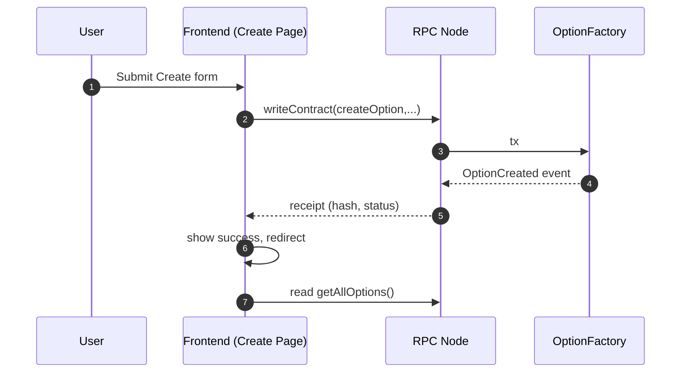

# Knowledge Base (English)

## Master Table of Contents

1. [Contracts](#chapter-01-contracts)
2. [Frontend](#chapter-02-frontend)
3. [Deployment](#chapter-03-deployment)
4. [Testing](#chapter-04-testing)
5. [Other](#chapter-05-other)
6. [Call Chains](#chapter-06-call-chains)
7. [Layered Index](#chapter-07-layered-index)

---

<a id="chapter-01-contracts"></a>

# Contracts

[Back to Master TOC](#master-table-of-contents)

---

# Smart Contracts Documentation

## Table of Contents

1. [Introduction and Overview](#part-1-introduction-and-overview)
2. [Background - Options Trading Fundamentals](#part-2-background---options-trading-fundamentals)
3. [Background - Blockchain and Smart Contracts](#part-3-background---blockchain-and-smart-contracts)
4. [Project Contract Architecture](#part-4-project-contract-architecture)
5. [EuropeanCallOption Contract - Part 1](#part-5-europeancalloption-contract---part-1)
6. [EuropeanCallOption Contract - Part 2](#part-6-europeancalloption-contract---part-2)
7. [EuropeanCallOption Contract - Part 3](#part-7-europeancalloption-contract---part-3)
8. [OptionFactory Contract](#part-8-optionfactory-contract)
9. [Security Features and Best Practices](#part-9-security-features-and-best-practices)
10. [Code Examples and Summary](#part-10-code-examples-and-summary)

[Back to Table of Contents](#table-of-contents)

---

## Part 1: Introduction and Overview

### What are Smart Contracts?

A **smart contract** is a self-executing program that runs on a blockchain network. Think of it as a digital contract that automatically executes when predetermined conditions are met. Unlike traditional contracts that require intermediaries (like lawyers or banks) to enforce terms, smart contracts operate autonomously on the blockchain.

#### Key Characteristics:

1. **Self-Executing**: Once deployed, smart contracts execute automatically when conditions are met
2. **Immutable**: Once deployed, the code cannot be changed (unless upgrade mechanisms are built-in)
3. **Transparent**: All transactions and state changes are publicly visible on the blockchain
4. **Trustless**: No need to trust a third party; the blockchain network enforces the rules
5. **Deterministic**: Given the same inputs, a smart contract will always produce the same outputs

#### Real-World Analogy:

Imagine a vending machine. You insert money, select a product, and the machine automatically dispenses it without requiring a cashier. A smart contract works similarly - you send cryptocurrency, trigger a function, and the contract automatically executes the logic without human intervention.

### Introduction to Solidity

**Solidity** is the most popular programming language for writing smart contracts on Ethereum and other Ethereum Virtual Machine (EVM) compatible blockchains. It was specifically designed for creating decentralized applications (dApps).

#### Solidity Basics:

**Syntax Similarity**: Solidity's syntax is similar to JavaScript, C++, and Python, making it accessible to developers familiar with these languages.

**Key Features**:
- **Object-Oriented**: Supports inheritance, libraries, and complex user-defined types
- **Type-Safe**: Strongly typed language with explicit data types
- **Ethereum-Specific**: Built-in support for addresses, Ether, and blockchain-specific features
- **Events**: Built-in event system for logging and off-chain monitoring

#### Solidity Version in This Project:

```solidity
pragma solidity ^0.8.19;
```

This project uses Solidity version 0.8.19 or higher. Version 0.8.x introduced automatic overflow/underflow protection, meaning arithmetic operations automatically check for overflow conditions, significantly improving safety.

#### Why Solidity?

1. **Industry Standard**: Most Ethereum smart contracts are written in Solidity
2. **Rich Ecosystem**: Extensive tooling, libraries (like OpenZeppelin), and community support
3. **Safety Features**: Built-in security features like overflow protection
4. **Compatibility**: Works with all Ethereum-based networks

### Project Contract Overview

This project implements a **decentralized European call option trading platform** on the Ethereum blockchain. The system allows users to create, match, and exercise call options without intermediaries.

#### What is a Call Option?

A **call option** is a financial derivative that gives the holder (buyer) the right (but not the obligation) to purchase a specified amount of an underlying asset at a predetermined price (strike price) within a specific time period (until expiration).

#### Project Components:

The project consists of three main smart contracts:

1. **EuropeanCallOption** (`contracts/EuropeanCallOption.sol`)
   - Core contract representing a single call option
   - Manages option lifecycle: creation, premium payment, exercise
   - Each instance represents one unique option

2. **OptionFactory** (`contracts/OptionFactory.sol`)
   - Factory contract that creates and manages all option instances
   - Provides functions to create new options, match options, and query option lists
   - Uses the Factory Pattern for scalable option creation

3. **MockERC20** (`contracts/mocks/MockERC20.sol`)
   - Mock ERC20 token for testing purposes
   - Represents underlying and strike assets in test environments

#### Project Architecture Overview:

```
┌─────────────────────────────────────────┐
│         OptionFactory Contract          │
│  (Creates and manages all options)      │
└──────────────┬──────────────────────────┘
               │
               │ Creates
               │
               ▼
┌─────────────────────────────────────────┐
│      EuropeanCallOption Contract        │
│  (Individual option instance)           │
│  ┌─────────────────────────────────┐   │
│  │ • Underlying Asset (ERC20)      │   │
│  │ • Strike Asset (ERC20)          │   │
│  │ • Strike Price                  │   │
│  │ • Expiration Time                │   │
│  │ • Issuer & Holder                │   │
│  └─────────────────────────────────┘   │
└─────────────────────────────────────────┘
```

#### Key Features:

1. **Factory Pattern**: Centralized option creation through a factory contract
2. **State Management**: Clear state machine (Created → Active → Exercised/Expired)
3. **Access Control**: Role-based permissions (issuer, holder, factory)
4. **Security**: ReentrancyGuard protection, input validation
5. **Events**: Comprehensive event logging for off-chain monitoring

#### Technology Stack:

- **Solidity**: ^0.8.19
- **OpenZeppelin Contracts**: ^4.9.0 (for ReentrancyGuard and ERC20 interfaces)
- **Hardhat**: Development framework
- **Network**: Ethereum Sepolia Testnet (for deployment)

[Back to Table of Contents](#table-of-contents)

---

## Part 2: Background - Options Trading Fundamentals

### What are Options?

**Options** are financial derivatives that give the holder the right, but not the obligation, to buy or sell an underlying asset at a predetermined price (called the strike price) within a specific time period. Unlike stocks or bonds, which represent ownership or debt, options are contracts that derive their value from an underlying asset.

#### Real-World Analogy:

Imagine you're looking to buy a house, but you're not sure if you want to commit yet. You could pay a small fee (premium) to the seller for the right to buy the house at a fixed price (strike price) within the next three months. This is similar to how options work:

- **You pay a premium** (small fee) upfront
- **You get the right** (but not obligation) to buy
- **At a fixed price** (strike price)
- **Within a time limit** (expiration)

If the house price increases, you can exercise your right and buy at the lower fixed price. If it decreases, you can simply let the option expire and only lose the premium you paid.

#### Key Characteristics:

1. **Right, Not Obligation**: The holder can choose whether to exercise the option
2. **Premium Payment**: The buyer pays a premium upfront to the seller
3. **Expiration Date**: Options have a fixed expiration date after which they become worthless
4. **Strike Price**: The predetermined price at which the asset can be bought/sold
5. **Time Decay**: Options lose value as they approach expiration

### Understanding Call Options

A **call option** specifically gives the holder the right to **buy** an underlying asset at the strike price. In this project, we implement European call options.

#### How Call Options Work:

**Scenario Example:**
- Current price of Token A: $100
- You buy a call option with:
  - Strike price: $110
  - Expiration: 30 days
  - Premium: $5

**Two Possible Outcomes:**

1. **Price Increases Above Strike (e.g., $130)**
   - You can exercise the option: Buy at $110 (even though market price is $130)
   - Profit: $130 - $110 - $5 = $15 per token
   - The option is "in the money"

2. **Price Stays Below Strike (e.g., $105)**
   - You won't exercise (no point buying at $110 when market is $105)
   - The option expires worthless
   - Loss: Only the $5 premium paid

#### Call Option Participants:

1. **Holder (Buyer)**: 
   - Pays premium upfront
   - Has the right to buy at strike price
   - Profits if asset price increases above strike price

2. **Issuer (Seller/Writer)**:
   - Receives premium upfront
   - Obligated to sell if holder exercises
   - Profits if option expires worthless

### European vs American Options

This project implements **European-style options**. Understanding the difference is crucial:

#### European Options:
- **Exercise Timing**: Can only be exercised **at expiration**
- **Flexibility**: Less flexible for holders
- **Complexity**: Simpler to implement in smart contracts
- **Use Case**: Common in DeFi due to simpler logic

**Example:**
```
Day 1: Option created (30 days until expiration)
Day 15: Cannot exercise yet (must wait until expiration)
Day 30: Expiration day - can exercise now
Day 31: Too late - option expired
```

#### American Options:
- **Exercise Timing**: Can be exercised **anytime before expiration**
- **Flexibility**: More flexible for holders
- **Complexity**: More complex to implement (requires continuous monitoring)
- **Use Case**: Traditional finance (stock options)

**Example:**
```
Day 1: Option created (30 days until expiration)
Day 15: Can exercise now if profitable
Day 20: Can exercise now if profitable
Day 30: Last day to exercise
```

#### Why European Options for DeFi?

1. **Simpler Implementation**: No need for continuous monitoring of exercise eligibility
2. **Gas Efficiency**: Exercise only happens once, reducing gas costs
3. **Predictability**: Clear expiration date makes pricing and management easier
4. **Standard Practice**: Most DeFi options protocols use European style

### Key Terminology Explained

Understanding these terms is essential for working with options:

#### 1. Underlying Asset (标的资产)
- **Definition**: The asset that the option gives you the right to buy/sell
- **In This Project**: An ERC20 token address
- **Example**: If the option is for buying ETH tokens, ETH is the underlying asset
- **Code Representation**: `address public underlyingAsset;`

#### 2. Strike Price (执行价格)
- **Definition**: The predetermined price at which the option can be exercised
- **In This Project**: Price in terms of the strike asset
- **Example**: 100 USDC per 1 ETH token
- **Code Representation**: `uint256 public strikePrice;`

#### 3. Strike Asset (执行资产)
- **Definition**: The currency used to pay the strike price when exercising
- **In This Project**: Usually a stablecoin like USDC or DAI
- **Example**: When exercising, you pay in USDC (strike asset) to receive ETH (underlying asset)
- **Code Representation**: `address public strikeAsset;`

#### 4. Expiration Time (到期时间)
- **Definition**: The specific timestamp when the option expires
- **In This Project**: Unix timestamp (seconds since Jan 1, 1970)
- **Example**: 1735689600 (December 31, 2024, 12:00 AM UTC)
- **Code Representation**: `uint256 public expirationTime;`

#### 5. Contract Size (合约规模)
- **Definition**: The amount of underlying asset covered by one option contract
- **In This Project**: Amount in the smallest unit (wei for tokens with 18 decimals)
- **Example**: 1 ETH = 1e18 wei
- **Code Representation**: `uint256 public contractSize;`

#### 6. Premium (保费)
- **Definition**: The fee paid by the option buyer to the option seller upfront
- **In This Project**: Paid in strike asset tokens
- **Example**: 10 USDC premium for the right to buy 1 ETH at $100
- **When Paid**: When the holder calls `payPremium()` function

#### 7. Issuer (发行者/卖方)
- **Definition**: The party who creates and sells the option
- **Role**: Receives premium, must deliver underlying asset if exercised
- **In This Project**: Address that created the option through factory
- **Code Representation**: `address public issuer;`

#### 8. Holder (持有者/买方)
- **Definition**: The party who buys the option
- **Role**: Pays premium, has right to exercise
- **In This Project**: Address that matched the option or was assigned initially
- **Code Representation**: `address public holder;`

#### 9. Exercise Window (行权窗口)
- **Definition**: The time period during which the option can be exercised
- **In This Project**: 10 days after expiration (European style)
- **Example**: If expiration is Dec 31, exercise window is Dec 31 - Jan 10
- **Code Implementation**: `block.timestamp <= expirationTime + 10 days`

#### 10. In the Money / Out of the Money
- **In the Money**: Asset price > Strike price (profitable to exercise)
- **Out of the Money**: Asset price < Strike price (not profitable to exercise)
- **At the Money**: Asset price = Strike price (break-even)

### Options in DeFi Context

#### Why Options in DeFi?

1. **Risk Management**: Users can hedge their positions
2. **Leverage**: Small premium can control large position
3. **Speculation**: Profit from price movements without owning assets
4. **Decentralization**: No intermediaries needed, trustless execution

#### Traditional vs DeFi Options:

| Aspect | Traditional Options | DeFi Options |
|--------|-------------------|--------------|
| **Intermediary** | Broker, exchange | None (smart contract) |
| **Settlement** | T+1 or T+2 days | Instant on-chain |
| **Transparency** | Limited | Fully transparent |
| **Access** | Regulated markets | Global, permissionless |
| **Custody** | Centralized | Self-custody |
| **Gas Costs** | Transaction fees | Network gas fees |

[Back to Table of Contents](#table-of-contents)

---

## Part 3: Background - Blockchain and Smart Contracts

### Ethereum Blockchain Basics

**Ethereum** is a decentralized, open-source blockchain platform that enables the creation and execution of smart contracts. Unlike Bitcoin, which is primarily a digital currency, Ethereum is a programmable blockchain that runs decentralized applications (dApps).

#### How Blockchain Works:

**Simplified Explanation:**
1. **Transactions**: Users send transactions (e.g., "transfer 10 ETH from Alice to Bob")
2. **Block Creation**: Miners/validators collect transactions and create a block
3. **Consensus**: Network participants agree the block is valid
4. **Chain Addition**: Valid block is added to the blockchain
5. **Immutability**: Once added, block cannot be changed

#### Ethereum Architecture:

```
┌─────────────────────────────────────┐
│      Ethereum Virtual Machine        │
│      (EVM) - Executes Smart          │
│      Contracts                       │
└──────────────┬───────────────────────┘
               │
               ▼
┌─────────────────────────────────────┐
│         Blockchain Network           │
│  • Nodes validate transactions       │
│  • Consensus mechanism (PoS/PoW)      │
│  • Storage of all transactions      │
└─────────────────────────────────────┘
```

#### Key Concepts:

1. **Accounts**:
   - **Externally Owned Accounts (EOA)**: Controlled by private keys, can send transactions
   - **Contract Accounts**: Controlled by code, can receive/send transactions and execute code

2. **Addresses**: 
   - Unique identifier (42 characters starting with 0x)
   - Example: `0x742d35Cc6634C0532925a3b844Bc9e7595f0bEb0`
   - Similar to a bank account number

3. **Transactions**:
   - Actions that modify blockchain state
   - Must be signed by sender's private key
   - Include: `from`, `to`, `value`, `data`, `gasLimit`, `gasPrice`

4. **Blocks**:
   - Collection of transactions
   - Contains: block number, timestamp, gas used, transactions list
   - Linked to previous block (chain structure)

### How Smart Contracts Work

Smart contracts are programs that run on the Ethereum blockchain. They are executed by all nodes in the network to ensure consensus.

#### Contract Lifecycle:

**1. Development**
```solidity
// Write contract in Solidity
contract MyContract {
    uint256 public value;
    
    function setValue(uint256 _value) public {
        value = _value;
    }
}
```

**2. Compilation**
- Solidity compiler converts code to bytecode (EVM instructions)
- Generates Application Binary Interface (ABI) - describes functions

**3. Deployment**
- Send transaction with contract bytecode
- Contract gets a unique address
- Code is stored on blockchain permanently

**4. Execution**
- Users call functions by sending transactions to contract address
- Network executes code deterministically
- State changes are recorded on blockchain

#### Contract Storage:

Smart contracts have different types of storage:

1. **Storage** (Permanent):
   - Stored on blockchain permanently
   - Expensive (20,000 gas per write)
   - Example: `uint256 public value;`

2. **Memory** (Temporary):
   - Exists only during function execution
   - Cheap (free after execution)
   - Example: Local variables in functions

3. **Stack** (Temporary):
   - Very fast, limited space
   - Used for computation
   - Managed automatically by EVM

#### Contract Execution Flow:

```
User sends transaction
    ↓
Transaction includes function call + parameters
    ↓
Network nodes execute contract code
    ↓
Code modifies contract state
    ↓
All nodes reach same state (consensus)
    ↓
Transaction confirmed in block
    ↓
State changes are permanent
```

### Gas Mechanism

**Gas** is the unit of computation on Ethereum. Every operation costs gas, which prevents infinite loops and ensures fair resource allocation.

#### Why Gas Exists:

1. **Prevent Infinite Loops**: Programs cannot run forever
2. **Resource Management**: Limit computational resources used
3. **Spam Prevention**: Makes attacks expensive
4. **Fee Calculation**: Gas cost × gas price = transaction fee

#### Gas Cost Examples:

| Operation | Gas Cost |
|-----------|----------|
| Simple transfer | 21,000 |
| Create contract | ~32,000 - 1,000,000+ |
| Storage write (SSTORE) | 20,000 (first time) or 5,000 (update) |
| Storage read (SLOAD) | 800 |
| Add operation | 3 |
| Multiply operation | 5 |

#### Gas Price and Gas Limit:

1. **Gas Price** (in Gwei):
   - Fee you pay per unit of gas
   - Set by user (higher = faster confirmation)
   - Example: 20 Gwei per gas unit

2. **Gas Limit**:
   - Maximum gas you're willing to spend
   - Protects against infinite loops
   - If transaction uses more, it reverts

3. **Total Fee Calculation**:
   ```
   Total Fee = Gas Used × Gas Price
   Example: 50,000 gas × 20 Gwei = 0.001 ETH
   ```

#### Gas Optimization Tips:

1. **Use Events Instead of Storage** (when possible):
   - Events: ~8 gas per byte
   - Storage: 20,000 gas per write

2. **Pack Storage Variables**:
   - Multiple small uint256s in one storage slot
   - Example: `uint128 a; uint128 b;` uses one slot instead of two

3. **Use Memory Instead of Storage** (in functions):
   - Copy to memory, modify, then write back once

4. **Avoid Loops** (when possible):
   - Unbounded loops can cause out-of-gas errors

### Events and Logs

**Events** are a way for smart contracts to communicate with off-chain applications. They are cheaper than storage and essential for building user interfaces.

#### What are Events?

Events are special functions that emit logs. They don't modify blockchain state but create searchable records in transaction logs.

#### Event Declaration:

```solidity
// Declare event
event OptionCreated(
    address indexed issuer,
    address indexed holder
);

// Emit event
emit OptionCreated(issuer, holder);
```

#### Event Components:

1. **Parameters**:
   - Regular parameters: Stored as data
   - `indexed` parameters: Searchable by filter

2. **Benefits**:
   - **Cheap**: ~8 gas per byte vs 20,000 for storage
   - **Searchable**: Can filter by indexed parameters
   - **Transparent**: All events visible on blockchain
   - **Off-chain Integration**: Frontend can listen to events

#### Event vs Storage:

**When to Use Events:**
- Logging historical data
- Notifying off-chain applications
- Data that doesn't need to be read by contracts

**When to Use Storage:**
- Data needed for contract logic
- State that affects contract behavior
- Data frequently accessed by contract functions

#### Example from This Project:

```solidity
event PremiumPaid(address indexed payer, uint256 amount);

function payPremium(uint256 premium) public {
    // ... logic ...
    emit PremiumPaid(holder, premium);
}
```

**Frontend can listen:**
```javascript
contract.on("PremiumPaid", (payer, amount) => {
    console.log(`${payer} paid ${amount} premium`);
});
```

### Access Control and Permissions

**Access control** ensures only authorized users can call specific functions. This is crucial for security.

#### Common Patterns:

**1. Owner Pattern:**
```solidity
address public owner;

constructor() {
    owner = msg.sender;
}

modifier onlyOwner() {
    require(msg.sender == owner, "Not owner");
    _;
}

function adminFunction() public onlyOwner {
    // Only owner can call
}
```

**2. Role-Based Access:**
```solidity
mapping(address => bool) public isAdmin;

modifier onlyAdmin() {
    require(isAdmin[msg.sender], "Not admin");
    _;
}
```

**3. Specific Address Check:**
```solidity
address public authorizedAddress;

function restrictedFunction() public {
    require(msg.sender == authorizedAddress, "Not authorized");
    // ...
}
```

#### In This Project:

**EuropeanCallOption Contract:**
- `payPremium()`: Only holder can call
- `exercised()`: Only holder can call
- `setHolder()`: Only factory can call

```solidity
function payPremium(uint256 premium) public {
    require(msg.sender == holder, "Only holder can pay premium");
    // ...
}
```

**Why This Matters:**
- Prevents unauthorized actions
- Protects contract funds
- Ensures correct state transitions

### Reentrancy Attacks and Protection

**Reentrancy attacks** are one of the most dangerous vulnerabilities in smart contracts. Understanding them is crucial for security.

#### What is Reentrancy?

A reentrancy attack occurs when:
1. Contract A calls Contract B
2. Contract B calls back into Contract A
3. Contract A's state hasn't been updated yet
4. Contract B can exploit the old state

#### Example Attack Scenario:

```solidity
// VULNERABLE CODE (DO NOT USE)
contract Vulnerable {
    mapping(address => uint256) public balances;
    
    function withdraw() public {
        uint256 amount = balances[msg.sender];
        (bool success, ) = msg.sender.call{value: amount}("");
        require(success);
        balances[msg.sender] = 0; // Too late! Attacker already called back
    }
}

// Attacker contract
contract Attacker {
    function attack() public {
        vulnerable.withdraw(); // Calls back into withdraw() before balance reset
    }
    
    receive() external payable {
        if (address(vulnerable).balance > 0) {
            vulnerable.withdraw(); // Reentrancy!
        }
    }
}
```

#### The Solution: ReentrancyGuard

**OpenZeppelin's ReentrancyGuard** uses a mutex pattern to prevent reentrancy:

```solidity
import "@openzeppelin/contracts/security/ReentrancyGuard.sol";

contract Secure is ReentrancyGuard {
    function withdraw() public nonReentrant {
        // Lock acquired, cannot be called again until function completes
        // ... safe logic ...
        // Lock released when function returns
    }
}
```

#### How ReentrancyGuard Works:

1. **Before Function**: Sets a flag (locked = true)
2. **During Execution**: Function runs with lock
3. **If Reentrancy Attempt**: `require(!locked)` fails, transaction reverts
4. **After Function**: Lock released

#### In This Project:

Both `payPremium()` and `exercised()` use `nonReentrant` modifier:

```solidity
function payPremium(uint256 premium) public nonReentrant {
    // Safe from reentrancy attacks
    // ...
}

function exercised() public nonReentrant {
    // Safe from reentrancy attacks
    // ...
}
```

**Why Important:**
- Contract handles token transfers
- External calls to ERC20 contracts
- Without protection, attacker could drain funds

### Blockchain State and Immutability

#### State Immutability:

**Once Deployed:**
- Contract code cannot be changed
- State changes are permanent
- Historical data cannot be erased

**Implications:**
- ✅ **Trust**: Code is transparent and verifiable
- ✅ **Security**: Cannot be modified after deployment
- ⚠️ **Bugs**: Cannot patch vulnerabilities easily
- ⚠️ **Updates**: Must deploy new contract if changes needed

#### State Reading:

**View Functions:**
```solidity
function getBalance() public view returns (uint256) {
    return balances[msg.sender];
}
```

- No gas cost (if called externally)
- Don't modify state
- Can be called without transaction

**Pure Functions:**
```solidity
function add(uint256 a, uint256 b) public pure returns (uint256) {
    return a + b;
}
```

- No gas cost
- Don't read or modify state
- Only computation

### Block Timestamp and Time Operations

**Block Timestamp** is crucial for time-sensitive operations like option expiration.

#### Understanding `block.timestamp`:

- Current block's timestamp (Unix time)
- Set by miner/validator
- Can vary slightly (±15 seconds typically)
- **Not perfectly accurate**: Should not rely on exact timing

#### Time Operations in This Project:

```solidity
// Check if expiration time is in future
require(_expirationTime > block.timestamp, "Expiration must be in future");

// Check if can exercise (after expiration)
require(block.timestamp >= expirationTime, "Not yet exercisable");

// Check if within exercise window (10 days)
require(block.timestamp <= expirationTime + 10 days, "Window expired");
```

#### Time Units in Solidity:

- `1 seconds`
- `1 minutes` (60 seconds)
- `1 hours` (3600 seconds)
- `1 days` (86400 seconds)
- `1 weeks` (604800 seconds)

**Example:**
```solidity
uint256 exerciseWindow = expirationTime + 10 days;
```

[Back to Table of Contents](#table-of-contents)

---

## Part 4: Project Contract Architecture

### Factory Pattern Design

The **Factory Pattern** is a design pattern used in software engineering to create objects without specifying the exact class of object that will be created. In smart contract development, the Factory Pattern is used to create and manage multiple instances of a contract.

#### Why Use Factory Pattern?

**Benefits:**
1. **Centralized Management**: All option instances are tracked in one place
2. **Scalability**: Easy to create new options without manual deployment
3. **Query Capabilities**: Can list all options, filter matchable options
4. **Gas Efficiency**: Factory handles common operations
5. **Uniform Interface**: All options follow same creation process

**Real-World Analogy:**
Think of a factory that produces cars. Instead of building each car manually in different locations, you have one factory (OptionFactory) that creates all cars (EuropeanCallOption instances) with standardized processes.

#### Factory Pattern in This Project:

```
┌─────────────────────────────────────────┐
│         OptionFactory Contract           │
│  • Tracks all option instances            │
│  • Provides creation & query functions    │
│  • Manages option lifecycle               │
└──────────────┬───────────────────────────┘
               │
               │ Creates instances
               │
               ▼
┌─────────────────────────────────────────┐
│      EuropeanCallOption #1              │
│      (Address: 0xABC...)                 │
└─────────────────────────────────────────┘

┌─────────────────────────────────────────┐
│      EuropeanCallOption #2              │
│      (Address: 0xDEF...)                 │
└─────────────────────────────────────────┘

┌─────────────────────────────────────────┐
│      EuropeanCallOption #N              │
│      (Address: 0x123...)                 │
└─────────────────────────────────────────┘
```

### Contract Relationships

Understanding how contracts interact is crucial for working with this project.

#### Relationship Diagram:

```
                    Users (EOA)
                        │
                        ├──────────┐
                        │          │
                        ▼          ▼
            ┌───────────────────────┐
            │   OptionFactory       │
            │   (Central Registry)  │
            └───────────┬───────────┘
                        │
                        │ 1. Creates
                        │ 2. Matches
                        │ 3. Queries
                        │
                        ▼
        ┌─────────────────────────────┐
        │  EuropeanCallOption          │
        │  (Individual Instance)       │
        └───────────┬─────────────────┘
                    │
                    │ Interacts with
                    │
        ┌───────────┴──────────┐
        │                      │
        ▼                      ▼
┌──────────────┐      ┌──────────────┐
│  ERC20 Token │      │  ERC20 Token │
│ (Underlying) │      │  (Strike)     │
└──────────────┘      └──────────────┘
```

#### Contract Interactions:

**1. User → OptionFactory:**
- User calls `createOption()` to create new option
- User calls `matchOption()` to become holder
- User calls query functions (`getAllOptions()`, `getMatchableOptions()`)

**2. OptionFactory → EuropeanCallOption:**
- Factory creates new option instance: `new EuropeanCallOption(...)`
- Factory sets holder: `optionContract.setHolder(address)`
- Factory queries status: `optionContract.status()`

**3. User → EuropeanCallOption:**
- Holder calls `payPremium()` to activate option
- Holder calls `exercised()` to exercise option
- User calls view functions (`isExercisable()`, `status()`)

**4. EuropeanCallOption → ERC20 Tokens:**
- Calls `transferFrom()` to move tokens
- Calls `approve()` to allow transfers
- Reads token balances and allowances

### Data Structures and Storage

Understanding how data is stored is essential for understanding the contract architecture.

#### OptionFactory Storage:

**1. Options Array:**
```solidity
OptionInfo[] public options;
```

- Stores information about all options
- Each element is an `OptionInfo` struct
- Index corresponds to option ID
- Gas cost: High for large arrays (loop operations)

**2. OptionIndex Mapping:**
```solidity
mapping(address => uint256) public optionIndex;
```

- Maps option address → array index
- Enables O(1) lookup instead of O(n) loop
- Problem: Cannot distinguish between "doesn't exist" and "index 0"
- Solution: Additional check in functions

**3. User Created Options Mapping:**
```solidity
mapping(address => address[]) public userCreatedOptions;
```

- Maps user address → array of option addresses
- Enables quick lookup of user's created options
- Gas cost: Low for read operations

#### OptionInfo Structure:

```solidity
struct OptionInfo {
    address optionAddress;  // Address of the option contract
    address issuer;        // Address of option seller
    address holder;        // Address of option buyer (0x0 if unmatched)
    uint256 createdAt;     // Timestamp when option was created
    bool exists;           // Whether option still exists
}
```

**Storage Layout:**
- Packed into storage slots
- `address`: 20 bytes
- `uint256`: 32 bytes
- `bool`: 1 byte (but takes 1 slot due to alignment)

#### EuropeanCallOption Storage:

**State Variables:**
```solidity
address public underlyingAsset;  // ERC20 token address
address public strikeAsset;       // ERC20 token address
uint256 public strikePrice;       // Strike price
uint256 public expirationTime;    // Unix timestamp
uint256 public contractSize;       // Amount of underlying
address public issuer;            // Option seller
address public holder;            // Option buyer
address public factory;           // Factory contract
OptionStatus public status;       // Current state
```

**Storage Optimization:**
- `address` types: 20 bytes each (3 variables = 60 bytes, 2 slots)
- `uint256` types: 32 bytes each (4 variables = 4 slots)
- `enum` type: 1 byte (but takes 1 slot)

**Total:** ~8 storage slots

### Data Flow and State Transitions

Understanding how data flows through the system is crucial for debugging and development.

#### Complete Option Lifecycle:

```
┌─────────────────────────────────────────────────┐
│ 1. CREATION                                      │
│    User calls Factory.createOption()            │
│    ├─ Factory creates EuropeanCallOption        │
│    ├─ Factory stores OptionInfo                 │
│    └─ Status: Created                           │
└─────────────────────────────────────────────────┘
                    │
                    ▼
┌─────────────────────────────────────────────────┐
│ 2. MATCHING                                      │
│    User calls Factory.matchOption()              │
│    ├─ Factory verifies option exists            │
│    ├─ Factory calls Option.setHolder()           │
│    ├─ Factory updates OptionInfo.holder          │
│    └─ Status: Created (holder now assigned)    │
└─────────────────────────────────────────────────┘
                    │
                    ▼
┌─────────────────────────────────────────────────┐
│ 3. PREMIUM PAYMENT                               │
│    Holder calls Option.payPremium()              │
│    ├─ Option verifies holder                    │
│    ├─ Option transfers premium (ERC20)           │
│    ├─ Option updates status                      │
│    └─ Status: Active                            │
└─────────────────────────────────────────────────┘
                    │
                    ▼
┌─────────────────────────────────────────────────┐
│ 4. EXERCISE (After Expiration)                   │
│    Holder calls Option.exercised()               │
│    ├─ Option verifies expiration                │
│    ├─ Option transfers strike price (ERC20)       │
│    ├─ Option transfers underlying (ERC20)       │
│    ├─ Option updates status                      │
│    └─ Status: Exercised                          │
└─────────────────────────────────────────────────┘
```

#### State Transition Diagram:

```
                    ┌─────────┐
                    │ CREATED │
                    └────┬─────┘
                         │
                         │ matchOption()
                         │ setHolder()
                         │
                         ▼
                    ┌─────────┐
                    │ CREATED │
                    │(matched)│
                    └────┬─────┘
                         │
                         │ payPremium()
                         │
                         ▼
                    ┌─────────┐
                    │ ACTIVE  │
                    └────┬─────┘
                         │
                         │ After expiration
                         │ exercised()
                         │
                         ▼
                    ┌──────────┐
                    │ EXERCISED │
                    └──────────┘

                    OR (if not exercised)
                         │
                         │ expireOption()
                         │ OR time > expiration + 10 days
                         │
                         ▼
                    ┌──────────┐
                    │ EXPIRED  │
                    └──────────┘
```

### Storage Mechanism Deep Dive

#### How Storage Works in Ethereum:

**Storage Slots:**
- Each contract has 2^256 storage slots
- Each slot is 32 bytes (256 bits)
- Variables are packed into slots when possible

**Example from EuropeanCallOption:**

```solidity
address public underlyingAsset;  // Slot 0: bytes 0-19
address public strikeAsset;     // Slot 0: bytes 20-31 (packed)
uint256 public strikePrice;      // Slot 1: full slot
uint256 public expirationTime;  // Slot 2: full slot
```

**Actual Implementation (Not Packed):**
- Each `address` takes 20 bytes but alignment forces 1 slot each
- Each `uint256` takes 1 full slot

#### Gas Cost for Storage Operations:

**First-Time Write (SSTORE):** ~20,000 gas
**Update Write (SSTORE):** ~5,000 gas
**Read (SLOAD):** ~800 gas

**Optimization Tips:**
1. **Pack Variables**: Use smaller types (uint128 instead of uint256)
2. **Use Events**: For data not needed by contract logic
3. **Memory Instead of Storage**: In functions, copy to memory first

### Query Functions and Gas Optimization

Understanding query functions helps optimize frontend interactions.

#### View Functions in OptionFactory:

**1. `getAllOptions()`:**
```solidity
function getAllOptions() external view returns (address[] memory);
```
- Returns all option addresses
- Gas cost: O(n) where n = number of options
- Use case: Display all options in UI

**2. `getMatchableOptions()`:**
```solidity
function getMatchableOptions() external view returns (address[] memory);
```
- Returns only options available for matching
- Gas cost: O(n) with additional checks
- Uses `try-catch` for safety
- Use case: Show options user can match

**3. `getOptionInfo()`:**
```solidity
function getOptionInfo(address) external view returns (OptionInfo memory);
```
- Returns specific option information
- Gas cost: O(1) lookup
- Use case: Get details for single option

**4. `getUserCreatedOptions()`:**
```solidity
function getUserCreatedOptions(address) external view returns (address[] memory);
```
- Returns options created by specific user
- Gas cost: O(1) lookup + O(k) where k = user's options
- Use case: Display user's created options

#### Gas Optimization in Queries:

**Problem with Large Arrays:**
- Looping through arrays costs gas
- For 100 options: ~800 gas × 100 = 80,000 gas

**Solutions:**
1. **Pagination**: Return limited results
2. **Indexing**: Use mappings for common queries
3. **Off-chain Indexing**: Frontend tracks options
4. **Events**: Listen to events instead of polling

### Error Handling and Validation

Understanding error handling helps prevent bugs and improve security.

#### Common Validation Patterns:

**1. Zero Address Check:**
```solidity
require(_address != address(0), "Invalid address");
```
- Prevents setting zero address
- Common mistake: Forgetting to initialize

**2. Zero Value Check:**
```solidity
require(_amount > 0, "Amount must be greater than 0");
```
- Prevents zero-value operations
- Saves gas by avoiding unnecessary operations

**3. State Check:**
```solidity
require(status == OptionStatus.Created, "Option must be in Created state");
```
- Ensures correct state transitions
- Prevents invalid operations

**4. Time Validation:**
```solidity
require(_expirationTime > block.timestamp, "Expiration must be in future");
```
- Ensures logical time constraints
- Prevents expired options

**5. Access Control:**
```solidity
require(msg.sender == holder, "Only holder can call");
```
- Enforces permissions
- Prevents unauthorized actions

#### Try-Catch Pattern in Factory:

The `getMatchableOptions()` function uses try-catch:

```solidity
try EuropeanCallOption(options[i].optionAddress).status() 
    returns (EuropeanCallOption.OptionStatus status) {
    if (status == EuropeanCallOption.OptionStatus.Created) {
        count++;
    }
} catch {
    // If call fails, skip this option
}
```

**Why Use Try-Catch:**
- Option contract might not exist
- Option might have been self-destructed
- Prevents function from reverting

### Contract Interaction Patterns

Understanding how contracts interact helps with integration.

#### Pattern 1: Factory Creates Instance

```solidity
// In OptionFactory
EuropeanCallOption newOption = new EuropeanCallOption(
    _underlyingAsset,
    _strikeAsset,
    _strikePrice,
    _expirationTime,
    _contractSize,
    address(0),      // holder
    msg.sender,     // issuer
    address(this)   // factory
);
```

**What Happens:**
1. New contract deployed
2. Constructor executes
3. Returns address
4. Factory stores address

#### Pattern 2: Factory Calls Instance Method

```solidity
// In OptionFactory
EuropeanCallOption optionContract = EuropeanCallOption(_optionAddress);
optionContract.setHolder(msg.sender);
```

**What Happens:**
1. Factory gets contract interface
2. Factory calls function on instance
3. Instance verifies caller (factory)
4. Instance updates state

#### Pattern 3: User Directly Calls Instance

```solidity
// User calls directly
optionContract.payPremium(premium);
```

**What Happens:**
1. User sends transaction to option contract
2. Option contract verifies caller
3. Option contract executes logic
4. State updated on option contract

[Back to Table of Contents](#table-of-contents)

---

## Part 5: EuropeanCallOption Contract - Part 1 (Overview & Parameters)

### Contract Overview

The **EuropeanCallOption** contract is the core contract of this project. Each instance represents a single European call option with specific parameters. This contract manages the complete lifecycle of an option: creation, premium payment, exercise, and expiration.

#### Contract Purpose:

**Primary Functions:**
1. **Represents One Option**: Each contract instance represents one unique option
2. **Manages Option State**: Tracks current state (Created, Active, Exercised, Expired)
3. **Handles Premium Payment**: Transfers premium from holder to issuer
4. **Executes Option Exercise**: Transfers assets when holder exercises
5. **Enforces Rules**: Validates all operations according to option parameters

#### Key Design Principles:

1. **Stateless Design**: Each option is independent; no shared state between options
2. **Immutable Parameters**: Once set in constructor, parameters cannot be changed
3. **State Machine**: Strict state transitions prevent invalid operations
4. **Access Control**: Only authorized parties can execute functions
5. **Security First**: ReentrancyGuard protection on all state-changing functions

#### Contract Inheritance:

```solidity
contract EuropeanCallOption is ReentrancyGuard {
    // ...
}
```

**What This Means:**
- Inherits from OpenZeppelin's `ReentrancyGuard`
- Provides `nonReentrant` modifier for security
- Prevents reentrancy attacks automatically

### State Enumeration: OptionStatus

The contract uses an enumeration to represent the current state of the option. This is crucial for managing the option lifecycle.

#### OptionStatus Enum:

```solidity
enum OptionStatus { Created, Active, Expired, Exercised }
```

#### State Values:

**1. Created (Value: 0)**
- **When**: Immediately after contract creation
- **Meaning**: Option has been created but not yet activated
- **Holder Status**: May be `address(0)` if waiting for matching
- **Actions Possible**: 
  - Factory can set holder
  - Holder can pay premium (after being assigned)
- **Next State**: Active (when premium paid)

**2. Active (Value: 1)**
- **When**: After holder pays premium
- **Meaning**: Option is active and ready for exercise
- **Holder Status**: Must be assigned (not zero address)
- **Actions Possible**: 
  - Holder can exercise (after expiration)
  - Anyone can mark as expired
- **Next State**: Exercised (if exercised) or Expired (if expired)

**3. Expired (Value: 2)**
- **When**: Option passed exercise window without being exercised
- **Meaning**: Option is no longer valid
- **Actions Possible**: None (final state)
- **Next State**: None (terminal state)

**4. Exercised (Value: 3)**
- **When**: Holder exercised the option successfully
- **Meaning**: Option has been fulfilled
- **Actions Possible**: None (final state)
- **Next State**: None (terminal state)

#### State Transition Rules:

```
┌─────────┐
│ CREATED │  ← Initial state (constructor)
└────┬────┘
     │
     │ payPremium() [by holder]
     │
     ▼
┌─────────┐
│ ACTIVE  │
└────┬────┘
     │
     ├──► exercised() [by holder] ────► ┌──────────┐
     │                                    │ EXERCISED │
     │                                    └──────────┘
     │
     └──► expireOption() [by anyone] ──► ┌──────────┐
                                          │ EXPIRED  │
                                          └──────────┘
```

#### Why Use Enum?

**Benefits:**
1. **Type Safety**: Compiler enforces valid state values
2. **Gas Efficiency**: Stored as 1 byte (cheaper than uint256)
3. **Readability**: Code is more readable than magic numbers
4. **Maintainability**: Easy to add new states if needed

**Example Usage:**
```solidity
// Good (using enum)
require(status == OptionStatus.Created, "Option must be Created");

// Bad (using magic number)
require(status == 0, "Option must be Created"); // What is 0?
```

### Core Parameters Explained

Understanding each parameter is crucial for working with options. Let's explore each one in detail.

#### 1. Underlying Asset (`underlyingAsset`)

```solidity
address public underlyingAsset;  // Underlying asset address
```

**Purpose:**
- The ERC20 token that the option gives you the right to buy
- This is the asset you will receive when exercising the option

**Data Type:** `address`
- 20 bytes (42 characters starting with 0x)
- Example: `0x452f0232e083998d2f968b0602fb8208e7320df8`

**Validation in Constructor:**
```solidity
require(_underlyingAsset != address(0), "Invalid underlying asset");
```
- Cannot be zero address
- Must be a valid ERC20 contract address

**Real-World Example:**
- If option is for buying ETH, `underlyingAsset` is the WETH token address
- If option is for buying Token A, `underlyingAsset` is Token A's contract address

**Storage:**
- Takes 1 storage slot (20 bytes, but alignment forces full 32-byte slot)
- Gas cost: ~20,000 gas (first write), ~5,000 gas (read)

#### 2. Strike Asset (`strikeAsset`)

```solidity
address public strikeAsset;      // Strike asset address
```

**Purpose:**
- The ERC20 token used to pay the strike price when exercising
- Usually a stablecoin like USDC, DAI, or USDT

**Data Type:** `address`
- 20 bytes
- Example: `0x424bd9e49e2049600deda9604d2a3ba836f99ee4`

**Validation in Constructor:**
```solidity
require(_strikeAsset != address(0), "Invalid strike asset");
```
- Cannot be zero address
- Must be a valid ERC20 contract address

**Real-World Example:**
- If exercising requires paying in USDC, `strikeAsset` is USDC token address
- Can be different from underlying asset

**Why Separate Assets?**
- Flexibility: Can create options for any token pair
- Standard Practice: Strike price typically paid in stablecoin
- DeFi Integration: Works with any ERC20 tokens

#### 3. Strike Price (`strikePrice`)

```solidity
uint256 public strikePrice;      // Strike price
```

**Purpose:**
- The predetermined price at which you can buy the underlying asset
- Amount is in units of strike asset per unit of underlying asset

**Data Type:** `uint256`
- 32 bytes (256 bits)
- Range: 0 to 2^256 - 1
- In practice, usually uses 18 decimals (like Ether)

**Validation in Constructor:**
```solidity
require(_strikePrice > 0, "Strike price must be greater than 0");
```
- Must be greater than zero
- Cannot be zero (no free option)

**Format:**
- Usually stored with 18 decimals
- Example: 100 (in code) = 100 × 10^18 = 100.0 tokens (with 18 decimals)

**Calculation Example:**
```solidity
// Strike price calculation in exercised()
uint256 strikeAmount = strikePrice * contractSize / 1e18;
// If strikePrice = 100e18, contractSize = 1e18
// strikeAmount = 100e18 * 1e18 / 1e18 = 100e18
```

**Real-World Example:**
- Strike price: 100 USDC per 1 ETH
- If ETH price rises to 150 USDC, holder can exercise and buy at 100 USDC

**Storage:**
- Takes 1 storage slot (32 bytes)
- Gas cost: ~20,000 gas (first write), ~800 gas (read)

#### 4. Expiration Time (`expirationTime`)

```solidity
uint256 public expirationTime;   // Expiration timestamp
```

**Purpose:**
- The Unix timestamp when the option expires
- After this time, the option can be exercised (if still within exercise window)

**Data Type:** `uint256`
- Unix timestamp (seconds since January 1, 1970, 00:00:00 UTC)
- Example: 1735689600 = December 31, 2024, 12:00:00 AM UTC

**Validation in Constructor:**
```solidity
require(_expirationTime > block.timestamp, "Expiration time must be in the future");
```
- Must be in the future
- Cannot be in the past

**Calculation:**
```solidity
// Example: 30 days from now
uint256 expirationTime = block.timestamp + 30 days;
// block.timestamp = current Unix timestamp
// 30 days = 30 * 86400 = 2,592,000 seconds
```

**Real-World Example:**
```javascript
// JavaScript calculation
const now = Math.floor(Date.now() / 1000); // Current Unix timestamp
const expirationTime = now + (30 * 24 * 60 * 60); // 30 days from now
// expirationTime = 1735689600 (example)
```

**Usage in Contract:**
```solidity
// Check if can exercise (must be after expiration)
require(block.timestamp >= expirationTime, "Not yet exercisable");

// Check if within exercise window (10 days after expiration)
require(block.timestamp <= expirationTime + 10 days, "Exercise window expired");
```

**Storage:**
- Takes 1 storage slot (32 bytes)
- Gas cost: ~20,000 gas (first write), ~800 gas (read)

#### 5. Contract Size (`contractSize`)

```solidity
uint256 public contractSize;     // Contract size
```

**Purpose:**
- The amount of underlying asset covered by this option
- This is how much you will receive when exercising

**Data Type:** `uint256`
- Amount in the smallest unit (wei for tokens with 18 decimals)
- Example: 1 token = 1e18 wei (if token has 18 decimals)

**Validation in Constructor:**
```solidity
require(_contractSize > 0, "Contract size must be greater than 0");
```
- Must be greater than zero
- Cannot be zero (no option for zero amount)

**Format:**
- Stored in smallest unit (wei)
- If token has 18 decimals: 1 token = 1e18
- Example: `1e18` = 1.0 token

**Real-World Example:**
```solidity
// 1 ETH option (assuming 18 decimals)
contractSize = 1e18; // = 1,000,000,000,000,000,000 wei

// 100 tokens option (assuming 18 decimals)
contractSize = 100e18; // = 100 * 10^18
```

**Usage in Exercise:**
```solidity
// When exercising, holder receives contractSize of underlying asset
IERC20(underlyingAsset).transferFrom(issuer, holder, contractSize);
```

**Storage:**
- Takes 1 storage slot (32 bytes)
- Gas cost: ~20,000 gas (first write), ~800 gas (read)

#### 6. Issuer (`issuer`)

```solidity
address public issuer;           // Issuer (seller)
```

**Purpose:**
- The address of the option seller
- This person receives the premium and must deliver underlying asset if exercised

**Data Type:** `address`
- 20 bytes
- Example: `0x15Db97935D18C391F9B4106D4511F699Be3C794D`

**Validation in Constructor:**
```solidity
require(_issuer != address(0), "Invalid issuer address");
```
- Cannot be zero address
- Must be a valid Ethereum address

**Role:**
- Creates the option through factory
- Receives premium when holder pays
- Must have underlying asset to deliver when exercised

**Responsibilities:**
1. Must approve underlying asset to option contract
2. Must have sufficient underlying asset balance
3. Receives premium and strike price when exercised

**Real-World Example:**
```solidity
// Issuer creates option
optionFactory.createOption(...); // msg.sender becomes issuer

// Issuer receives premium
// When holder pays premium, it goes to issuer address

// Issuer delivers underlying asset
// When exercised, issuer must transfer underlying asset to holder
```

**Storage:**
- Takes 1 storage slot (20 bytes, but alignment forces full 32-byte slot)
- Gas cost: ~20,000 gas (first write), ~800 gas (read)

#### 7. Holder (`holder`)

```solidity
address public holder;           // Holder (buyer)
```

**Purpose:**
- The address of the option buyer
- This person pays premium and can exercise the option

**Data Type:** `address`
- 20 bytes
- Can be `address(0)` initially (waiting for matching)

**Validation in Constructor:**
```solidity
// No explicit validation - can be address(0) for matching
holder = _holder; // Can be address(0), indicating waiting for matching
```

**Special Case: Zero Address:**
- `address(0)` means no holder assigned yet
- Option is waiting for someone to match
- Factory can set holder later via `setHolder()`

**Role:**
- Matches option through factory
- Pays premium to activate option
- Can exercise option after expiration

**Responsibilities:**
1. Must approve strike asset for premium payment
2. Must approve strike asset for exercise (strike price)
3. Pays premium and strike price
4. Receives underlying asset when exercising

**Real-World Example:**
```solidity
// Initial state (waiting for matching)
holder = address(0); // No holder yet

// After matching
optionFactory.matchOption(optionAddress); // msg.sender becomes holder
holder = msg.sender; // Now has a valid address

// Holder pays premium
optionContract.payPremium(premium); // Only holder can call

// Holder exercises
optionContract.exercised(); // Only holder can call
```

**Storage:**
- Takes 1 storage slot (20 bytes, but alignment forces full 32-byte slot)
- Gas cost: ~20,000 gas (first write), ~5,000 gas (update), ~800 gas (read)

#### 8. Factory (`factory`)

```solidity
address public factory;          // Factory contract address
```

**Purpose:**
- The address of the OptionFactory contract
- Only factory can call `setHolder()` function

**Data Type:** `address`
- 20 bytes
- Example: Factory contract address

**Validation in Constructor:**
```solidity
require(_factory != address(0), "Invalid factory address");
```
- Cannot be zero address
- Must be a valid contract address

**Role:**
- Creates the option instance
- Sets holder when matching occurs
- Central registry for all options

**Access Control:**
```solidity
function setHolder(address _holder) external {
    require(msg.sender == factory, "Only factory can set holder");
    // ...
}
```

**Why Needed:**
- Ensures only factory can assign holders
- Prevents unauthorized holder changes
- Maintains centralized control

**Real-World Example:**
```solidity
// Factory creates option
EuropeanCallOption option = new EuropeanCallOption(
    // ... parameters ...
    address(this) // factory address
);

// Factory sets holder
option.setHolder(msg.sender); // Only factory can call
```

**Storage:**
- Takes 1 storage slot (20 bytes, but alignment forces full 32-byte slot)
- Gas cost: ~20,000 gas (first write), ~800 gas (read)

### Constructor Deep Dive

The constructor is called once when the contract is deployed. It initializes all parameters and validates them.

#### Constructor Signature:

```solidity
constructor(
    address _underlyingAsset,
    address _strikeAsset,
    uint256 _strikePrice,
    uint256 _expirationTime,
    uint256 _contractSize,
    address _holder,
    address _issuer,
    address _factory
)
```

#### Parameter Validation:

**1. Address Validations:**
```solidity
require(_underlyingAsset != address(0), "Invalid underlying asset");
require(_strikeAsset != address(0), "Invalid strike asset");
require(_issuer != address(0), "Invalid issuer address");
require(_factory != address(0), "Invalid factory address");
```
- All address parameters must be non-zero
- Prevents invalid deployments

**2. Value Validations:**
```solidity
require(_strikePrice > 0, "Strike price must be greater than 0");
require(_contractSize > 0, "Contract size must be greater than 0");
```
- Strike price and contract size must be positive
- Cannot create option with zero value

**3. Time Validation:**
```solidity
require(_expirationTime > block.timestamp, "Expiration time must be in the future");
```
- Expiration must be in the future
- Cannot create expired option

**Note:** `_holder` can be `address(0)` - this is valid for matching

#### State Initialization:

```solidity
underlyingAsset = _underlyingAsset;
strikeAsset = _strikeAsset;
strikePrice = _strikePrice;
expirationTime = _expirationTime;
contractSize = _contractSize;
holder = _holder; // Can be address(0)
issuer = _issuer;
factory = _factory;

status = OptionStatus.Created;
```

**Initial State:**
- All parameters set from constructor arguments
- Status set to `Created`
- Ready for holder assignment or premium payment

#### Event Emission:

```solidity
emit OptionCreated(_issuer, _holder);
```

**Event Details:**
- Emitted when option is created
- Logs issuer and holder addresses
- Indexed parameters for efficient searching
- Used by frontend to track new options

#### Gas Cost:

**Constructor Gas:**
- Parameter validation: ~21 gas per `require`
- Storage writes: ~20,000 gas × 8 variables = ~160,000 gas
- Event emission: ~1,000 gas
- **Total**: ~170,000 gas for deployment

#### Example Constructor Call:

```solidity
// In OptionFactory
EuropeanCallOption newOption = new EuropeanCallOption(
    0x452f0232e083998d2f968b0602fb8208e7320df8, // underlyingAsset
    0x424bd9e49e2049600deda9604d2a3ba836f99ee4, // strikeAsset
    100e18,                                      // strikePrice (100 tokens)
    block.timestamp + 30 days,                  // expirationTime
    1e18,                                        // contractSize (1 token)
    address(0),                                  // holder (unmatched)
    msg.sender,                                  // issuer
    address(this)                                // factory
);
```

### Parameter Relationships

Understanding how parameters relate to each other helps in creating valid options.

#### Key Relationships:

**1. Strike Price and Contract Size:**
```solidity
// Total strike amount when exercising
uint256 totalStrikeAmount = strikePrice * contractSize / 1e18;
// Example: 100e18 * 1e18 / 1e18 = 100e18
```

**2. Expiration and Exercise Window:**
```solidity
// Exercise window is 10 days after expiration
uint256 exerciseWindowEnd = expirationTime + 10 days;
// Can exercise between expirationTime and exerciseWindowEnd
```

**3. Assets and Tokens:**
- `underlyingAsset`: Token you receive when exercising
- `strikeAsset`: Token you pay when exercising
- Can be same token or different tokens

#### Common Patterns:

**Pattern 1: Stablecoin Strike Asset**
```solidity
underlyingAsset = WETH;     // Receive ETH
strikeAsset = USDC;         // Pay USDC
strikePrice = 100e18;        // 100 USDC per 1 ETH
```

**Pattern 2: Same Asset**
```solidity
underlyingAsset = TokenA;    // Receive TokenA
strikeAsset = TokenA;        // Pay TokenA
strikePrice = 150e18;        // 150 TokenA per 1 TokenA (premium structure)
```

[Back to Table of Contents](#table-of-contents)

---

## Part 6: EuropeanCallOption Contract - Part 2 (Core Functions)

### Overview of Core Functions

The EuropeanCallOption contract has two primary functions that manage the option lifecycle:
1. **`payPremium()`**: Activates the option by transferring premium from holder to issuer
2. **`exercised()`**: Executes the option, transferring assets between holder and issuer

Both functions use the `nonReentrant` modifier for security and follow strict state machine rules.

### payPremium() Function

The `payPremium()` function is called by the holder to pay the premium and activate the option.

#### Function Signature:

```solidity
function payPremium(uint256 premium) public nonReentrant
```

#### Parameters:

- **`premium`** (uint256): The premium amount to be paid, in units of the strike asset
  - Must be greater than zero
  - Paid in strike asset tokens (not ETH)
  - Amount is user's choice (market determines appropriate premium)

#### Function Logic Step-by-Step:

**Step 1: Access Control Check**
```solidity
require(msg.sender == holder, "Only holder can pay premium");
```
- **Purpose**: Ensures only the holder can pay premium
- **Security**: Prevents unauthorized premium payments
- **Error**: Reverts if called by non-holder

**Step 2: State Validation**
```solidity
require(status == OptionStatus.Created, "Option must be in Created state");
```
- **Purpose**: Ensures option is in correct state
- **Rule**: Can only pay premium when option is Created
- **Prevents**: Paying premium multiple times or in wrong state

**Step 3: Premium Amount Validation**
```solidity
require(premium > 0, "Premium must be greater than 0");
```
- **Purpose**: Ensures premium is positive
- **Prevents**: Zero-value payments
- **Gas**: Saves gas by avoiding unnecessary transfers

**Step 4: Token Transfer**
```solidity
bool success = IERC20(strikeAsset).transferFrom(holder, issuer, premium);
require(success, "Transfer failed");
```
- **Purpose**: Transfers premium from holder to issuer
- **Mechanism**: Uses ERC20 `transferFrom()` function
- **Requirements**: 
  - Holder must have approved option contract to spend strike asset
  - Holder must have sufficient balance
- **Failure Handling**: Reverts if transfer fails

**Step 5: State Update**
```solidity
status = OptionStatus.Active;
```
- **Purpose**: Updates option status to Active
- **Gas Cost**: ~5,000 gas (storage update, not first write)
- **Effect**: Option is now active and can be exercised after expiration

**Step 6: Event Emission**
```solidity
emit PremiumPaid(holder, premium);
```
- **Purpose**: Logs premium payment for off-chain tracking
- **Gas Cost**: ~1,000 gas
- **Benefits**: Frontend can listen to events, track payments

#### Complete Function Code:

```solidity
function payPremium(uint256 premium) public nonReentrant {
    require(msg.sender == holder, "Only holder can pay premium");
    require(status == OptionStatus.Created, "Option must be in Created state");
    require(premium > 0, "Premium must be greater than 0");
    
    // Transfer premium from holder to issuer
    bool success = IERC20(strikeAsset).transferFrom(holder, issuer, premium);
    require(success, "Transfer failed");
    
    status = OptionStatus.Active;
    
    emit PremiumPaid(holder, premium);
}
```

#### Prerequisites for Calling payPremium():

**Before calling `payPremium()`, the holder must:**

1. **Be Assigned**: Option must have a holder (not `address(0)`)
   - Either set in constructor or via `setHolder()` by factory

2. **Approve Token Transfer**:
   ```solidity
   // Holder must approve option contract
   IERC20(strikeAsset).approve(optionAddress, premium);
   ```

3. **Have Sufficient Balance**:
   ```solidity
   // Check balance
   uint256 balance = IERC20(strikeAsset).balanceOf(holder);
   require(balance >= premium, "Insufficient balance");
   ```

4. **Option Must Be Created**: Status must be `Created`

#### Gas Cost Analysis:

**Typical Gas Costs:**
- Access control check: ~3 gas
- State validation: ~3 gas
- Premium validation: ~3 gas
- Token transfer: ~21,000 - 65,000 gas (depends on token)
- State update: ~5,000 gas (storage update)
- Event emission: ~1,000 gas
- **Total**: ~27,000 - 71,000 gas

**Optimization Tips:**
- Batch operations if possible
- Use events instead of storage for historical data
- Minimize external calls

#### Example Usage:

**Scenario**: Holder wants to pay 10 USDC premium

```solidity
// Step 1: Holder approves token
IERC20 USDC = IERC20(0x...); // USDC address
uint256 premium = 10e6; // 10 USDC (6 decimals)
USDC.approve(optionAddress, premium);

// Step 2: Holder pays premium
EuropeanCallOption option = EuropeanCallOption(optionAddress);
option.payPremium(premium);

// Result:
// - 10 USDC transferred from holder to issuer
// - Option status changed to Active
// - PremiumPaid event emitted
```

#### Error Cases:

**Case 1: Non-Holder Calls**
```
Error: "Only holder can pay premium"
Reason: msg.sender != holder
```

**Case 2: Wrong State**
```
Error: "Option must be in Created state"
Reason: status != OptionStatus.Created
```

**Case 3: Zero Premium**
```
Error: "Premium must be greater than 0"
Reason: premium == 0
```

**Case 4: Insufficient Approval**
```
Error: "Transfer failed"
Reason: Holder hasn't approved or amount > allowance
```

**Case 5: Insufficient Balance**
```
Error: "Transfer failed"
Reason: Holder's balance < premium
```

### exercised() Function

The `exercised()` function is called by the holder to exercise the option after expiration. This transfers the strike price from holder to issuer and the underlying asset from issuer to holder.

#### Function Signature:

```solidity
function exercised() public nonReentrant
```

#### Parameters:

- **None**: Function takes no parameters
- All values are read from contract state variables

#### Function Logic Step-by-Step:

**Step 1: Access Control Check**
```solidity
require(msg.sender == holder, "Only holder can exercise");
```
- **Purpose**: Ensures only holder can exercise
- **Security**: Prevents unauthorized exercise
- **Error**: Reverts if called by non-holder

**Step 2: State Validation**
```solidity
require(status == OptionStatus.Active, "Option must be active");
```
- **Purpose**: Ensures option is active
- **Rule**: Can only exercise active options
- **Prevents**: Exercising created or expired options

**Step 3: Expiration Check**
```solidity
require(block.timestamp >= expirationTime, "Not yet exercisable");
```
- **Purpose**: Ensures expiration time has passed
- **Rule**: European options can only be exercised at/after expiration
- **Prevents**: Premature exercise

**Step 4: Exercise Window Check**
```solidity
require(block.timestamp <= expirationTime + 10 days, "Exercise window expired");
```
- **Purpose**: Ensures within exercise window
- **Window**: 10 days after expiration
- **Prevents**: Exercising after window closes

**Step 5: Calculate Strike Amount**
```solidity
uint256 strikeAmount = strikePrice * contractSize / 1e18;
```
- **Purpose**: Calculates total strike price to pay
- **Formula**: `strikePrice × contractSize ÷ 1e18`
- **Example**: 
  - `strikePrice = 100e18` (100 tokens)
  - `contractSize = 1e18` (1 token)
  - `strikeAmount = 100e18 × 1e18 / 1e18 = 100e18`

**Why Division by 1e18?**
- Both values have 18 decimals
- Multiplying would give 36 decimals
- Division normalizes back to 18 decimals

**Step 6: Transfer Strike Asset (Holder → Issuer)**
```solidity
bool strikeTransfer = IERC20(strikeAsset).transferFrom(holder, issuer, strikeAmount);
require(strikeTransfer, "Strike asset transfer failed");
```
- **Purpose**: Holder pays strike price to issuer
- **Direction**: From holder to issuer
- **Token**: Strike asset (usually stablecoin)
- **Requirements**: 
  - Holder must have approved option contract
  - Holder must have sufficient balance

**Step 7: Transfer Underlying Asset (Issuer → Holder)**
```solidity
bool underlyingTransfer = IERC20(underlyingAsset).transferFrom(issuer, holder, contractSize);
require(underlyingTransfer, "Underlying asset transfer failed");
```
- **Purpose**: Issuer delivers underlying asset to holder
- **Direction**: From issuer to holder
- **Token**: Underlying asset
- **Amount**: Contract size (full amount)
- **Requirements**: 
  - Issuer must have approved option contract
  - Issuer must have sufficient balance

**Step 8: State Update**
```solidity
status = OptionStatus.Exercised;
```
- **Purpose**: Marks option as exercised
- **Gas Cost**: ~5,000 gas (storage update)
- **Effect**: Option is now in final state (cannot be exercised again)

**Step 9: Event Emission**
```solidity
emit OptionExercised(holder);
```
- **Purpose**: Logs exercise for off-chain tracking
- **Gas Cost**: ~1,000 gas
- **Benefits**: Frontend can track exercises, analytics

#### Complete Function Code:

```solidity
function exercised() public nonReentrant {
    require(msg.sender == holder, "Only holder can exercise");
    require(status == OptionStatus.Active, "Option must be active");
    require(block.timestamp >= expirationTime, "Not yet exercisable");
    require(block.timestamp <= expirationTime + 10 days, "Exercise window expired");
    
    // Calculate required strike asset amount
    uint256 strikeAmount = strikePrice * contractSize / 1e18;
    
    // Holder pays strike asset to issuer
    bool strikeTransfer = IERC20(strikeAsset).transferFrom(holder, issuer, strikeAmount);
    require(strikeTransfer, "Strike asset transfer failed");
    
    // Issuer transfers underlying asset to holder
    bool underlyingTransfer = IERC20(underlyingAsset).transferFrom(issuer, holder, contractSize);
    require(underlyingTransfer, "Underlying asset transfer failed");
    
    status = OptionStatus.Exercised;
    
    emit OptionExercised(holder);
}
```

#### Prerequisites for Calling exercised():

**Before calling `exercised()`, the holder must:**

1. **Be Assigned**: Option must have a holder
   - Must be the holder of record

2. **Have Paid Premium**: Option must be Active
   - Status must be `OptionStatus.Active`

3. **Wait for Expiration**: Current time >= expiration time
   ```solidity
   require(block.timestamp >= expirationTime, "Not yet exercisable");
   ```

4. **Within Exercise Window**: Within 10 days of expiration
   ```solidity
   require(block.timestamp <= expirationTime + 10 days, "Window expired");
   ```

5. **Approve Strike Asset**:
   ```solidity
   IERC20(strikeAsset).approve(optionAddress, strikeAmount);
   ```

6. **Have Sufficient Strike Asset Balance**:
   ```solidity
   uint256 balance = IERC20(strikeAsset).balanceOf(holder);
   require(balance >= strikeAmount, "Insufficient balance");
   ```

**The issuer must:**

1. **Approve Underlying Asset**:
   ```solidity
   IERC20(underlyingAsset).approve(optionAddress, contractSize);
   ```

2. **Have Sufficient Underlying Asset Balance**:
   ```solidity
   uint256 balance = IERC20(underlyingAsset).balanceOf(issuer);
   require(balance >= contractSize, "Insufficient balance");
   ```

#### Gas Cost Analysis:

**Typical Gas Costs:**
- Access control check: ~3 gas
- State validation: ~3 gas
- Expiration check: ~3 gas
- Window check: ~3 gas
- Calculation: ~5 gas
- Strike asset transfer: ~21,000 - 65,000 gas
- Underlying asset transfer: ~21,000 - 65,000 gas
- State update: ~5,000 gas
- Event emission: ~1,000 gas
- **Total**: ~52,000 - 136,000 gas

**Factors Affecting Gas:**
- Token implementation complexity
- First-time transfers vs subsequent transfers
- Network congestion

#### Example Usage:

**Scenario**: Holder exercises option after expiration

```solidity
// Step 1: Check if exercisable
EuropeanCallOption option = EuropeanCallOption(optionAddress);
require(option.isExercisable(), "Option not exercisable");

// Step 2: Calculate required amounts
uint256 strikePrice = option.strikePrice();
uint256 contractSize = option.contractSize();
uint256 strikeAmount = strikePrice * contractSize / 1e18;

// Step 3: Holder approves strike asset
IERC20 USDC = IERC20(strikeAssetAddress);
USDC.approve(optionAddress, strikeAmount);

// Step 4: Issuer approves underlying asset
IERC20 ETH = IERC20(underlyingAssetAddress);
ETH.approve(optionAddress, contractSize);

// Step 5: Holder exercises
option.exercised();

// Result:
// - Strike amount transferred from holder to issuer
// - Contract size transferred from issuer to holder
// - Option status changed to Exercised
// - OptionExercised event emitted
```

#### Error Cases:

**Case 1: Non-Holder Calls**
```
Error: "Only holder can exercise"
Reason: msg.sender != holder
```

**Case 2: Wrong State**
```
Error: "Option must be active"
Reason: status != OptionStatus.Active
```

**Case 3: Not Yet Expired**
```
Error: "Not yet exercisable"
Reason: block.timestamp < expirationTime
```

**Case 4: Exercise Window Expired**
```
Error: "Exercise window expired"
Reason: block.timestamp > expirationTime + 10 days
```

**Case 5: Insufficient Strike Asset Approval/Balance**
```
Error: "Strike asset transfer failed"
Reason: Holder hasn't approved or balance insufficient
```

**Case 6: Insufficient Underlying Asset Approval/Balance**
```
Error: "Underlying asset transfer failed"
Reason: Issuer hasn't approved or balance insufficient
```

### Function Comparison

#### Similarities:

1. **Both Use `nonReentrant`**: Protection against reentrancy attacks
2. **Both Check Holder**: Only holder can call
3. **Both Transfer Tokens**: Move ERC20 tokens between parties
4. **Both Update State**: Change option status
5. **Both Emit Events**: Log important actions

#### Differences:

| Aspect | payPremium() | exercised() |
|--------|-------------|--------------|
| **State Required** | Created | Active |
| **Token Direction** | Holder → Issuer | Both directions |
| **Amount** | User choice | Calculated from strikePrice |
| **Time Constraints** | None | Must be after expiration |
| **Tokens Transferred** | 1 (strike asset) | 2 (strike + underlying) |
| **Gas Cost** | Lower (~27k-71k) | Higher (~52k-136k) |

### Security Considerations

#### Reentrancy Protection:

Both functions use `nonReentrant` modifier:

```solidity
function payPremium(uint256 premium) public nonReentrant { ... }
function exercised() public nonReentrant { ... }
```

**Why Important:**
- Functions make external calls to ERC20 tokens
- Malicious tokens could call back into contract
- `nonReentrant` prevents reentrancy attacks
- Follows Checks-Effects-Interactions pattern

#### Checks-Effects-Interactions Pattern:

**Correct Order (Used in Contract):**
1. **Checks**: Validate inputs and state
2. **Effects**: Update state variables
3. **Interactions**: Call external contracts

**Why This Order:**
- Prevents reentrancy attacks
- State updated before external calls
- If external call fails, state already updated (but will revert)

**Implementation in payPremium():**
```solidity
// Checks
require(msg.sender == holder, "Only holder can pay premium");
require(status == OptionStatus.Created, "Option must be in Created state");
require(premium > 0, "Premium must be greater than 0");

// Interactions
bool success = IERC20(strikeAsset).transferFrom(holder, issuer, premium);
require(success, "Transfer failed");

// Effects
status = OptionStatus.Active;
emit PremiumPaid(holder, premium);
```

#### Token Transfer Safety:

**Why Use `transferFrom()` Instead of `transfer()`:**
- `transferFrom()`: Requires approval (more secure)
- `transfer()`: Only requires balance (less secure)
- Approval pattern allows better control

**Why Check Return Value:**
```solidity
bool success = IERC20(strikeAsset).transferFrom(...);
require(success, "Transfer failed");
```
- Some tokens return `false` on failure (non-standard)
- Some tokens revert on failure (standard)
- Checking ensures contract handles both cases

[Back to Table of Contents](#table-of-contents)

---

## Part 7: EuropeanCallOption Contract - Part 3 (Other Functions & Events)

### Overview of Remaining Functions

In addition to the core functions (`payPremium()` and `exercised()`), the EuropeanCallOption contract has three other functions:
1. **`setHolder()`**: Factory-only function to assign a holder when matching
2. **`isExercisable()`**: View function to check if option can be exercised
3. **`expireOption()`**: Public function to mark expired options

These functions support the option lifecycle and provide utility features for interaction with the contract.

### setHolder() Function

The `setHolder()` function is called by the factory contract to assign a holder when someone matches an option.

#### Function Signature:

```solidity
function setHolder(address _holder) external
```

#### Parameters:

- **`_holder`** (address): The address of the new holder
  - Must be non-zero address
  - Cannot be set if holder already exists
  - Set during option matching process

#### Function Logic Step-by-Step:

**Step 1: Access Control Check**
```solidity
require(msg.sender == factory, "Only factory can set holder");
```
- **Purpose**: Ensures only factory can call this function
- **Security**: Prevents unauthorized holder assignment
- **Why Factory Only**: Factory manages matching process centrally

**Step 2: Holder Validation**
```solidity
require(_holder != address(0), "Invalid holder address");
```
- **Purpose**: Ensures holder is not zero address
- **Prevents**: Invalid holder assignment
- **Error**: Reverts if zero address provided

**Step 3: Existing Holder Check**
```solidity
require(holder == address(0), "Holder already set");
```
- **Purpose**: Ensures holder hasn't been set yet
- **Prevents**: Overwriting existing holder
- **Initial State**: Holder is `address(0)` when created (waiting for matching)

**Step 4: State Validation**
```solidity
require(status == OptionStatus.Created, "Option must be in Created state");
```
- **Purpose**: Ensures option is in Created state
- **Rule**: Can only set holder when option is Created
- **Prevents**: Setting holder after premium paid or exercise

**Step 5: Set Holder**
```solidity
holder = _holder;
```
- **Purpose**: Assigns holder address
- **Gas Cost**: ~5,000 gas (storage update)
- **Effect**: Option now has a holder who can pay premium

#### Complete Function Code:

```solidity
function setHolder(address _holder) external {
    require(msg.sender == factory, "Only factory can set holder");
    require(_holder != address(0), "Invalid holder address");
    require(holder == address(0), "Holder already set");
    require(status == OptionStatus.Created, "Option must be in Created state");
    
    holder = _holder;
}
```

#### When is setHolder() Called?

**Called by Factory:**
```solidity
// In OptionFactory.matchOption()
function matchOption(address _optionAddress) external {
    // ... validation ...
    EuropeanCallOption optionContract = EuropeanCallOption(_optionAddress);
    optionContract.setHolder(msg.sender); // Factory calls setHolder
    // ...
}
```

**Flow:**
1. User calls `Factory.matchOption(optionAddress)`
2. Factory validates option exists and is matchable
3. Factory calls `Option.setHolder(msg.sender)`
4. Option contract sets holder to user's address
5. User becomes holder and can now pay premium

#### Prerequisites for Calling setHolder():

**Only Factory Can Call:**
- Must be called by factory contract address
- Factory address set in constructor

**Option Must Be:**
- In Created state
- Holder must be `address(0)` (unmatched)
- Option must exist and be valid

#### Gas Cost Analysis:

**Typical Gas Costs:**
- Access control check: ~3 gas
- Holder validation: ~3 gas
- Existing holder check: ~800 gas (storage read)
- State validation: ~3 gas
- Storage update: ~5,000 gas (update, not first write)
- **Total**: ~6,000 gas

**Gas Optimization:**
- Function is relatively gas-efficient
- No external calls
- Only state updates

#### Example Usage:

**Scenario**: User matches an option through factory

```solidity
// In OptionFactory
function matchOption(address _optionAddress) external {
    // ... validations ...
    
    // Get option contract
    EuropeanCallOption optionContract = EuropeanCallOption(_optionAddress);
    
    // Set holder (factory calls setHolder on behalf of user)
    optionContract.setHolder(msg.sender); // msg.sender is the matching user
    
    // Factory also updates its own OptionInfo
    option.holder = msg.sender;
    
    // Emit event
    emit OptionMatched(optionId, _optionAddress, msg.sender);
}
```

**After setHolder() Called:**
- Option has holder assigned
- Holder can now call `payPremium()`
- Option is ready for premium payment

#### Error Cases:

**Case 1: Non-Factory Calls**
```
Error: "Only factory can set holder"
Reason: msg.sender != factory
```

**Case 2: Zero Address**
```
Error: "Invalid holder address"
Reason: _holder == address(0)
```

**Case 3: Holder Already Set**
```
Error: "Holder already set"
Reason: holder != address(0)
```

**Case 4: Wrong State**
```
Error: "Option must be in Created state"
Reason: status != OptionStatus.Created
```

### isExercisable() Function

The `isExercisable()` function is a view function that checks if the option can currently be exercised.

#### Function Signature:

```solidity
function isExercisable() public view returns (bool)
```

#### Parameters:

- **None**: Function takes no parameters
- All values read from contract state

#### Return Value:

- **`bool`**: Returns `true` if option can be exercised, `false` otherwise
- No gas cost for external calls (view function)

#### Function Logic:

```solidity
function isExercisable() public view returns (bool) {
    return status == OptionStatus.Active && 
           block.timestamp >= expirationTime && 
           block.timestamp <= expirationTime + 10 days;
}
```

**Conditions for Exercise:**
1. **Status Must Be Active**: `status == OptionStatus.Active`
   - Option must have premium paid
   - Cannot exercise Created options

2. **Must Be After Expiration**: `block.timestamp >= expirationTime`
   - European options can only be exercised at/after expiration
   - Cannot exercise before expiration

3. **Within Exercise Window**: `block.timestamp <= expirationTime + 10 days`
   - Must exercise within 10 days of expiration
   - After 10 days, window closes

**All three conditions must be true** for the function to return `true`.

#### When to Use isExercisable():

**1. Frontend UI Display:**
```javascript
// Check if option can be exercised
const isExercisable = await optionContract.isExercisable();
if (isExercisable) {
    showExerciseButton();
} else {
    showExerciseButtonDisabled();
}
```

**2. Pre-flight Checks:**
```solidity
// Before calling exercised()
require(option.isExercisable(), "Option not exercisable");
option.exercised();
```

**3. Filtering Options:**
```solidity
// Get all exercisable options
function getExercisableOptions() external view returns (address[] memory) {
    // Loop through options and filter by isExercisable()
}
```

#### Gas Cost Analysis:

**View Function:**
- No gas cost when called externally (read-only)
- Gas cost when called from contract (still view, but reads storage)
- Typical cost: ~2,400 gas (3 storage reads)

**Optimization:**
- Used frequently by frontend
- No state changes
- Efficient for querying

#### Example Usage:

**Scenario 1: Check if Option Can Be Exercised**
```solidity
EuropeanCallOption option = EuropeanCallOption(optionAddress);
bool canExercise = option.isExercisable();

if (canExercise) {
    // Show exercise button in UI
    // Allow user to exercise
} else {
    // Check why not exercisable
    if (option.status() != 1) { // Not Active
        // Show: "Premium not paid"
    } else if (block.timestamp < option.expirationTime()) {
        // Show: "Not yet expired"
    } else {
        // Show: "Exercise window expired"
    }
}
```

**Scenario 2: Pre-flight Check Before Exercise**
```solidity
// Check before expensive operation
require(option.isExercisable(), "Option not exercisable");

// Calculate required amounts
uint256 strikeAmount = option.strikePrice() * option.contractSize() / 1e18;

// Approve tokens
// ... approvals ...

// Exercise (will also check, but saves gas by checking first)
option.exercised();
```

#### Truth Table:

| Status | block.timestamp vs expiration | block.timestamp vs window | isExercisable() |
|--------|-------------------------------|---------------------------|-----------------|
| Active | >= expiration | <= expiration + 10 days | ✅ True |
| Active | < expiration | Any | ❌ False |
| Active | >= expiration | > expiration + 10 days | ❌ False |
| Created | Any | Any | ❌ False |
| Expired | Any | Any | ❌ False |
| Exercised | Any | Any | ❌ False |

### expireOption() Function

The `expireOption()` function allows anyone to mark an option as expired.

#### Function Signature:

```solidity
function expireOption() public
```

#### Parameters:

- **None**: Function takes no parameters
- Uses `msg.sender` to record who called it

#### Function Logic Step-by-Step:

**Step 1: State Validation**
```solidity
require(
    status == OptionStatus.Created || status == OptionStatus.Active,
    "Option must be Created or Active to expire"
);
```
- **Purpose**: Ensures option can be expired
- **Allowed States**: Created or Active
- **Prevents**: Expiring already-expired or exercised options

**Step 2: Mark as Expired**
```solidity
status = OptionStatus.Expired;
```
- **Purpose**: Updates status to Expired
- **Gas Cost**: ~5,000 gas (storage update)
- **Effect**: Option can no longer be exercised

**Step 3: Event Emission**
```solidity
emit OptionExpired(msg.sender);
```
- **Purpose**: Logs who expired the option
- **Gas Cost**: ~1,000 gas
- **Benefit**: Track expiration events

#### Complete Function Code:

```solidity
function expireOption() public {
    require(
        status == OptionStatus.Created || status == OptionStatus.Active,
        "Option must be Created or Active to expire"
    );
    
    status = OptionStatus.Expired;
    
    emit OptionExpired(msg.sender);
}
```

#### When to Use expireOption():

**1. Manual Expiration:**
- Anyone can call to clean up expired options
- Useful for UI that needs to mark options as expired
- Can be called after exercise window closes

**2. Automated Expiration:**
- Frontend or backend service can call periodically
- Batch expiration for multiple options
- Keep blockchain state clean

**3. Time-Based Expiration:**
```solidity
// Automated expiration service
function expireExpiredOptions(address[] memory options) external {
    for (uint256 i = 0; i < options.length; i++) {
        EuropeanCallOption option = EuropeanCallOption(options[i]);
        if (option.status() == 1 && block.timestamp > option.expirationTime() + 10 days) {
            option.expireOption();
        }
    }
}
```

#### Why Anyone Can Call?

**Design Rationale:**
1. **No Harm**: Setting expired option to Expired has no negative effect
2. **Cleanup Utility**: Helps keep blockchain state accurate
3. **No Privilege Needed**: Expiration is a read-only operation conceptually
4. **Gas Efficient**: Someone else pays gas for cleanup

**Alternative Design (More Restrictive):**
```solidity
// Could restrict to holder or issuer only
modifier onlyHolderOrIssuer() {
    require(msg.sender == holder || msg.sender == issuer, "Not authorized");
    _;
}
```

#### Gas Cost Analysis:

**Typical Gas Costs:**
- State validation: ~3-800 gas (depending on state read)
- Storage update: ~5,000 gas
- Event emission: ~1,000 gas
- **Total**: ~6,000 - 7,000 gas

**Cost-Benefit:**
- Low gas cost
- Helps maintain accurate state
- Useful for cleanup operations

#### Example Usage:

**Scenario 1: Manual Expiration After Window**
```solidity
// Check if option should be expired
EuropeanCallOption option = EuropeanCallOption(optionAddress);
uint256 expirationTime = option.expirationTime();
uint256 windowEnd = expirationTime + 10 days;

if (block.timestamp > windowEnd && option.status() == 1) {
    // Option is past exercise window but still Active
    option.expireOption(); // Mark as expired
}
```

**Scenario 2: Batch Expiration**
```solidity
// Expire multiple options
function expireBatch(address[] memory optionAddresses) external {
    for (uint256 i = 0; i < optionAddresses.length; i++) {
        EuropeanCallOption option = EuropeanCallOption(optionAddresses[i]);
        
        // Only expire if past window
        if (block.timestamp > option.expirationTime() + 10 days) {
            if (option.status() == 1 || option.status() == 0) {
                option.expireOption();
            }
        }
    }
}
```

#### Error Cases:

**Case 1: Already Exercised**
```
Error: "Option must be Created or Active to expire"
Reason: status == OptionStatus.Exercised
```

**Case 2: Already Expired**
```
Error: "Option must be Created or Active to expire"
Reason: status == OptionStatus.Expired
```

### Events System

Events are crucial for off-chain applications to track on-chain activities. The EuropeanCallOption contract emits events for all major state changes.

#### Event Overview:

The contract defines 4 events:
1. **OptionCreated**: Emitted when option is created
2. **PremiumPaid**: Emitted when premium is paid
3. **OptionExercised**: Emitted when option is exercised
4. **OptionExpired**: Emitted when option is marked as expired

#### Event Declaration:

```solidity
// Event definitions
event OptionCreated(address indexed issuer, address indexed holder);
event OptionExercised(address indexed exerciser);
event OptionExpired(address indexed caller);
event PremiumPaid(address indexed payer, uint256 amount);
```

#### Event Components Explained:

**1. Event Name**: Identifies the event type
**2. Parameters**: Data included in the event
**3. `indexed` Keyword**: Makes parameter searchable

**Benefits of `indexed`:**
- Can filter events by indexed parameters
- Efficient for queries
- Up to 3 indexed parameters per event

**Non-indexed Parameters:**
- Stored as data (not indexed)
- Cheaper gas cost
- Cannot filter efficiently

#### 1. OptionCreated Event

**Declaration:**
```solidity
event OptionCreated(address indexed issuer, address indexed holder);
```

**Emitted When:**
- Constructor completes successfully
- Option is created and initialized

**Parameters:**
- `issuer` (indexed): Address of option seller
- `holder` (indexed): Address of option buyer (may be address(0))

**Usage:**
```javascript
// Listen for new options
contract.on("OptionCreated", (issuer, holder) => {
    console.log(`New option created by ${issuer}`);
    if (holder !== "0x0000000000000000000000000000000000000000") {
        console.log(`Holder: ${holder}`);
    } else {
        console.log("Waiting for matching");
    }
});
```

#### 2. PremiumPaid Event

**Declaration:**
```solidity
event PremiumPaid(address indexed payer, uint256 amount);
```

**Emitted When:**
- Holder successfully pays premium
- Option status changes to Active

**Parameters:**
- `payer` (indexed): Address of premium payer (holder)
- `amount` (not indexed): Premium amount paid

**Usage:**
```javascript
// Listen for premium payments
contract.on("PremiumPaid", (payer, amount) => {
    console.log(`${payer} paid ${amount} premium`);
    updateOptionStatus(optionAddress, "Active");
});
```

**Filter by Payer:**
```javascript
// Get all premium payments by specific address
const filter = contract.filters.PremiumPaid(specificAddress);
const events = await contract.queryFilter(filter);
```

#### 3. OptionExercised Event

**Declaration:**
```solidity
event OptionExercised(address indexed exerciser);
```

**Emitted When:**
- Holder successfully exercises option
- Option status changes to Exercised

**Parameters:**
- `exerciser` (indexed): Address of exerciser (holder)

**Usage:**
```javascript
// Listen for exercises
contract.on("OptionExercised", (exerciser) => {
    console.log(`${exerciser} exercised option`);
    updateOptionStatus(optionAddress, "Exercised");
    showSuccessMessage("Option exercised successfully");
});
```

**Filter by Exerciser:**
```javascript
// Get all exercises by specific address
const filter = contract.filters.OptionExercised(specificAddress);
const events = await contract.queryFilter(filter);
```

#### 4. OptionExpired Event

**Declaration:**
```solidity
event OptionExpired(address indexed caller);
```

**Emitted When:**
- Option is marked as expired
- `expireOption()` is called successfully

**Parameters:**
- `caller` (indexed): Address of caller (who expired it)

**Usage:**
```javascript
// Listen for expirations
contract.on("OptionExpired", (caller) => {
    console.log(`Option expired by ${caller}`);
    updateOptionStatus(optionAddress, "Expired");
    removeFromActiveList(optionAddress);
});
```

### Event Gas Costs

#### Gas Cost Per Event:

**Event Emission Costs:**
- Base cost: ~1,000 gas
- Per byte of data: ~8 gas
- Per indexed topic: ~375 gas

**Example Calculations:**

**OptionCreated:**
- Base: 1,000 gas
- 2 indexed addresses: 2 × 375 = 750 gas
- **Total**: ~1,750 gas

**PremiumPaid:**
- Base: 1,000 gas
- 1 indexed address: 375 gas
- 1 uint256 data: ~256 gas (if large amount)
- **Total**: ~1,600 gas

**OptionExercised:**
- Base: 1,000 gas
- 1 indexed address: 375 gas
- **Total**: ~1,375 gas

**OptionExpired:**
- Base: 1,000 gas
- 1 indexed address: 375 gas
- **Total**: ~1,375 gas

#### Event vs Storage Cost:

**Why Events Are Preferred for Logging:**

| Aspect | Events | Storage |
|--------|--------|---------|
| **Gas Cost** | ~1,000-2,000 | ~20,000 (first write) |
| **Searchable** | Yes (indexed) | No |
| **Historical Data** | Perfect | Expensive |
| **Off-chain Access** | Easy | Requires RPC calls |
| **Read Cost** | Free (logs) | Gas (SLOAD) |

**When to Use Events:**
- Logging historical data
- Notifying off-chain applications
- Data not needed by contract logic
- Tracking user actions

**When to Use Storage:**
- Data needed for contract logic
- State that affects contract behavior
- Frequently accessed data

### Frontend Integration with Events

#### Listening to Events:

**Using ethers.js:**
```javascript
// Listen to all PremiumPaid events
contract.on("PremiumPaid", (payer, amount, event) => {
    console.log(`Premium paid: ${ethers.utils.formatUnits(amount, 18)}`);
    updateUI();
});

// Listen to specific option
const filter = contract.filters.PremiumPaid(null, null);
const events = await contract.queryFilter(filter, fromBlock, toBlock);
```

**Using wagmi (React):**
```javascript
// Watch for PremiumPaid events
const { data: events } = useContractEvent({
    address: optionAddress,
    abi: optionABI,
    eventName: 'PremiumPaid',
    listener: (payer, amount) => {
        console.log(`Premium paid: ${payer}, ${amount}`);
    }
});
```

#### Querying Historical Events:

```javascript
// Get all PremiumPaid events in last 1000 blocks
const filter = contract.filters.PremiumPaid();
const events = await contract.queryFilter(filter, -1000);

// Get events for specific payer
const payerFilter = contract.filters.PremiumPaid(specificAddress);
const payerEvents = await contract.queryFilter(payerFilter);
```

### Complete Function Summary

#### All Functions in EuropeanCallOption:

| Function | Type | Modifier | Purpose |
|----------|------|----------|---------|
| `constructor()` | Constructor | None | Initialize option |
| `payPremium()` | Public | `nonReentrant` | Pay premium to activate |
| `exercised()` | Public | `nonReentrant` | Exercise option |
| `setHolder()` | External | None | Set holder (factory only) |
| `isExercisable()` | Public | `view` | Check if can exercise |
| `expireOption()` | Public | None | Mark as expired |

#### Function Access Matrix:

| Function | Holder | Issuer | Factory | Anyone |
|----------|--------|--------|---------|--------|
| `payPremium()` | ✅ | ❌ | ❌ | ❌ |
| `exercised()` | ✅ | ❌ | ❌ | ❌ |
| `setHolder()` | ❌ | ❌ | ✅ | ❌ |
| `isExercisable()` | ✅ | ✅ | ✅ | ✅ |
| `expireOption()` | ✅ | ✅ | ✅ | ✅ |

[Back to Table of Contents](#table-of-contents)

---

## Part 8: OptionFactory Contract

### Contract Overview

The **OptionFactory** contract is the central registry that creates and manages all EuropeanCallOption instances. It implements the Factory Pattern for scalable option creation and provides query functions for listing options.

**Key Responsibilities:**
- Create new option instances via `createOption()`
- Match options via `matchOption()`
- Query all options, matchable options, and user-specific options
- Track option lifecycle and state

### Data Structures

#### OptionInfo Struct

```solidity
struct OptionInfo {
    address optionAddress;  // Contract address
    address issuer;        // Option seller
    address holder;        // Option buyer (0x0 if unmatched)
    uint256 createdAt;     // Creation timestamp
    bool exists;           // Whether option still exists
}
```

**Storage Layout:** ~5 storage slots per struct

#### Storage Variables

**1. Options Array:**
```solidity
OptionInfo[] public options;
```
- Stores all option information
- Index = option ID
- Gas cost: O(n) for loops

**2. OptionIndex Mapping:**
```solidity
mapping(address => uint256) public optionIndex;
```
- Maps option address → array index
- Enables O(1) lookup
- Edge case: index 0 vs non-existent (handled with extra check)

**3. User Created Options Mapping:**
```solidity
mapping(address => address[]) public userCreatedOptions;
```
- Maps user → array of option addresses
- Quick lookup of user's options

### Core Functions

#### createOption()

**Purpose:** Creates a new EuropeanCallOption instance.

**Signature:**
```solidity
function createOption(
    address _underlyingAsset,
    address _strikeAsset,
    uint256 _strikePrice,
    uint256 _expirationTime,
    uint256 _contractSize
) external returns (uint256 optionId, address optionAddress)
```

**Process:**
1. Deploys new `EuropeanCallOption` contract via `new` keyword
2. Sets holder to `address(0)` (waiting for matching)
3. Stores `OptionInfo` in array
4. Updates `optionIndex` mapping
5. Adds to `userCreatedOptions[msg.sender]`
6. Emits `OptionCreated` event

**Gas Cost:** ~170,000 gas (includes option contract deployment)

**Example:**
```solidity
(uint256 id, address addr) = factory.createOption(
    underlyingAsset, strikeAsset, strikePrice, expirationTime, contractSize
);
```

#### matchOption()

**Purpose:** Assigns a holder to an unmatched option.

**Signature:**
```solidity
function matchOption(address _optionAddress) external
```

**Process:**
1. Validates option exists and is matchable
2. Checks option status is `Created`
3. Calls `optionContract.setHolder(msg.sender)`
4. Updates factory's `OptionInfo.holder`
5. Emits `OptionMatched` event

**Gas Cost:** ~30,000 gas (includes option contract call)

**Example:**
```solidity
factory.matchOption(optionAddress); // msg.sender becomes holder
```

### Query Functions

#### getAllOptions()

Returns array of all option addresses.

```solidity
function getAllOptions() external view returns (address[] memory)
```

**Gas Cost:** O(n) - depends on number of options
**Use Case:** Display all options in UI

#### getMatchableOptions()

Returns options available for matching (unmatched, status = Created).

```solidity
function getMatchableOptions() external view returns (address[] memory)
```

**Features:**
- Uses `try-catch` for safety (handles self-destructed contracts)
- Filters by `holder == address(0)` and `status == Created`
- Two-pass algorithm: count first, then populate array

**Gas Cost:** O(n) with additional status checks

#### getOptionInfo()

Returns OptionInfo struct for specific option.

```solidity
function getOptionInfo(address _optionAddress) external view returns (OptionInfo memory)
```

**Gas Cost:** O(1) lookup via mapping

#### getUserCreatedOptions()

Returns all options created by specific user.

```solidity
function getUserCreatedOptions(address _user) external view returns (address[] memory)
```

**Gas Cost:** O(k) where k = user's option count

#### getOptionCount()

Returns total number of options.

```solidity
function getOptionCount() external view returns (uint256)
```

**Gas Cost:** ~800 gas (single storage read)

### Events

#### OptionCreated

```solidity
event OptionCreated(
    uint256 indexed optionId,
    address indexed optionAddress,
    address indexed issuer,
    address underlyingAsset,
    address strikeAsset,
    uint256 strikePrice,
    uint256 expirationTime,
    uint256 contractSize
);
```

**Emitted:** When `createOption()` succeeds
**Indexed Parameters:** `optionId`, `optionAddress`, `issuer` (for filtering)

#### OptionMatched

```solidity
event OptionMatched(
    uint256 indexed optionId,
    address indexed optionAddress,
    address indexed holder
);
```

**Emitted:** When `matchOption()` succeeds
**Indexed Parameters:** All three parameters (for filtering)

### Error Handling

#### Zero Address Check

```solidity
require(_optionAddress != address(0), "Invalid option address");
```

#### Index Edge Case Handling

The contract handles the case where `optionIndex[address]` returns 0:

```solidity
require(
    (idx > 0 && idx < options.length) || 
    (idx == 0 && options.length > 0 && options[0].optionAddress == _optionAddress),
    "Option does not exist"
);
```

**Why Needed:** Mapping returns 0 for non-existent keys, which could match index 0

#### Try-Catch Pattern

Used in `getMatchableOptions()` to handle potential failures:

```solidity
try EuropeanCallOption(options[i].optionAddress).status() returns (...) {
    // Success
} catch {
    // Skip if call fails (contract might not exist)
}
```

### Gas Optimization Considerations

**Issues:**
- Array loops become expensive with many options
- `getAllOptions()` and `getMatchableOptions()` are O(n)

**Solutions:**
1. Pagination for large arrays
2. Off-chain indexing via events
3. Caching results in frontend
4. Use events instead of polling

### Complete Function Summary

| Function | Type | Modifier | Gas Cost |
|----------|------|----------|----------|
| `createOption()` | External | None | ~170,000 |
| `matchOption()` | External | None | ~30,000 |
| `getAllOptions()` | External | `view` | O(n) |
| `getMatchableOptions()` | External | `view` | O(n) |
| `getOptionInfo()` | External | `view` | O(1) |
| `getUserCreatedOptions()` | External | `view` | O(k) |
| `getOptionCount()` | External | `view` | ~800 |

[Back to Table of Contents](#table-of-contents)

---

## Part 9: Security Features and Best Practices

### Security Features Implemented

#### 1. Reentrancy Protection

**Implementation:**
- Uses OpenZeppelin's `ReentrancyGuard`
- Applied to `payPremium()` and `exercised()` via `nonReentrant` modifier

**Why Important:**
- Functions make external calls to ERC20 tokens
- Prevents recursive calls that could drain funds
- Follows Checks-Effects-Interactions pattern

#### 2. Input Validation

**Zero Address Checks:**
```solidity
require(_address != address(0), "Invalid address");
```
- Applied to all address parameters
- Prevents setting invalid addresses

**Zero Value Checks:**
```solidity
require(_value > 0, "Value must be greater than 0");
```
- Applied to strikePrice, contractSize, premium
- Prevents zero-value operations

**Time Validation:**
```solidity
require(_expirationTime > block.timestamp, "Expiration must be in future");
```
- Ensures logical time constraints

#### 3. Access Control

**Role-Based Permissions:**
- Holder-only: `payPremium()`, `exercised()`
- Factory-only: `setHolder()`
- Public: `isExercisable()`, `expireOption()`

**Implementation:**
```solidity
require(msg.sender == holder, "Only holder can call");
require(msg.sender == factory, "Only factory can call");
```

#### 4. State Machine Protection

**Strict State Transitions:**
- Created → Active (via payPremium)
- Active → Exercised/Expired (via exercised/expireOption)
- No invalid transitions allowed

**Enforcement:**
```solidity
require(status == OptionStatus.Created, "Option must be in Created state");
```

#### 5. Safe Math

**Built-in Protection (Solidity 0.8.19):**
- Automatic overflow/underflow protection
- No need for SafeMath library
- Reverts on overflow automatically

### Best Practices Applied

#### Code Organization

**1. Clear Naming:**
- Descriptive variable names
- Function names reflect purpose
- Events clearly named

**2. NatSpec Comments:**
```solidity
/**
 * @dev Pay premium to activate the option
 * @param premium Premium amount
 */
```

**3. Error Messages:**
- Descriptive error messages
- Helpful for debugging

#### Gas Optimization

**1. Storage vs Memory:**
- Use memory for temporary data
- Minimize storage reads/writes

**2. Events for Logging:**
- Use events instead of storage for historical data
- ~10x cheaper than storage

**3. Packed Storage:**
- Consider packing small types (if applicable)

#### Security Patterns

**1. Checks-Effects-Interactions:**
```solidity
// 1. Checks
require(msg.sender == holder, "Only holder");
require(status == Active, "Must be active");

// 2. Effects
status = Exercised;

// 3. Interactions
IERC20(strikeAsset).transferFrom(...);
```

**2. Fail-Safe Design:**
- Functions revert on failure (fail-safe)
- No partial state changes

**3. Minimal External Calls:**
- Only call trusted contracts (ERC20)
- Validate external call results

### Common Vulnerabilities Prevented

#### 1. Reentrancy Attacks

**Prevented By:** `ReentrancyGuard`
**How:** Mutex pattern prevents recursive calls

#### 2. Integer Overflow/Underflow

**Prevented By:** Solidity 0.8.19 built-in protection
**How:** Automatic checks on arithmetic operations

#### 3. Access Control Issues

**Prevented By:** Explicit permission checks
**How:** `require(msg.sender == authorized)` on all sensitive functions

#### 4. State Machine Violations

**Prevented By:** State validation on all transitions
**How:** Check current state before allowing operation

#### 5. Zero Address/Value Issues

**Prevented By:** Input validation
**How:** `require(address != address(0))` and `require(value > 0)`

### Security Recommendations

#### For Production Deployment

1. **Professional Audit:** Get contracts audited before mainnet
2. **Gradual Rollout:** Deploy to testnet first, then small amounts
3. **Multi-signature:** Use multi-sig for factory deployment
4. **Monitoring:** Set up event monitoring and alerts
5. **Upgrade Path:** Consider upgradeable proxies if needed

#### Additional Security Measures

1. **Time Lock:** Consider adding timelock for critical operations
2. **Circuit Breaker:** Pause mechanism for emergencies
3. **Rate Limiting:** Limit operations per user/time
4. **Oracle Integration:** For price feeds (future enhancement)

### MockERC20 Contract

The project includes a `MockERC20` contract for testing.

#### Purpose

- Testing without real ERC20 tokens
- Controlled token supply
- Simple implementation

#### Features

```solidity
contract MockERC20 is ERC20 {
    function mint(address to, uint256 amount) external;
    function burn(address from, uint256 amount) external;
}
```

**Key Functions:**
- `mint()`: Creates new tokens (for testing)
- `burn()`: Destroys tokens (for testing)
- Standard ERC20: Inherits from OpenZeppelin ERC20

**Usage:** Deploy separate instances for underlying and strike assets in tests

[Back to Table of Contents](#table-of-contents)

---

## Part 10: Code Examples and Summary

### Complete Code Example: Option Lifecycle

```solidity
// Step 1: Deploy factory
OptionFactory factory = new OptionFactory();

// Step 2: Create option
(uint256 optionId, address optionAddress) = factory.createOption(
    underlyingToken,    // Underlying asset
    strikeToken,        // Strike asset
    100e18,             // Strike price: 100 tokens
    block.timestamp + 30 days, // Expiration: 30 days
    1e18                // Contract size: 1 token
);

// Step 3: Match option
factory.matchOption(optionAddress); // msg.sender becomes holder

// Step 4: Pay premium
IERC20(strikeToken).approve(optionAddress, 10e18);
EuropeanCallOption option = EuropeanCallOption(optionAddress);
option.payPremium(10e18); // Pay 10 tokens premium

// Step 5: Wait for expiration (in tests, use time.increaseTo)

// Step 6: Exercise
uint256 strikeAmount = 100e18; // strikePrice * contractSize / 1e18
IERC20(strikeToken).approve(optionAddress, strikeAmount);
IERC20(underlyingToken).approve(optionAddress, 1e18); // Issuer approves
option.exercised(); // Holder exercises
```

### Key Takeaways

#### Architecture

1. **Factory Pattern:** Centralized option creation and management
2. **Stateless Design:** Each option is independent
3. **State Machine:** Clear state transitions (Created → Active → Exercised/Expired)

#### Security

1. **ReentrancyGuard:** Protection on all state-changing functions
2. **Input Validation:** All parameters validated
3. **Access Control:** Role-based permissions enforced

#### Best Practices

1. **OpenZeppelin Libraries:** Use battle-tested libraries
2. **Events:** Comprehensive event logging
3. **Error Messages:** Descriptive error messages
4. **NatSpec:** Complete documentation

### Common Use Cases

#### Use Case 1: Create and Trade Option

1. Issuer creates option through factory
2. Holder matches option
3. Holder pays premium
4. Option becomes active
5. After expiration, holder exercises (if profitable)

#### Use Case 2: Option Expires Worthless

1. Issuer creates option
2. Holder matches and pays premium
3. Option expires
4. Asset price stays below strike
5. Holder doesn't exercise, option expires worthless
6. Issuer keeps premium

#### Use Case 3: Query Options

1. Frontend calls `factory.getAllOptions()`
2. Filters by status, expiration, etc.
3. Displays options to users
4. Users match/exercise through UI

### Integration Guide

#### Frontend Integration Steps

1. **Connect Wallet:** Use Wagmi/RainbowKit
2. **Get Contract Instances:** 
   ```javascript
   const factory = useContract({ address: factoryAddress, abi: factoryABI });
   ```
3. **Listen to Events:**
   ```javascript
   useContractEvent({
     address: factoryAddress,
     eventName: 'OptionCreated',
     listener: (id, address) => { /* update UI */ }
   });
   ```
4. **Query Options:**
   ```javascript
   const options = await factory.getAllOptions();
   ```
5. **Call Functions:**
   ```javascript
   await factory.createOption(...);
   await option.payPremium(premium);
   ```

### Summary

#### Project Highlights

- **Decentralized:** No intermediaries required
- **Transparent:** All transactions on-chain
- **Secure:** Multiple security measures implemented
- **Scalable:** Factory pattern allows unlimited options
- **Tested:** Comprehensive test suite
- **Documented:** Complete code documentation

#### Technology Stack

- **Solidity 0.8.19:** Modern language features
- **OpenZeppelin:** Battle-tested libraries
- **Hardhat:** Development framework
- **TypeScript:** Type-safe testing
- **Ethereum Sepolia:** Testnet deployment

#### Contract Statistics

- **Contracts:** 3 (EuropeanCallOption, OptionFactory, MockERC20)
- **Total Functions:** 13+ functions
- **Events:** 6 events
- **Storage Variables:** ~15 state variables
- **Gas Costs:** 27k-170k per operation

### References

- **Solidity Documentation:** https://docs.soliditylang.org/
- **OpenZeppelin Contracts:** https://docs.openzeppelin.com/contracts/
- **Hardhat Documentation:** https://hardhat.org/docs
- **Ethereum Documentation:** https://ethereum.org/en/developers/
- **Project Repository:** https://github.com/Blockchain-LU-Group/Blockchain-Group-Project
[Back to Table of Contents](#table-of-contents)
---

## Conclusion


This document provides comprehensive documentation for the European Call Option DeFi platform smart contracts. The system demonstrates best practices in:

- **Smart Contract Design:** Factory pattern, state machines, access control
- **Security:** Reentrancy protection, input validation, safe math
- **Gas Optimization:** Events, storage patterns, efficient queries
- **Code Quality:** NatSpec comments, clear naming, error handling

The contracts are production-ready for testnet deployment and can serve as a foundation for more complex DeFi derivative products.

For questions or contributions, please refer to the project repository.


---

<a id="chapter-02-frontend"></a>

# Frontend

[Back to Master TOC](#master-table-of-contents)

---

# Frontend Documentation

> See also: [Architecture-First Guide](./06_Architecture-First.md)

## Table of Contents

1. [Introduction and Frontend Overview](#part-1-introduction-and-frontend-overview)
2. [Background - Web3 and Frontend Integration](#part-2-background---web3-and-frontend-integration)
3. [Project Frontend Architecture](#part-3-project-frontend-architecture)
4. [Web3 Setup and Configuration](#part-4-web3-setup-and-configuration)
5. [Wallet Connection Implementation](#part-5-wallet-connection-implementation)
6. [OptionList Component - Part 1](#part-6-optionlist-component---part-1)
7. [OptionList Component - Part 2](#part-7-optionlist-component---part-2)
8. [OptionDashboard and OptionOperations](#part-8-optiondashboard-and-optionoperations)
9. [Create Option Page](#part-9-create-option-page)
10. [Frontend Best Practices and Summary](#part-10-frontend-best-practices-and-summary)

---

## Part 1: Introduction and Frontend Overview

### What is a DApp (Decentralized Application)?

A **DApp** (Decentralized Application) is an application that runs on a decentralized network, typically a blockchain. Unlike traditional web applications (Web2) that rely on centralized servers, DApps interact directly with blockchain networks and smart contracts.

#### Key Characteristics:

1. **Decentralized Backend**: Uses blockchain and smart contracts instead of traditional servers
2. **Wallet Integration**: Users connect via cryptocurrency wallets (MetaMask, WalletConnect, etc.)
3. **On-Chain Data**: Data is stored on blockchain, visible and verifiable by anyone
4. **Cryptocurrency Payments**: Transactions use cryptocurrency (ETH, tokens) instead of traditional payment methods
5. **No Central Authority**: No single entity controls the application

#### DApp vs Traditional Web App:

| Aspect | Traditional Web App (Web2) | DApp (Web3) |
|--------|---------------------------|-------------|
| **Backend** | Centralized servers | Blockchain/Smart contracts |
| **Authentication** | Username/password | Wallet connection |
| **Data Storage** | Centralized database | Decentralized blockchain |
| **Payment** | Credit cards, PayPal | Cryptocurrency |
| **Censorship** | Can be censored | Censorship-resistant |
| **Ownership** | Company owns data | Users own data |

### Introduction to Next.js

**Next.js** is a React framework for building production-ready web applications. It provides features like server-side rendering, routing, and API routes out of the box.

#### Next.js 14 Features Used:

1. **App Router**: File-based routing system
2. **Server Components**: Default React Server Components
3. **Client Components**: Marked with `'use client'` for interactivity
4. **API Routes**: Backend functionality (e.g., `/api/deployment`)
5. **Built-in Optimization**: Image optimization, code splitting

#### Why Next.js for DApps?

1. **Excellent Performance**: Automatic code splitting and optimization
2. **SEO Friendly**: Server-side rendering capabilities
3. **Developer Experience**: Hot reload, TypeScript support
4. **Full-Stack**: Can handle both frontend and API routes
5. **Production Ready**: Handles complex routing and state management

### Introduction to React 18

**React** is a JavaScript library for building user interfaces. React 18 introduces new features for better performance and developer experience.

#### React 18 Features Used:

1. **Hooks**: `useState`, `useEffect`, custom hooks
2. **Functional Components**: Modern component architecture
3. **Context API**: For sharing state across components
4. **Concurrent Rendering**: Better performance

#### React in This Project:

- All components are functional components
- Uses React Hooks for state management
- Client-side rendering for Web3 interactions

### Project Frontend Architecture

The frontend is a modern DApp built with Next.js 14 and React 18, designed to interact with Ethereum smart contracts.

#### High-Level Architecture:

```
┌─────────────────────────────────────────┐
│         User's Browser                  │
│  ┌──────────────────────────────────┐   │
│  │   Next.js Frontend Application    │   │
│  │  • React Components               │   │
│  │  • Wagmi Hooks (Web3)             │   │
│  │  • Tailwind CSS (Styling)         │   │
│  └───────────┬───────────────────────┘   │
│              │                             │
│              │ Wagmi/Viem                 │
│              ▼                             │
│  ┌──────────────────────────────────┐     │
│  │   Wallet (MetaMask)              │     │
│  │   • User's Private Key           │     │
│  │   • Transaction Signing          │     │
│  └───────────┬───────────────────────┘     │
│              │                             │
└──────────────┼─────────────────────────────┘
               │
               │ RPC Calls
               │
               ▼
┌─────────────────────────────────────────┐
│      Ethereum Sepolia Network            │
│  ┌──────────────────────────────────┐   │
│  │   Smart Contracts                 │   │
│  │   • OptionFactory                 │   │
│  │   • EuropeanCallOption            │   │
│  └──────────────────────────────────┘   │
└─────────────────────────────────────────┘
```

#### Frontend Project Structure:

```
frontend/
├── src/
│   ├── app/                    # Next.js App Router
│   │   ├── page.tsx           # Main page (option list)
│   │   ├── create/            # Create option page
│   │   │   └── page.tsx
│   │   ├── layout.tsx         # Root layout
│   │   ├── providers.tsx      # Web3 providers setup
│   │   ├── globals.css        # Global styles
│   │   └── api/               # API routes
│   │       └── deployment/
│   │           └── route.ts    # Read deployment info
│   └── components/            # React components
│       ├── WalletConnect.tsx  # Wallet connection UI
│       ├── OptionList.tsx     # Option list display
│       ├── OptionDashboard.tsx # Option details view
│       ├── OptionOperations.tsx # Option actions
│       ├── TokenDisplay.tsx   # Token information
│       └── utils.ts           # Utility functions
├── package.json
├── tailwind.config.ts
└── tsconfig.json
```

### Technology Stack

#### Core Technologies:

1. **Next.js 14.0.4**: React framework
2. **React 18.2.0**: UI library
3. **TypeScript 5.3.3**: Type safety
4. **Tailwind CSS 3.4**: Utility-first CSS framework

#### Web3 Libraries:

1. **Wagmi 2.0.0**: React Hooks for Ethereum
   - Provides hooks like `useAccount()`, `useReadContract()`, `useWriteContract()`
   - Manages connection state and caching

2. **Viem 2.0.0**: TypeScript Ethereum client
   - Low-level Ethereum utilities
   - Type-safe contract interactions
   - Used by Wagmi internally

3. **RainbowKit 2.0.0**: Wallet connection UI
   - Pre-built wallet connection button
   - Supports MetaMask, WalletConnect, Coinbase Wallet, etc.

#### Additional Libraries:

1. **TanStack Query 5.0.0**: Data fetching and caching
   - Caches blockchain data
   - Automatic refetching
   - Optimistic updates

2. **Motion 12.23.24**: Animation library
3. **clsx & tailwind-merge**: CSS class utilities
---

[Back to Table of Contents](#table-of-contents)

---

## Part 2: Background - Web3 and Frontend Integration

### Web3 vs Web2 Development

Understanding the differences between Web3 and Web2 development is crucial for building DApps.

#### Web2 Development:

**Characteristics:**
- Client-server architecture
- Centralized backend (Node.js, Python, etc.)
- Traditional database (MySQL, PostgreSQL)
- REST/GraphQL APIs
- Username/password authentication

**Flow:**
```
User → Frontend → API Server → Database → API Server → Frontend → User
```

#### Web3 Development:

**Characteristics:**
- Client-blockchain architecture
- Decentralized backend (Smart contracts)
- On-chain storage (Blockchain)
- RPC calls to blockchain nodes
- Wallet-based authentication

**Flow:**
```
User → Frontend → Wallet → Blockchain Node → Smart Contract → Blockchain → Frontend → User
```

#### Key Differences:

| Aspect | Web2 | Web3 |
|--------|------|------|
| **Backend** | Centralized server | Smart contracts on blockchain |
| **Database** | Traditional DB | Blockchain state |
| **Auth** | Username/password | Wallet connection |
| **Payments** | Stripe, PayPal | Cryptocurrency |
| **API** | REST/GraphQL | RPC calls to blockchain |
| **Deployment** | Server hosting | Contract deployment to blockchain |

### Wallet Integration Basics

Wallets are essential for Web3 applications. They manage users' private keys and sign transactions.

#### What is a Crypto Wallet?

A **crypto wallet** is a software application that:
- Stores private keys (access to cryptocurrency)
- Signs transactions (proves ownership)
- Manages multiple blockchain networks
- Provides user interface for managing assets

#### Popular Wallets:

1. **MetaMask**: Browser extension wallet
2. **WalletConnect**: Mobile wallet connection protocol
3. **Coinbase Wallet**: Coinbase's wallet solution
4. **Trust Wallet**: Mobile wallet

#### How Wallet Integration Works:

```
1. User clicks "Connect Wallet" button
   ↓
2. Frontend requests wallet connection via Wagmi
   ↓
3. Wallet (MetaMask) prompts user for permission
   ↓
4. User approves connection
   ↓
5. Wallet provides:
   - User's address
   - Network information
   - Balance data
   ↓
6. Frontend can now:
   - Read blockchain data
   - Send transactions (requires user signature)
```

#### Wallet Connection Flow:

```javascript
// User clicks "Connect Wallet"
const { connect, connectors } = useConnect();

connect({ connector: connectors[0] });

// Wallet prompts user
// User approves
// Connection established
// useAccount() hook now returns connected address
```

### RPC Nodes and Providers

**RPC** (Remote Procedure Call) nodes are servers that provide access to blockchain data.

#### What are RPC Nodes?

RPC nodes are servers that:
- Maintain a copy of the blockchain
- Process read/write requests
- Return blockchain data (blocks, transactions, state)
- Broadcast transactions to network

#### RPC Providers:

1. **Public RPCs**: Free but rate-limited
   - Example: `https://rpc.sepolia.org`

2. **Infura**: Popular RPC provider
   - Requires API key
   - Reliable and fast
   - `https://sepolia.infura.io/v3/YOUR_API_KEY`

3. **Alchemy**: Enterprise-grade RPC provider
   - High reliability
   - Analytics tools

4. **Local Node**: Run your own (Hardhat, Geth)
   - Full control
   - No rate limits
   - `http://localhost:8545`

#### RPC vs HTTP:

**RPC Nodes:**
- Blockchain-specific protocol
- Methods: `eth_getBalance`, `eth_sendTransaction`
- Returns blockchain data

**HTTP API:**
- Standard REST/GraphQL
- Returns application data
- Traditional web APIs

### Frontend-Blockchain Communication

Understanding how frontend communicates with blockchain is essential.

#### Communication Flow:

```
┌─────────────┐
│   Frontend  │
│  (React)    │
└──────┬──────┘
       │
       │ 1. useReadContract() hook
       │
       ▼
┌─────────────┐
│    Wagmi    │
│  (Library)  │
└──────┬──────┘
       │
       │ 2. RPC Call (via Viem)
       │
       ▼
┌─────────────┐
│  RPC Node   │
│ (Infura/etc)│
└──────┬──────┘
       │
       │ 3. Query Blockchain
       │
       ▼
┌─────────────┐
│  Blockchain │
│   Network   │
└──────┬──────┘
       │
       │ 4. Execute Smart Contract
       │
       ▼
┌─────────────┐
│   Contract  │
│  (Returns)  │
└─────────────┘
```

#### Read Operations:

**Example: Reading Contract Data**
```javascript
// Frontend calls useReadContract hook
const { data: balance } = useReadContract({
  address: tokenAddress,
  abi: ERC20_ABI,
  functionName: 'balanceOf',
  args: [userAddress]
});

// Wagmi makes RPC call: eth_call
// RPC node queries contract
// Returns balance data
// Wagmi caches result
```

#### Write Operations:

**Example: Sending Transaction**
```javascript
// Frontend calls useWriteContract hook
const { writeContract } = useWriteContract();

writeContract({
  address: contractAddress,
  abi: CONTRACT_ABI,
  functionName: 'payPremium',
  args: [premium]
});

// Wagmi prepares transaction
// Wallet prompts user to sign
// User approves transaction
// Transaction sent to blockchain
// Wait for confirmation
```

#### Transaction Lifecycle:

1. **Prepare**: Frontend prepares transaction data
2. **Sign**: Wallet prompts user, user signs
3. **Broadcast**: Transaction sent to blockchain
4. **Pending**: Transaction in mempool
5. **Confirmed**: Transaction included in block
6. **Final**: Multiple confirmations received
---

[Back to Table of Contents](#table-of-contents)

---

## Part 3: Project Frontend Architecture

### Next.js App Router Structure

Next.js 14 uses the App Router, a file-based routing system where folders define routes.

#### Directory Structure:

```
app/
├── page.tsx          # Route: / (home page)
├── layout.tsx        # Root layout (wraps all pages)
├── providers.tsx     # Web3 providers (not a route)
├── globals.css       # Global styles
├── create/
│   └── page.tsx      # Route: /create (create option page)
└── api/
    └── deployment/
        └── route.ts  # Route: /api/deployment (API endpoint)
```

#### Routing Rules:

- **`page.tsx`**: Defines a route (accessible via URL)
- **`layout.tsx`**: Shared UI wrapper for routes
- **`route.ts`**: API endpoint (not a page)
- **Folders**: Create URL path segments

**Example URLs:**
- `/` → `app/page.tsx`
- `/create` → `app/create/page.tsx`
- `/api/deployment` → `app/api/deployment/route.ts`

### Component Organization

The project uses a component-based architecture for reusability and maintainability.

#### Component Structure:

```
components/
├── WalletConnect.tsx      # Wallet connection UI
├── OptionList.tsx         # Displays all options
├── OptionDashboard.tsx    # Option details view
├── OptionOperations.tsx   # Option actions (pay, exercise)
├── TokenDisplay.tsx       # Token information display
├── utils.ts               # Utility functions
└── use-mouse.tsx          # Custom React hook
```

#### Component Hierarchy:

```
<Providers>                    # Web3 context (providers.tsx)
  <Layout>                     # Root layout (layout.tsx)
    <Home>                     # Main page (page.tsx)
      <WalletConnect />        # Wallet connection
      <OptionList />           # Option list
        <OptionCard />         # Individual option (within OptionList)
      <OptionDashboard />      # Option details
      <OptionOperations />     # Option actions
```

### State Management Strategy

The project uses React hooks and React Query for state management.

#### State Management Layers:

**1. React State (`useState`):**
- Local component state
- UI state (loading, errors, form inputs)
- Example: `const [selectedOption, setSelectedOption] = useState('')`

**2. React Query (TanStack Query):**
- Server/blockchain state
- Automatic caching
- Refetching logic
- Example: `useReadContract()` uses React Query internally

**3. Wagmi Context:**
- Wallet connection state
- Network information
- Account data
- Global Web3 state

#### State Flow Example:

```javascript
// 1. Wallet Connection State (Wagmi)
const { address, isConnected } = useAccount(); // Global state

// 2. Contract Data State (React Query via Wagmi)
const { data: options } = useReadContract({
  address: factoryAddress,
  abi: FACTORY_ABI,
  functionName: 'getAllOptions'
}); // Cached blockchain data

// 3. Local UI State (React State)
const [selectedOption, setSelectedOption] = useState(''); // Local state
```

### Routing and Navigation

Next.js App Router handles routing automatically.

#### Navigation Methods:

**1. Link Component:**
```jsx
import Link from 'next/link';

<Link href="/create">Create Option</Link>
```

**2. useRouter Hook:**
```jsx
import { useRouter } from 'next/navigation';

const router = useRouter();
router.push('/create');
```

**3. URL Parameters:**
```jsx
// Set URL param
router.push(`/?option=${optionAddress}`);

// Read URL param
const optionParam = searchParams?.get('option');
```

#### Route Examples in This Project:

**Home Page (`/`):**
- Displays option list
- Shows selected option details if `?option=...` in URL
- Handles option selection and navigation

**Create Page (`/create`):**
- Form for creating new options
- Redirects to home after creation

**API Route (`/api/deployment`):**
- Reads deployment information from JSON file
- Returns contract addresses to frontend
---

[Back to Table of Contents](#table-of-contents)

---

## Part 4: Web3 Setup and Configuration

### Wagmi Configuration

**Wagmi** is a React Hooks library for Ethereum that provides hooks for reading blockchain data and sending transactions.

#### Configuration File: `providers.tsx`

The `providers.tsx` file sets up the Web3 infrastructure for the entire application.

#### Key Components:

**1. QueryClient (React Query):**
```javascript
const queryClient = new QueryClient();
```
- Manages data caching
- Automatic refetching
- Optimistic updates
- Reduces RPC calls

**2. Wagmi Config:**
```javascript
const config = getDefaultConfig({
  appName: 'EuropeanCallOption DeFi',
  projectId: 'YOUR_WALLETCONNECT_PROJECT_ID',
  chains: [sepolia, localhost],
  transports: {
    [sepolia.id]: http(),
    [hardhat.id]: http(),
  },
});
```

**Configuration Options:**
- **appName**: Application name (used by WalletConnect)
- **projectId**: WalletConnect project ID (optional for testnet)
- **chains**: Supported blockchain networks
- **transports**: RPC endpoint configuration for each chain

#### Network Configuration

**Supported Networks:**

1. **Sepolia Testnet:**
   - Chain ID: 11155111
   - Purpose: Production testing
   - RPC: Uses Wagmi's default public RPC

2. **Localhost (Hardhat):**
   - Chain ID: 31337
   - Purpose: Local development
   - RPC: `http://127.0.0.1:8545`
   - Requires running `npx hardhat node`

#### Providers Component

```jsx
export function Providers({ children }) {
  const [mounted, setMounted] = useState(false);
  
  useEffect(() => setMounted(true), []);

  return (
    <WagmiProvider config={config}>
      <QueryClientProvider client={queryClient}>
        <RainbowKitProvider>
          {mounted && children}
        </RainbowKitProvider>
      </QueryClientProvider>
    </WagmiProvider>
  );
}
```

**Why Nested Providers?**
- **WagmiProvider**: Provides Web3 hooks (`useAccount`, `useReadContract`, etc.)
- **QueryClientProvider**: Provides data caching and refetching
- **RainbowKitProvider**: Provides wallet connection UI components

**Why `mounted` Check?**
- Prevents hydration mismatch in Next.js
- Ensures client-only code runs only in browser

### RainbowKit Setup

**RainbowKit** provides pre-built wallet connection UI.

#### Features:

1. **Connect Button**: Pre-styled wallet connection button
2. **Modal**: Wallet selection modal
3. **Network Switching**: Automatic network switching
4. **Multiple Wallet Support**: MetaMask, WalletConnect, Coinbase Wallet, etc.

#### Integration:

```jsx
import { ConnectButton } from '@rainbow-me/rainbowkit';

<ConnectButton />
```

**What It Provides:**
- Wallet selection UI
- Network switching
- Account information display
- Disconnect functionality

### Network Configuration Details

#### Sepolia Network Setup:

```javascript
import { sepolia } from 'wagmi/chains';

chains: [sepolia]
```

**Sepolia Details:**
- **Name**: Sepolia Testnet
- **Chain ID**: 11155111
- **Currency**: SepoliaETH
- **Block Explorer**: https://sepolia.etherscan.io
- **RPC**: Uses Wagmi's default public endpoint

#### Localhost Network Setup:

```javascript
import { defineChain } from 'viem';

const localhost = defineChain({
  id: 31337,
  name: 'Localhost 8545',
  nativeCurrency: {
    decimals: 18,
    name: 'Ether',
    symbol: 'ETH',
  },
  rpcUrls: {
    default: {
      http: ['http://127.0.0.1:8545'],
    },
  },
});
```

**Why Custom Chain?**
- Hardhat uses Chain ID 31337
- Not in Wagmi's default chains
- Must be defined manually

### Query Client Configuration

React Query provides data caching and automatic refetching.

#### Benefits:

1. **Caching**: Stores blockchain data in memory
2. **Automatic Refetching**: Refetches stale data
3. **Optimistic Updates**: Updates UI before confirmation
4. **Background Refetching**: Refetches on window focus

#### How It Works:

```javascript
// First call: Fetches from blockchain
const { data } = useReadContract({...}); // RPC call

// Subsequent calls: Returns cached data
const { data } = useReadContract({...}); // Returns cached value

// After timeout: Refetches automatically
// Returns fresh data from blockchain
```

### RPC Transport Configuration

**Transports** define how to connect to blockchain networks.

#### Configuration:

```javascript
transports: {
  [sepolia.id]: http(),      // Public RPC (default)
  [hardhat.id]: http(),      // Local node
}
```

#### Production Configuration (Recommended):

```javascript
transports: {
  [sepolia.id]: http('https://sepolia.infura.io/v3/YOUR_API_KEY'),
  // Or
  [sepolia.id]: http('https://eth-sepolia.g.alchemy.com/v2/YOUR_API_KEY'),
}
```

**Why Use Paid RPC?**
- Higher rate limits
- More reliable
- Better performance
- Analytics tools
---

[Back to Table of Contents](#table-of-contents)

---

## Part 5: Wallet Connection Implementation

### WalletConnect Component

The `WalletConnect` component handles wallet connection UI and state.

#### Component Overview:

```jsx
export default function WalletConnect({ onConnect, onDisconnect }) {
  const { address, isConnected } = useAccount();
  const { data: balance } = useBalance({ address });
  
  // Callbacks to parent component
  useEffect(() => {
    if (isConnected && address && onConnect) {
      onConnect(address);
    } else if (!isConnected && onDisconnect) {
      onDisconnect();
    }
  }, [isConnected, address, onConnect, onDisconnect]);

  return (
    <div>
      {isConnected ? (
        // Connected state UI
      ) : (
        // Not connected state UI
      )}
      <ConnectButton />
    </div>
  );
}
```

### useAccount Hook

**`useAccount()`** is a Wagmi hook that provides wallet connection information.

#### Usage:

```javascript
const { address, isConnected, isConnecting, isDisconnected } = useAccount();
```

#### Return Values:

- **`address`**: Connected wallet address (or `undefined`)
- **`isConnected`**: Boolean indicating connection status
- **`isConnecting`**: Boolean indicating connection in progress
- **`isDisconnected`**: Boolean indicating disconnected state

#### Example:

```javascript
const { address, isConnected } = useAccount();

if (isConnected) {
  console.log('Connected:', address);
  // User can interact with contracts
} else {
  console.log('Not connected');
  // Show connect button
}
```

### useBalance Hook

**`useBalance()`** fetches the native token balance (ETH, SepoliaETH, etc.) for an address.

#### Usage:

```javascript
const { data: balance, isLoading, error } = useBalance({
  address: address, // Optional, defaults to connected address
});
```

#### Balance Object Structure:

```javascript
balance = {
  value: BigInt,      // Balance in wei (smallest unit)
  decimals: 18,       // Token decimals
  formatted: string,  // Human-readable format
  symbol: string      // Token symbol (ETH, SepoliaETH)
}
```

#### Example Usage:

```javascript
const { data: balance } = useBalance({ address });

if (balance) {
  console.log('Balance:', balance.formatted); // "1.5 ETH"
  console.log('Value:', balance.value);       // 1500000000000000000n (wei)
  console.log('Symbol:', balance.symbol);     // "ETH"
}
```

### Connection State Management

The component manages connection state through callbacks.

#### Flow:

```javascript
// 1. User clicks ConnectButton
// 2. Wallet (MetaMask) prompts user
// 3. User approves connection
// 4. useAccount() hook updates:
//    - isConnected = true
//    - address = user's address
// 5. useEffect triggers onConnect callback
// 6. Parent component receives address
```

#### Callback Usage:

```jsx
// In parent component (page.tsx)
<WalletConnect
  onConnect={(address) => {
    setConnectedAddress(address);
    // Load user-specific data
  }}
  onDisconnect={() => {
    setConnectedAddress(undefined);
    // Clear user data
  }}
/>
```

### Display Formatting

#### Address Formatting:

```javascript
const formatAddress = (addr: string) => {
  return `${addr.slice(0, 6)}...${addr.slice(-4)}`;
};

// Example:
// 0x742d35Cc6634C0532925a3b844Bc9e7595f0bEb0
// → 0x742d...bEb0
```

**Why Format?**
- Addresses are 42 characters long
- Hard to display in UI
- Formatting improves readability

#### Balance Formatting:

```javascript
import { formatEther } from 'viem';

// Convert wei to ETH
const formatted = formatEther(balance.value);
// "1.5" (string)

// Display with decimals
const display = parseFloat(formatted).toFixed(4);
// "1.5000"
```
---

[Back to Table of Contents](#table-of-contents)

---

## Part 6: OptionList Component - Part 1 (Reading Data)

### Component Overview

The `OptionList` component displays all options from the factory contract and allows users to match options.

#### Component Structure:

```jsx
export default function OptionList({ factoryAddress, onMatchSuccess }) {
  const { address, isConnected } = useAccount();
  const { data: allOptions, isLoading } = useReadContract({
    address: factoryAddress,
    abi: OPTION_FACTORY_ABI,
    functionName: 'getAllOptions'
  });
  
  // Component logic...
}
```

### useReadContract Hook

**`useReadContract()`** is a Wagmi hook for reading contract data (view functions).

#### Basic Usage:

```javascript
const { data, isLoading, error, refetch } = useReadContract({
  address: contractAddress,    // Contract address
  abi: CONTRACT_ABI,           // Contract ABI
  functionName: 'functionName', // Function to call
  args: [arg1, arg2],          // Function arguments (optional)
});
```

#### Return Values:

- **`data`**: Function return value (or `undefined` while loading)
- **`isLoading`**: Boolean indicating loading state
- **`error`**: Error object (if call failed)
- **`refetch`**: Function to manually refetch data

### Reading All Options

#### Implementation:

```javascript
const { data: allOptions, refetch: refetchAll, isLoading } = useReadContract({
  address: factoryAddress,
  abi: OPTION_FACTORY_ABI,
  functionName: 'getAllOptions'
});
```

**What Happens:**
1. Wagmi makes RPC call to factory contract
2. Calls `getAllOptions()` view function
3. Returns array of option addresses
4. Result is cached by React Query
5. Component renders with option addresses

#### ABI Definition:

```javascript
const OPTION_FACTORY_ABI = [
  {
    "inputs": [],
    "name": "getAllOptions",
    "outputs": [{"internalType": "address[]", "name": "addresses", "type": "address[]"}],
    "stateMutability": "view",
    "type": "function"
  }
] as const;
```

**ABI Structure:**
- **inputs**: Function parameters (empty for `getAllOptions`)
- **outputs**: Return type (array of addresses)
- **stateMutability**: `view` (read-only, no gas cost)

### Reading Individual Option Data

For each option, the component reads multiple contract values.

#### Example: Reading Option Status

```javascript
const { data: status } = useReadContract({
  address: optionAddress,
  abi: EUROPEAN_CALL_OPTION_ABI,
  functionName: 'status'
});
```

#### Multiple Reads Pattern:

```javascript
// Read underlying asset
const { data: underlyingAsset } = useReadContract({
  address: optionAddress,
  abi: EUROPEAN_CALL_OPTION_ABI,
  functionName: 'underlyingAsset'
});

// Read strike asset
const { data: strikeAsset } = useReadContract({
  address: optionAddress,
  abi: EUROPEAN_CALL_OPTION_ABI,
  functionName: 'strikeAsset'
});

// Read strike price
const { data: strikePrice } = useReadContract({
  address: optionAddress,
  abi: EUROPEAN_CALL_OPTION_ABI,
  functionName: 'strikePrice'
});

// ... and so on
```

**Note:** Each `useReadContract` call is cached independently by React Query.

### Data Fetching Strategy

#### Conditional Fetching:

```javascript
// Only fetch if option address exists
const { data: status } = useReadContract({
  address: optionAddress,
  abi: OPTION_ABI,
  functionName: 'status',
  query: {
    enabled: !!optionAddress, // Only fetch if optionAddress is truthy
  }
});
```

**Why Conditional?**
- Prevents unnecessary RPC calls
- Avoids errors from invalid addresses
- Better performance

#### Refetching on Changes:

```javascript
// Refetch when factory address changes
const { data: options, refetch } = useReadContract({
  address: factoryAddress,
  abi: FACTORY_ABI,
  functionName: 'getAllOptions',
  query: {
    enabled: !!factoryAddress, // Only when factory address exists
  }
});

// Manual refetch
useEffect(() => {
  if (factoryAddress) {
    refetch();
  }
}, [factoryAddress, refetch]);
```

### Display Logic

#### Option List Rendering:

```jsx
{allOptions && allOptions.length > 0 ? (
  <div className="grid grid-cols-1 gap-4">
    {allOptions.map((optionAddress, index) => (
      <OptionCard
        key={optionAddress}
        optionAddress={optionAddress}
        onSelect={() => setSelectedOption(optionAddress)}
      />
    ))}
  </div>
) : (
  <div>No options available</div>
)}
```

#### Loading States:

```jsx
{isLoading ? (
  <div>Loading options...</div>
) : error ? (
  <div>Error loading options: {error.message}</div>
) : (
  // Display options
)}
```
---

[Back to Table of Contents](#table-of-contents)

---

## Part 7: OptionList Component - Part 2 (Writing Data)

### Writing to Smart Contracts

In `OptionList.tsx`, users can match options (become holders). This involves writing to the blockchain using `useWriteContract`.

#### useWriteContract Hook:

```tsx
import { useWriteContract, useWaitForTransactionReceipt } from 'wagmi';

const { writeContract, data: hash, isPending, error } = useWriteContract();
const { isLoading: isConfirming, isSuccess: isConfirmed } = useWaitForTransactionReceipt({ hash });
```

**Key Properties:**
- `writeContract`: Function to send write transactions
- `data`: Transaction hash (used to track transaction)
- `isPending`: True while waiting for user to confirm in wallet
- `error`: Error object if transaction fails

#### Transaction Tracking:

`useWaitForTransactionReceipt` waits for transaction to be mined:
- `isLoading`: True while waiting for confirmation
- `isSuccess`: True when transaction is confirmed on blockchain

### Match Option Implementation

#### Match Function:

```tsx
const handleMatch = async (optionAddress: Address) => {
  if (!isConnected || !address) {
    setError('Please connect your wallet first');
    return;
  }
  
  setMatchingOption(optionAddress);
  setError('');
  
  try {
    await writeContract({
      address: factoryAddress,
      abi: OPTION_FACTORY_ABI,
      functionName: 'matchOption',
      args: [optionAddress],
    });
  } catch (error: any) {
    setError(error?.shortMessage || 'Match failed');
  }
};
```

**Flow:**
1. Check wallet connection
2. Set matching state (for UI feedback)
3. Call `writeContract` with factory address and `matchOption` function
4. Wait for user confirmation in wallet
5. Handle errors

#### Transaction States:

```tsx
{matchingOption === optionAddress && (isPending || isConfirming) && (
  <div>Processing match...</div>
)}

{hash && isConfirmed && (
  <div>✅ Match successful!</div>
)}

{error && (
  <div>Error: {error.message}</div>
)}
```

### Error Handling

#### Common Errors:

1. **User Rejection**: User cancels transaction in wallet
   ```tsx
   if (error?.code === 4001) {
     setError('Transaction cancelled by user');
   }
   ```

2. **Insufficient Gas**: Not enough ETH for gas
   ```tsx
   if (error?.message?.includes('insufficient funds')) {
     setError('Insufficient ETH for gas fees');
   }
   ```

3. **Transaction Failure**: Smart contract reverts
   ```tsx
   setError(error?.shortMessage || error?.message || 'Transaction failed');
   ```

### Auto-Refresh After Match

```tsx
useEffect(() => {
  if (isConfirmed && matchingOption) {
    // Refetch options list after successful match
    refetchAll();
    setMatchingOption(null);
    
    // Notify parent component
    if (onMatchSuccess) {
      onMatchSuccess();
    }
  }
}, [isConfirmed, matchingOption, refetchAll, onMatchSuccess]);
```

**Benefits:**
- UI updates automatically after match
- Shows new option state (holder assigned)
- Better user experience
---

[Back to Table of Contents](#table-of-contents)

---

## Part 8: OptionDashboard and OptionOperations

### OptionDashboard Component

The **OptionDashboard** component displays read-only option information. It uses multiple `useReadContract` calls to fetch all option details.

#### Purpose:

- Display option parameters (underlying asset, strike price, expiration, etc.)
- Show option status and roles (issuer, holder)
- Display token information using `TokenDisplay` component

#### Key Data Fetching:

```tsx
const { data: underlyingAsset } = useReadContract({
  address: contractAddress,
  abi: EUROPEAN_CALL_OPTION_ABI,
  functionName: 'underlyingAsset',
  query: { enabled: !!contractAddress }
});

const { data: strikePrice } = useReadContract({
  address: contractAddress,
  abi: EUROPEAN_CALL_OPTION_ABI,
  functionName: 'strikePrice',
});

// ... similar calls for all option parameters
```

#### Status Display:

```tsx
const statusNames = ['Created', 'Active', 'Expired', 'Exercised'];
const statusColors = {
  0: 'bg-blue-500/20 text-blue-400',  // Created
  1: 'bg-green-500/20 text-green-400', // Active
  2: 'bg-gray-500/20 text-gray-400',   // Expired
  3: 'bg-purple-500/20 text-purple-400' // Exercised
};

<div className={statusColors[status]}>
  {statusNames[status]}
</div>
```

#### Token Display Integration:

```tsx
<TokenDisplay 
  tokenAddress={underlyingAsset as Address}
  label="Underlying Asset"
/>
```

The `TokenDisplay` component shows:
- Token name and symbol
- Token address (formatted)
- User's balance (if wallet connected)

### OptionOperations Component

The **OptionOperations** component handles all write operations on an option contract:
- Pay premium (holder)
- Exercise option (holder)
- Expire option (anyone, after exercise window)
- Approve tokens (for premium and exercise)

#### Role-Based Operations:

```tsx
const isHolder = address && holder && 
  address.toLowerCase() === holder.toLowerCase();
const isIssuer = address && issuer && 
  address.toLowerCase() === issuer.toLowerCase();
```

**Operations by Role:**

| Operation | Who Can Execute | When |
|-----------|----------------|------|
| Pay Premium | Holder | Status = Created |
| Exercise | Holder | Status = Active, after expiration |
| Expire | Anyone | Status = Active, 10 days after expiration |
| Approve Strike Asset | Holder | Before pay premium or exercise |
| Approve Underlying Asset | Issuer | Before holder can exercise |

#### Pay Premium Flow:

```tsx
const handlePayPremium = async () => {
  // 1. Check if user is holder
  if (!isHolder) {
    setError('Only holder can pay premium');
    return;
  }
  
  // 2. Check balance
  if (strikeBalance < premiumAmount) {
    setError('Insufficient balance');
    return;
  }
  
  // 3. Check approval
  if (allowance < premiumAmount) {
    // Approve first
    await writeContract({
      address: strikeAsset,
      abi: ERC20_ABI,
      functionName: 'approve',
      args: [contractAddress, parseEther('1000000')]
    });
    // Wait for approval...
  }
  
  // 4. Pay premium
  await writeContract({
    address: contractAddress,
    abi: OPTION_ABI,
    functionName: 'payPremium',
    args: [premiumAmount]
  });
};
```

**Key Points:**
- Two-step process: approve → pay premium
- Approval can be large amount (avoids frequent approvals)
- Check balance before attempting

#### Exercise Flow:

```tsx
const handleExercise = async () => {
  // 1. Check if exercisable
  if (!isExercisable || status !== 1) {
    setError('Option not exercisable');
    return;
  }
  
  // 2. Calculate required strike amount
  const strikeAmount = (strikePrice * contractSize) / parseEther('1');
  
  // 3. Check holder balance
  if (strikeBalance < strikeAmount) {
    setError('Insufficient strike asset balance');
    return;
  }
  
  // 4. Check issuer approval (CRITICAL!)
  if (issuerUnderlyingAllowance < contractSize) {
    setError('Issuer must approve underlying asset first');
    return;
  }
  
  // 5. Check holder approval
  if (allowance < strikeAmount) {
    // Approve strike asset
    await writeContract({
      address: strikeAsset,
      abi: ERC20_ABI,
      functionName: 'approve',
      args: [contractAddress, parseEther('1000000')]
    });
  }
  
  // 6. Exercise
  await writeContract({
    address: contractAddress,
    abi: OPTION_ABI,
    functionName: 'exercised'
  });
};
```

**Important Notes:**
- Exercise requires issuer's approval of underlying asset
- If issuer hasn't approved, exercise will fail
- Holder must also approve strike asset

#### Expiration Logic:

```tsx
const canExpire = useMemo(() => {
  if (status !== 1) return false; // Must be Active
  
  const expirationTimestamp = Number(expirationTime);
  const currentTimestamp = Math.floor(Date.now() / 1000);
  const exerciseWindowEnd = expirationTimestamp + (10 * 24 * 60 * 60);
  
  return currentTimestamp > exerciseWindowEnd;
}, [expirationTime, status]);
```

**Rule:** Option can only be marked expired after 10 days past expiration time (exercise window).

#### Token Approval UI:

```tsx
{isIssuer && (
  <div>
    <p>Current approval: {formatEther(currentUserUnderlyingAllowance)} UA</p>
    <p>Required: {formatEther(contractSize)} UA</p>
    
    {currentUserUnderlyingAllowance < contractSize && (
      <button onClick={handleApproveUnderlying}>
        Approve Underlying Asset
      </button>
    )}
  </div>
)}
```
---

[Back to Table of Contents](#table-of-contents)

---

## Part 9: Create Option Page

### Page Overview

The **Create Option Page** (`app/create/page.tsx`) allows users to create new European Call Options through the `OptionFactory` contract.

### Key Features

1. **Form-Based Input**: Users enter all option parameters
2. **Token Selection**: Choose underlying and strike assets
3. **Automatic Address Loading**: Fetches factory and token addresses from deployment API
4. **Transaction Handling**: Sends creation transaction and redirects on success

### Form State Management

```tsx
const [underlyingAsset, setUnderlyingAsset] = useState<string>('');
const [strikeAsset, setStrikeAsset] = useState<string>('');
const [strikePrice, setStrikePrice] = useState<string>('');
const [expirationDate, setExpirationDate] = useState<string>('');
const [contractSize, setContractSize] = useState<string>('');
```

**Input Types:**
- Token addresses: Ethereum addresses (0x...)
- Strike price: Number (wei or human-readable)
- Expiration: Date/time input (converted to Unix timestamp)
- Contract size: Number (wei or human-readable)

### Deployment Info Loading

```tsx
useEffect(() => {
  const loadDeploymentInfo = async () => {
    const response = await fetch('/api/deployment');
    const data = await response.json();
    
    if (data.success && data.deployment) {
      // Load factory address
      setFactoryAddress(data.deployment.contracts.optionFactory.address);
      
      // Load token addresses
      setTokenAddresses({
        UA: data.deployment.contracts.underlyingAsset.address,
        SA: data.deployment.contracts.strikeAsset.address
      });
      
      // Auto-fill form
      setUnderlyingAsset(addresses.UA);
      setStrikeAsset(addresses.SA);
    }
  };
  
  loadDeploymentInfo();
}, []);
```

**Benefits:**
- No manual address entry needed
- Reduces user errors
- Consistent with deployed contracts

### Token Type Selection

Users can choose token types (UA or SA) or enter custom addresses:

```tsx
<select value={underlyingAssetType} onChange={(e) => setUnderlyingAssetType(e.target.value)}>
  <option value="UA">Underlying Asset (UA)</option>
  <option value="SA">Strike Asset (SA)</option>
  <option value="custom">Custom Address</option>
</select>

{underlyingAssetType === 'custom' && (
  <input 
    value={underlyingAsset}
    onChange={(e) => setUnderlyingAsset(e.target.value)}
    placeholder="Enter token address"
  />
)}
```

**Auto-Update Logic:**

```tsx
useEffect(() => {
  if (underlyingAssetType === 'UA' && tokenAddresses.UA) {
    setUnderlyingAsset(tokenAddresses.UA);
  } else if (underlyingAssetType === 'SA' && tokenAddresses.SA) {
    setUnderlyingAsset(tokenAddresses.SA);
  }
}, [underlyingAssetType, tokenAddresses]);
```

### Expiration Time Calculation

```tsx
useEffect(() => {
  if (expirationDate) {
    const date = new Date(expirationDate);
    const timestamp = Math.floor(date.getTime() / 1000);
    setExpirationTime(timestamp.toString());
  }
}, [expirationDate]);
```

**Process:**
1. User selects date/time
2. Convert to Unix timestamp (seconds since epoch)
3. Store as string for contract parameter

### Create Option Transaction

```tsx
const handleCreateOption = async () => {
  // Validation
  if (!factoryAddress || !underlyingAsset || !strikeAsset || 
      !strikePrice || !expirationTime || !contractSize) {
    setError('Please fill in all fields');
    return;
  }
  
  // Convert human-readable values to wei
  const strikePriceWei = parseEther(strikePrice);
  const contractSizeWei = parseEther(contractSize);
  
  try {
    await writeContract({
      address: factoryAddress as Address,
      abi: OPTION_FACTORY_ABI,
      functionName: 'createOption',
      args: [
        underlyingAsset as Address,
        strikeAsset as Address,
        strikePriceWei,
        BigInt(expirationTime),
        contractSizeWei
      ]
    });
  } catch (error: any) {
    setError(error?.shortMessage || 'Creation failed');
  }
};
```

**Transaction Parameters:**
1. `underlyingAsset`: Address of underlying token
2. `strikeAsset`: Address of strike token
3. `strikePrice`: Strike price in wei (uint256)
4. `expirationTime`: Unix timestamp (uint256)
5. `contractSize`: Contract size in wei (uint256)

### Success Handling and Redirect

```tsx
useEffect(() => {
  if (isConfirmed) {
    setSuccess('Option created successfully! Redirecting...');
    setTimeout(() => {
      router.push('/');
    }, 2000);
  }
}, [isConfirmed, router]);
```

**User Flow:**
1. Transaction confirmed on blockchain
2. Show success message
3. Wait 2 seconds
4. Redirect to home page (shows new option in list)

### Form Validation

```tsx
const isValid = factoryAddress && 
                underlyingAsset && 
                strikeAsset && 
                strikePrice && 
                expirationTime && 
                contractSize &&
                Number(expirationTime) > Math.floor(Date.now() / 1000); // Future date

<button 
  onClick={handleCreateOption}
  disabled={!isValid || isPending || isConfirming}
>
  {isPending || isConfirming ? 'Creating...' : 'Create Option'}
</button>
```

**Validation Checks:**
- All fields filled
- Expiration time is in future
- Button disabled during transaction
---

[Back to Table of Contents](#table-of-contents)

---

## Part 10: Frontend Best Practices and Summary

### Best Practices

#### 1. Error Handling

**Always handle errors gracefully:**

```tsx
try {
  await writeContract({ ... });
} catch (error: any) {
  const errorMessage = error?.shortMessage || 
                       error?.message || 
                       'Transaction failed';
  setError(errorMessage);
  console.error('Transaction error:', error);
}
```

**Common Error Patterns:**
- User rejection: `error?.code === 4001`
- Insufficient funds: Check `error.message` for "insufficient"
- Contract revert: `error?.shortMessage` usually has reason

#### 2. Loading States

**Show loading states for all async operations:**

```tsx
{isPending || isConfirming ? (
  <div>Processing transaction...</div>
) : (
  <button onClick={handleAction}>Action</button>
)}
```

**Why?**
- Better UX (user knows something is happening)
- Prevents duplicate transactions
- Clear feedback

#### 3. Conditional Rendering

**Only render components when data is available:**

```tsx
{contractAddress && (
  <OptionDashboard contractAddress={contractAddress} />
)}
```

**Use `enabled` option in hooks:**

```tsx
const { data } = useReadContract({
  address: contractAddress,
  abi: ABI,
  functionName: 'someFunction',
  query: {
    enabled: !!contractAddress // Only fetch if address exists
  }
});
```

#### 4. Token Amount Handling

**Always use `parseEther` and `formatEther` for consistency:**

```tsx
// Input: "1.5" → Output: BigInt (1500000000000000000 wei)
const amountWei = parseEther(inputValue);

// Display: BigInt → "1.5000 ETH"
const displayValue = formatEther(amountWei);
```

**Never mix wei and human-readable values!**

#### 5. Address Validation

**Validate addresses before using:**

```tsx
const isValidAddress = address && 
                      address.length === 42 && 
                      address.startsWith('0x');
```

**Or use library:**

```tsx
import { isAddress } from 'viem';

if (!isAddress(address)) {
  setError('Invalid address');
  return;
}
```

#### 6. Transaction Confirmation

**Always wait for transaction confirmation:**

```tsx
const { data: hash } = useWriteContract();
const { isSuccess: isConfirmed } = useWaitForTransactionReceipt({ hash });

useEffect(() => {
  if (isConfirmed) {
    // Transaction confirmed, update UI
    refetchData();
  }
}, [isConfirmed]);
```

**Why?**
- Transaction might fail after being sent
- UI should reflect actual blockchain state
- User expects confirmation feedback

#### 7. State Management

**Use React Query for automatic caching:**

```tsx
const { data, refetch } = useReadContract({
  query: {
    refetchInterval: 10_000, // Auto-refetch every 10 seconds
    staleTime: 5_000,        // Data considered fresh for 5 seconds
  }
});
```

**Benefits:**
- Automatic caching
- Reduces RPC calls
- Better performance

#### 8. Component Organization

**Separate concerns:**

- `WalletConnect.tsx`: Wallet connection only
- `OptionList.tsx`: List display and matching
- `OptionDashboard.tsx`: Read-only option info
- `OptionOperations.tsx`: Write operations
- `TokenDisplay.tsx`: Reusable token info display

**Benefits:**
- Easier to maintain
- Reusable components
- Clear responsibility

### Common Pitfalls

#### 1. Not Checking Wallet Connection

```tsx
// ❌ Bad
await writeContract({ ... });

// ✅ Good
if (!isConnected) {
  setError('Please connect wallet');
  return;
}
await writeContract({ ... });
```

#### 2. Using Wrong Token Amount Format

```tsx
// ❌ Bad
args: [strikePrice] // Might be string or number

// ✅ Good
args: [parseEther(strikePrice)] // Always BigInt
```

#### 3. Not Waiting for Approval

```tsx
// ❌ Bad
await writeContract({ functionName: 'approve' });
await writeContract({ functionName: 'payPremium' }); // Might fail

// ✅ Good
await writeContract({ functionName: 'approve' });
await waitForTransactionReceipt({ hash: approveHash });
await writeContract({ functionName: 'payPremium' });
```

#### 4. Not Handling Loading States

```tsx
// ❌ Bad
<button onClick={handleAction}>Action</button> // Can click multiple times

// ✅ Good
<button 
  onClick={handleAction}
  disabled={isPending || isConfirming}
>
  {isPending ? 'Processing...' : 'Action'}
</button>
```

### Frontend Architecture Summary

#### Data Flow:

```
User Action → React Component → Wagmi Hook → RPC Node → Blockchain
                                      ↓
                                React Query Cache
                                      ↓
                              UI Update (React Re-render)
```

#### Key Libraries:

1. **Wagmi**: Web3 React hooks
2. **Viem**: TypeScript Ethereum library
3. **React Query**: Data fetching and caching
4. **RainbowKit**: Wallet connection UI
5. **Next.js**: React framework with routing

#### Component Hierarchy:

```
app/page.tsx (Home)
├── WalletConnect
├── OptionList
│   └── OptionCard (multiple)
├── OptionDashboard (when option selected)
└── OptionOperations (when option selected)

app/create/page.tsx (Create)
├── WalletConnect
└── Create Form

app/providers.tsx (Root)
├── WagmiProvider
├── QueryClientProvider
└── RainbowKitProvider
```

### Testing Considerations

#### What to Test:

1. **Wallet Connection**: Connect/disconnect flows
2. **Reading Data**: All `useReadContract` calls
3. **Writing Data**: All transactions (approve, pay, exercise, etc.)
4. **Error Handling**: User rejection, insufficient funds, etc.
5. **Loading States**: UI during transactions
6. **Token Approvals**: Two-step approval flows

#### Testing Tools:

- **Wagmi Test Utils**: Mock blockchain state
- **React Testing Library**: Component testing
- **Jest**: Unit tests
- **Playwright**: E2E testing with test wallets

### Deployment Considerations

#### Environment Variables:

```env
NEXT_PUBLIC_RPC_URL=https://sepolia.infura.io/...
NEXT_PUBLIC_FACTORY_ADDRESS=0x...
```

**Note:** Variables prefixed with `NEXT_PUBLIC_` are exposed to browser.

#### Production Optimizations:

1. **RPC Provider**: Use reliable RPC (Infura, Alchemy)
2. **Caching**: Enable React Query caching
3. **Error Monitoring**: Add error tracking (Sentry)
4. **Analytics**: Track user interactions (optional)

### Summary

#### What We've Learned:

1. **DApp Basics**: How DApps differ from traditional apps
2. **Web3 Integration**: Using Wagmi and Viem
3. **Wallet Connection**: RainbowKit integration
4. **Reading Data**: `useReadContract` hooks
5. **Writing Data**: `useWriteContract` and transaction handling
6. **Component Architecture**: Organizing frontend code
7. **Best Practices**: Error handling, loading states, validation

#### Key Takeaways:

- Always handle errors gracefully
- Show loading states for async operations
- Validate inputs before transactions
- Wait for transaction confirmations
- Use proper token amount formatting
- Organize components by responsibility

#### Next Steps:

- Deploy frontend to production (Vercel, Netlify)
- Add more error handling and user feedback
- Implement additional features (filters, search)
- Add analytics and monitoring
- Write comprehensive tests

[Back to Table of Contents](#table-of-contents)

---

**Frontend Documentation Complete!** 🎉

The frontend connects users to the blockchain, providing an intuitive interface for creating, viewing, and managing European Call Options. All transactions are transparent, verifiable, and executed on-chain through smart contracts.


---

<a id="chapter-03-deployment"></a>

# Deployment

[Back to Master TOC](#master-table-of-contents)

---

# Deployment Documentation

## Table of Contents

1. [Overview](#part-1-overview)
2. [Prerequisites and Environment](#part-2-prerequisites-and-environment)
3. [Hardhat and Project Scripts](#part-3-hardhat-and-project-scripts)
4. [Deployment Script Walkthrough](#part-4-deployment-script-walkthrough)
5. [Verification Script Walkthrough](#part-5-verification-script-walkthrough)
6. [Deployment Artifacts](#part-6-deployment-artifacts)
7. [Frontend Wiring to Deployments](#part-7-frontend-wiring-to-deployments)
8. [Local vs Testnet](#part-8-local-vs-testnet)
9. [End-to-End Runbook](#part-9-end-to-end-runbook)
10. [Troubleshooting](#part-10-troubleshooting)
11. [Security and Ops Notes](#part-11-security-and-ops-notes)

---

## Part 1: Overview

This chapter explains how to deploy the European Call Option contracts, verify them, persist deployment metadata, and wire addresses to the frontend. It focuses on code-level meaning: what each script does, how arguments flow, and how the frontend consumes deployment outputs.

[Back to Table of Contents](#table-of-contents)

---

## Part 2: Prerequisites and Environment

### Tools
- Node.js ≥ 18, npm ≥ 8
- Hardhat (installed via devDependencies)
- A wallet/private key with Sepolia ETH for gas
- RPC provider (Infura/Alchemy/QuickNode) or local Hardhat node

### Environment Variables (.env)

Create a `.env` in the project root for Hardhat:

```bash
SEPOLIA_RPC_URL=https://sepolia.infura.io/v3/YOUR_KEY
PRIVATE_KEY=0xYOUR_PRIVATE_KEY
ETHERSCAN_API_KEY=YOUR_ETHERSCAN_KEY
```

Notes:
- PRIVATE_KEY must have Sepolia ETH. Never commit real keys.
- ETHERSCAN_API_KEY is required only for verification.

[Back to Table of Contents](#table-of-contents)

---

## Part 3: Hardhat and Project Scripts

`package.json` provides canonical scripts for this repo:

```json
{
  "scripts": {
    "compile": "hardhat compile",
    "test": "hardhat test",
    "test:coverage": "hardhat coverage",
    "deploy:sepolia": "hardhat run scripts/deploy_option.js --network sepolia",
    "verify:sepolia": "hardhat run scripts/verify_contract.js --network sepolia",
    "slither": "slither . --config-file slither.config.json",
    "clean": "hardhat clean"
  }
}
```

Meaning:
- compile: Builds Solidity to bytecode/ABIs. Fails on syntax/type errors.
- deploy:sepolia: Executes your deployment script against Sepolia; uses RPC URL and PRIVATE_KEY from env.
- verify:sepolia: Runs the verification script; submits source and constructor args to Etherscan.
- clean: Removes build artifacts to ensure a fresh compile.

[Back to Table of Contents](#table-of-contents)

---

## Part 4: Deployment Script Walkthrough

The repository uses a deployment script `scripts/deploy_option.js` (JS naming per package.json). A typical flow is:

1) Deploy mock or real ERC20s for underlying and strike assets
2) Deploy `OptionFactory`
3) Optionally create a sample `EuropeanCallOption` via factory (or record addresses only)
4) Persist addresses and constructor args to `deployments/sepolia_option.json`

Conceptual skeleton:

```javascript
const { ethers } = require("hardhat");
const fs = require("fs");

async function main() {
  const [deployer] = await ethers.getSigners();

  // 1) Deploy tokens (or read from env)
  const Mock = await ethers.getContractFactory("MockERC20");
  const underlying = await Mock.deploy("Underlying Asset", "UA");
  await underlying.waitForDeployment();
  const strike = await Mock.deploy("Strike Asset", "SA");
  await strike.waitForDeployment();

  // 2) Deploy factory
  const Factory = await ethers.getContractFactory("OptionFactory");
  const factory = await Factory.deploy();
  await factory.waitForDeployment();

  // 3) Optionally create a sample option via factory
  // const tx = await factory.createOption(underlying, strike, strikePrice, expiration, contractSize);
  // const receipt = await tx.wait();

  // 4) Persist deployment metadata
  const out = {
    network: "sepolia",
    timestamp: new Date().toISOString(),
    deployer: deployer.address,
    contracts: {
      optionFactory: { address: await factory.getAddress() },
      underlyingAsset: { address: await underlying.getAddress(), name: "Underlying Asset", symbol: "UA" },
      strikeAsset: { address: await strike.getAddress(), name: "Strike Asset", symbol: "SA" }
    }
  };
  fs.writeFileSync("deployments/sepolia_option.json", JSON.stringify(out, null, 2));
}

main().catch((e) => { console.error(e); process.exit(1); });
```

Key ideas:
- waitForDeployment(): ensures the address is finalized before persisting.
- Constructor args for `EuropeanCallOption` should be recorded if you deploy a sample instance (needed for verification).
- Persist everything the frontend needs (addresses, symbols) in one JSON file for a single source of truth.

[Back to Table of Contents](#table-of-contents)

---

## Part 5: Verification Script Walkthrough

The verification script (`scripts/verify_contract.js`) submits your source to Etherscan with constructor parameters.

Conceptual skeleton:

```javascript
const { run } = require("hardhat");

async function verify(address, constructorArguments = []) {
  try {
    await run("verify:verify", { address, constructorArguments });
  } catch (err) {
    if (String(err).includes("Already Verified")) return;
    throw err;
  }
}

async function main() {
  // Example: verify factory
  await verify("0xFactory...", []);
  // Example: verify option instance with args
  // await verify("0xOption...", [underlying, strike, strikePrice, expiration, contractSize, holder, issuer, factory]);
}

main().catch((e) => { console.error(e); process.exit(1); });
```

Notes:
- Ensure the contract source, optimizer settings, and compiler version match those used during deployment.
- For proxies or libraries, verification requires additional parameters.
- Etherscan sometimes needs a few block confirmations before accepting verification.

[Back to Table of Contents](#table-of-contents)

---

## Part 6: Deployment Artifacts

The file `deployments/sepolia_option.json` captures deployment outputs for Sepolia:

```json
{
  "network": "sepolia",
  "timestamp": "2025-11-02T10:53:17.229Z",
  "deployer": "0x15Db97935D18C391F9B4106D4511F699Be3C794D",
  "contracts": {
    "optionFactory": { "address": "0x8000b7AE7a3C4138Dcc6DcE93E11051d1139c81D" },
    "underlyingAsset": { "address": "0x452f0232e083998d2f968b0602fb8208e7320df8", "name": "Underlying Asset", "symbol": "UA" },
    "strikeAsset": { "address": "0x424bd9e49e2049600deda9604d2a3ba836f99ee4", "name": "Strike Asset", "symbol": "SA" },
    "europeanCallOption": {
      "address": "0x20d2518424057D8DacBD9536D9D83B067990954e",
      "constructorArgs": {
        "underlyingAsset": "0x452f0232e083998d2f968b0602fb8208e7320df8",
        "strikeAsset": "0x424bd9e49e2049600deda9604d2a3ba836f99ee4",
        "strikePrice": "100000000000000000000",
        "expirationTime": 1764672787,
        "contractSize": "1000000000000000000",
        "holder": "0x15Db97935D18C391F9B4106D4511F699Be3C794D",
        "issuer": "0x15Db97935D18C391F9B4106D4511F699Be3C794D",
        "factory": "0x8000b7AE7a3C4138Dcc6DcE93E11051d1139c81D"
      }
    }
  },
  "roles": {
    "issuer": "0x15Db97935D18C391F9B4106D4511F699Be3C794D",
    "holder": "0x15Db97935D18C391F9B4106D4511F699Be3C794D"
  }
}
```

Field meaning:
- network, timestamp, deployer: deployment metadata
- contracts.optionFactory.address: factory for creating options
- contracts.underlyingAsset / strikeAsset: ERC20 token addresses used by the system
- contracts.europeanCallOption: optional sample instance; `constructorArgs` are vital for re-verification and reproducibility
- roles: convenience mapping for demo users

[Back to Table of Contents](#table-of-contents)

---

## Part 7: Frontend Wiring to Deployments

### API Route: serve deployment JSON

`frontend/src/app/api/deployment/route.ts` loads the JSON so the UI doesn’t hardcode addresses:

```ts
import { NextResponse } from 'next/server';
import fs from 'fs';
import path from 'path';

export async function GET() {
  try {
    const deploymentPath = path.join(process.cwd(), '../deployments/sepolia_option.json');
    if (!fs.existsSync(deploymentPath)) {
      return NextResponse.json({ success: false, error: 'Deployment file not found' }, { status: 404 });
    }
    const deploymentData = JSON.parse(fs.readFileSync(deploymentPath, 'utf-8'));
    return NextResponse.json({ success: true, deployment: deploymentData, timestamp: new Date().toISOString() });
  } catch (error: any) {
    return NextResponse.json({ success: false, error: 'Failed to read deployment file', message: error.message }, { status: 500 });
  }
}
```

### Providers: chains and transports

`frontend/src/app/providers.tsx` sets up Wagmi, RainbowKit, and Query Client. Important bits:
- Chains include `sepolia` and a local chain (31337)
- Transports use http() with environment-provided RPCs when set

### Pages: consuming deployment addresses

`frontend/src/app/create/page.tsx` fetches `/api/deployment` to auto-fill factory and token addresses, then uses `useWriteContract` to call `createOption` with typed args.

[Back to Table of Contents](#table-of-contents)

---

## Part 8: Local vs Testnet

### Local (Hardhat) network — chain 31337

Run a local node and frontend against it:

```bash
# in one terminal
npx hardhat node

# in another terminal (if you have a local deploy script path)
npx hardhat run scripts/deploy_option.js --network localhost
```

Notes:
- Local accounts are pre-funded; import one into your wallet using the private key shown in the Hardhat node output.
- Set RPC in the frontend providers to `http://127.0.0.1:8545` when testing locally.

### Sepolia Testnet

```bash
npm run compile
npm run deploy:sepolia
npm run verify:sepolia
```

Notes:
- Ensure `SEPOLIA_RPC_URL`, `PRIVATE_KEY`, `ETHERSCAN_API_KEY` are configured.
- Fund the deployer with Sepolia ETH.

[Back to Table of Contents](#table-of-contents)

---

## Part 9: End-to-End Runbook

1) Clean and compile
```bash
npm run clean && npm run compile
```

2) Deploy (local or Sepolia)
```bash
# local
npx hardhat run scripts/deploy_option.js --network localhost

# sepolia
npm run deploy:sepolia
```

3) (Optional) Verify on Etherscan
```bash
npm run verify:sepolia
```

4) Start frontend and interact
```bash
cd frontend
npm install
npm run dev
```

5) In the UI
- Connect wallet (RainbowKit)
- Create option (auto-filled addresses from /api/deployment)
- Match option and operate (pay premium, exercise, expire)

[Back to Table of Contents](#table-of-contents)

---

## Part 10: Troubleshooting

Common issues and fixes:

- Insufficient funds: Top-up Sepolia ETH for your deployer wallet.
- Nonce too low: Another process used the nonce; re-run with updated nonce or reset.
- Etherscan verification fails: Wait a few confirmations; ensure constructor args match precisely; check compiler version and optimizer settings.
- RPC rate limits: Use a paid tier or backoff; reduce polling in frontend.
- Missing deployment file: Ensure `deployments/sepolia_option.json` exists; redeploy if needed.

[Back to Table of Contents](#table-of-contents)

---

## Part 11: Security and Ops Notes

- Key management: Store PRIVATE_KEY in secrets manager; avoid committing .env.
- Idempotency: Re-run-safe deployments by checking for existing addresses before deploying new ones.
- Access control: Restrict who can run deployment/verification in CI.
- Rollbacks: Keep previous deployment JSONs; tag releases with addresses.
- Monitoring: Consider posting deployment hashes and addresses to chat/Slack on success.

[Back to Table of Contents](#table-of-contents)

---

Deployment chapter complete.


---

<a id="chapter-04-testing"></a>

# Testing

[Back to Master TOC](#master-table-of-contents)

---

# Testing Documentation

## Table of Contents

1. [Overview](#part-1-overview)
2. [Test Stack and Project Setup](#part-2-test-stack-and-project-setup)
3. [Unit and Integration Tests](#part-3-unit-and-integration-tests)
4. [Time Travel and Network Helpers](#part-4-time-travel-and-network-helpers)
5. [Token Mocks, Approvals, and Balances](#part-5-token-mocks-approvals-and-balances)
6. [Event Assertions and Logs](#part-6-event-assertions-and-logs)
7. [Coverage and CI](#part-7-coverage-and-ci)
8. [Troubleshooting](#part-8-troubleshooting)

---

## Part 1: Overview

This chapter explains how we test the European Call Option protocol using Hardhat, Chai, and the Hardhat Network Helpers. We focus on what the code does, why it is written a certain way, and how to expand tests safely.

[Back to Table of Contents](#table-of-contents)

---

## Part 2: Test Stack and Project Setup

### Tools
- Hardhat: local Ethereum network and tooling
- Chai: assertions (`expect` style)
- @nomicfoundation/hardhat-network-helpers: time helpers
- Ethers v6: contract factories, Signers, BigInt arithmetic

### Scripts
Package scripts of interest:

```json
{
  "scripts": {
    "test": "hardhat test",
    "test:coverage": "hardhat coverage"
  }
}
```

Run tests:
```bash
npm run test
```

Coverage:
```bash
npm run test:coverage
```

[Back to Table of Contents](#table-of-contents)

---

## Part 3: Unit and Integration Tests

The repository includes an integration test that walks through the end-to-end lifecycle: deploy tokens, deploy option, pay premium, and exercise.

Key imports and suite:
```9:16:/Users/Shared/Files From c.localized/workspace/HK/LU/Blockchain-Group-Project-v1/Blockchain-Group-Project/test/EuropeanCallOption.integration.test.ts
describe("EuropeanCallOption Integration Test", function () {
  let europeanCallOption: any; // Option contract instance
  let underlyingToken: any; // Underlying asset (UA) token contract instance
  let strikeToken: any; // Strike asset (SA) token contract instance
  let issuer: any; // Issuer (seller) account signer
  let holder: any; // Holder (buyer) account signer
  let isHardhatNetwork: boolean; // Flag indicating if running on Hardhat network
```

Why: The suite sets up shared variables for contract instances and signers, ensuring each test is independent but readable.

### Deploying Contracts per Test
```28:40:/Users/Shared/Files From c.localized/workspace/HK/LU/Blockchain-Group-Project-v1/Blockchain-Group-Project/test/EuropeanCallOption.integration.test.ts
beforeEach(async function () {
  [issuer, holder] = await ethers.getSigners();
  const MockERC20 = await ethers.getContractFactory("MockERC20");
  underlyingToken = await MockERC20.deploy("Underlying Asset", "UA", ethers.parseEther("1000000"));
  strikeToken = await MockERC20.deploy("Strike Asset", "SA", ethers.parseEther("1000000"));
  await strikeToken.transfer(holder.address, ethers.parseEther("10000"));
  await underlyingToken.transfer(issuer.address, ethers.parseEther("10000"));
});
```

Why: Each test gets a clean state. Tokens are pre-funded to the appropriate actor to mimic realistic flows (holder pays in SA; issuer delivers UA).

### Full Lifecycle Test
```42:59:/Users/Shared/Files From c.localized/workspace/HK/LU/Blockchain-Group-Project-v1/Blockchain-Group-Project/test/EuropeanCallOption.integration.test.ts
it("Complete workflow: Create option → Pay premium → Exercise", async function () {
  const latestBlock = await ethers.provider.getBlock('latest');
  const expirationTime = (latestBlock?.timestamp || 0) + 86400; // +1 day
  const EuropeanCallOption = await ethers.getContractFactory("EuropeanCallOption");
  europeanCallOption = await EuropeanCallOption.deploy(
    underlyingToken.target,
    strikeToken.target,
    STRIKE_PRICE,
    expirationTime,
    CONTRACT_SIZE,
    holder.address,
    issuer.address,
    issuer.address // factory address placeholder for tests
  );
```

Why: The constructor wiring is explicit. Tests use fresh deployments per run, avoiding cross-test contamination.

[Back to Table of Contents](#table-of-contents)

---

## Part 4: Time Travel and Network Helpers

Expiring an option requires moving chain time forward. This is only possible on the in-process Hardhat network.

Check network and jump in time:
```95:103:/Users/Shared/Files From c.localized/workspace/HK/LU/Blockchain-Group-Project-v1/Blockchain-Group-Project/test/EuropeanCallOption.integration.test.ts
if (!isHardhatNetwork) {
  this.skip(); // Skip on non-Hardhat networks
}
await time.increaseTo(expirationTime + 1); // move past expiration
```

Why: Production networks don’t allow artificial time jumps. The guard keeps the test portable while enabling deterministic local testing.

[Back to Table of Contents](#table-of-contents)

---

## Part 5: Token Mocks, Approvals, and Balances

Before paying premium or exercising, approvals and balances must be prepared.

Approvals and accounting:
```64:76:/Users/Shared/Files From c.localized/workspace/HK/LU/Blockchain-Group-Project-v1/Blockchain-Group-Project/test/EuropeanCallOption.integration.test.ts
await underlyingToken.connect(issuer).approve(europeanCallOption.target, CONTRACT_SIZE * 2n);
const strikeAmount = STRIKE_PRICE * CONTRACT_SIZE / ethers.parseEther("1");
await strikeToken.connect(holder).approve(europeanCallOption.target, PREMIUM + strikeAmount);
const issuerStrikeBefore = await strikeToken.balanceOf(issuer.address);
const holderStrikeBefore = await strikeToken.balanceOf(holder.address);
const issuerUnderlyingBefore = await underlyingToken.balanceOf(issuer.address);
const holderUnderlyingBefore = await underlyingToken.balanceOf(holder.address);
```

Why: The option model requires the holder to pay premium and strike, and the issuer to pre-approve underlying for delivery upon exercise. Capturing balances enables precise post-transaction assertions.

[Back to Table of Contents](#table-of-contents)

---

## Part 6: Event Assertions and Logs

Events confirm off-chain that on-chain state transitions occurred.

Decode and assert emitted events:
```81:93:/Users/Shared/Files From c.localized/workspace/HK/LU/Blockchain-Group-Project-v1/Blockchain-Group-Project/test/EuropeanCallOption.integration.test.ts
const premiumPaidEvent = premiumReceipt.logs.find((log: any) => {
  try { return europeanCallOption.interface.parseLog(log).name === "PremiumPaid"; }
  catch { return false; }
});
expect(premiumPaidEvent).to.not.be.undefined;
expect(await europeanCallOption.status()).to.equal(1); // Active
```

…and for exercise:
```106:118:/Users/Shared/Files From c.localized/workspace/HK/LU/Blockchain-Group-Project-v1/Blockchain-Group-Project/test/EuropeanCallOption.integration.test.ts
const exercisedEvent = exercisedReceipt.logs.find((log: any) => {
  try { return europeanCallOption.interface.parseLog(log).name === "OptionExercised"; }
  catch { return false; }
});
expect(exercisedEvent).to.not.be.undefined;
expect(await europeanCallOption.status()).to.equal(3); // Exercised
```

Why: Decoding raw logs ensures we assert the exact events without relying on helper matchers, and also works across varying ABI/tooling versions.

[Back to Table of Contents](#table-of-contents)

---

## Part 7: Coverage and CI

### Coverage

Install if not present:
```bash
npm i -D solidity-coverage
```

Run:
```bash
npm run test:coverage
```

Notes:
- Exclude mocks if they skew percentages.
- Aim to cover all state transitions: Created → Active → Exercised/Expired, and revert paths.

### CI Hints
- Cache node_modules to speed up CI runs.
- Run a deterministic subset (unit) on PRs, full integration on main merges.
- Include coverage thresholds to prevent regressions.

[Back to Table of Contents](#table-of-contents)

---

## Part 8: Troubleshooting

- Revert without reason: Double-check approvals and role (holder vs issuer).
- Time helpers failing: Ensure `network.name === "hardhat"`, and use in-process `hardhat` network.
- BigInt math: Always use `ethers.parseEther` and BigInt-safe operations.
- Flaky tests: Avoid depending on wall-clock time; derive timestamps from the latest block.
- Out-of-gas in tests: Increase gas limit or ensure estimates are correct for large loops.

[Back to Table of Contents](#table-of-contents)

---

Testing chapter complete.


---

<a id="chapter-05-other"></a>

# Other

[Back to Master TOC](#master-table-of-contents)

---

# Other (Ops, Security, Tooling, and Practices)

> See also: [Architecture-First Guide](./06_Architecture-First.md)

## Table of Contents

1. [Overview](#part-1-overview)
2. [Tooling and Repo Hygiene](#part-2-tooling-and-repo-hygiene)
3. [Security and Auditing](#part-3-security-and-auditing)
4. [Gas and Performance](#part-4-gas-and-performance)
5. [RPC, Providers, and Environments](#part-5-rpc-providers-and-environments)
6. [CI/CD and Automation](#part-6-cicd-and-automation)
7. [Versioning and Releases](#part-7-versioning-and-releases)
8. [Monitoring and Observability](#part-8-monitoring-and-observability)
9. [Glossary](#part-9-glossary)
10. [FAQ](#part-10-faq)

---

## Part 1: Overview

This chapter collects practical guidance that doesn’t fit strictly into Contracts, Frontend, Deployment, or Testing. It focuses on secure operations, developer tooling, and production-readiness for a DeFi options protocol.

[Back to Table of Contents](#table-of-contents)

---

## Part 2: Tooling and Repo Hygiene

### Linting and Formatting
- ESLint + TypeScript rules keep the codebase consistent and safe.
- Prettier auto-formats code to reduce PR noise.

Commands (at project root):
```bash
npm run lint
npm run lint:fix
npm run format
```

Why it matters: consistent code improves review velocity, reduces defects, and avoids semantic changes hidden by formatting noise.

### TypeScript Strictness (Frontend)
- Prefer strict compile options in `tsconfig.json` (e.g., `strict`, `noImplicitAny`).
- Avoid `any`; use proper Ethereum types (`Address`, `Hex`, `bigint`).

### Commit Quality
- Small, focused commits with imperative messages (e.g., "Add approval check before exercise").
- PRs should include context, screenshots (UI), and test output when relevant.

[Back to Table of Contents](#table-of-contents)

---

## Part 3: Security and Auditing

### Core Invariants
- Checks-Effects-Interactions: validate first, update state, then external calls.
- Reentrancy: protect mutable flows (`nonReentrant`), avoid calling untrusted contracts before state updates.
- Authorization: restrict state-changing functions to intended roles (issuer, holder, factory).
- Funds Flow: verify `transferFrom` return values; handle non-standard ERC20s defensively.

### Static Analysis with Slither
Run:
```bash
npm run slither
```
Focus findings on:
- Reentrancy and state inconsistencies
- Missing input validation and unsafe external calls
- Shadowed variables, dead code, unreachable branches

### Key Management
- Never commit `.env` or private keys.
- Use per-env keys (dev/test/prod) and a secrets manager for CI.

### Change Control
- Require code review for protocol-affecting changes.
- Tag releases with commit SHAs and contract addresses (immutable history).

[Back to Table of Contents](#table-of-contents)

---

## Part 4: Gas and Performance

### Measurement
Enable gas reporter to quantify changes:
```bash
HARDHAT_GAS_REPORT=true npm run test
```

### Patterns
- Storage writes are expensive: pack variables where possible, avoid unnecessary writes.
- Avoid unbounded loops on-chain; prefer events + off-chain indexing.
- Cache repeated SLOADs in memory within a function.
- Use `unchecked` math only when safe and with explicit rationale.

### Frontend Performance
- Cache reads with React Query via Wagmi; set `staleTime` and `refetchInterval` appropriately.
- Batch RPCs where possible; avoid high-frequency polling.

[Back to Table of Contents](#table-of-contents)

---

## Part 5: RPC, Providers, and Environments

### RPC Providers
- Use reliable endpoints (Infura/Alchemy/Ankr). Prefer paid tiers in production.
- Configure timeouts and backoff; handle rate limits gracefully.

### Environment Separation
- Local: Hardhat network (31337). Fast, deterministic, supports time travel.
- Testnet: Sepolia. Mirrors production behavior; use dedicated keys and faucets.
- Production: Mainnet (if applicable). Strict controls and monitoring.

### Frontend Configuration
- Expose only necessary vars with `NEXT_PUBLIC_` prefix.
- Never expose private keys in the browser.

[Back to Table of Contents](#table-of-contents)

---

## Part 6: CI/CD and Automation

### Suggested Pipeline Stages
1. Install deps, type-check, lint, format check
2. Compile contracts and run unit tests
3. Run coverage and slither (optionally as advisory)
4. Build frontend
5. (Deploy stage) Run Hardhat deploy with env-specific secrets

### Determinism
- Pin Node and dependency versions in CI.
- Use exact compiler settings for verification parity.

[Back to Table of Contents](#table-of-contents)

---

## Part 7: Versioning and Releases

- SemVer for frontend libs and scripts.
- Tag deployments with `vX.Y.Z` + chain + addresses (e.g., `v1.0.0-sepolia-factory-0x...`).
- Keep `deployments/*.json` under version control for reproducibility.

[Back to Table of Contents](#table-of-contents)

---

## Part 8: Monitoring and Observability

- Track contract events via a lightweight indexer or a hosted service (e.g., Alchemy Notify, Blocknative).
- Alert on abnormal event rates (e.g., repeated reverts, failed matches).
- Frontend: capture errors (Sentry) and user-reported issues.

[Back to Table of Contents](#table-of-contents)

---

## Part 9: Glossary

- Holder: Buyer of the option; pays premium and may exercise.
- Issuer: Seller of the option; receives premium and delivers underlying on exercise.
- Strike Price: Price per unit of underlying paid in strike asset when exercising.
- Exercise: Settle option by paying strike and receiving underlying.
- Expiration: Last timestamp when the option can become exercisable.

[Back to Table of Contents](#table-of-contents)

---

## Part 10: FAQ

1) Why does exercise require issuer approval of underlying?
- To transfer underlying from issuer to holder via `transferFrom` safely and atomically.

2) Why decode events manually in tests instead of helper matchers?
- Works across tool versions and ensures exact event names and parameters.

3) Can I use the same token for underlying and strike?
- Yes. Business logic still applies; premiums and settlement stay consistent.

4) How to avoid frequent ERC20 approvals in the UI?
- Approve a sufficiently large allowance once; the app checks and reuses it.

[Back to Table of Contents](#table-of-contents)

---

Other chapter complete.


---

<a id="chapter-06-call-chains"></a>

# Call Chains

[Back to Master TOC](#master-table-of-contents)

---

# End-to-End Call Chains (Feature Flows)

## Table of Contents

1. [Primer: Roles, States, Patterns](#part-1-primer-roles-states-patterns)
2. [Create Option — Full Chain](#part-2-create-option--full-chain)
3. [Match Option — Full Chain](#part-3-match-option--full-chain)
4. [Pay Premium — Full Chain](#part-4-pay-premium--full-chain)
5. [Exercise — Full Chain](#part-5-exercise--full-chain)
6. [Expire — Full Chain](#part-6-expire--full-chain)
7. [Architecture Close-Loop](#part-7-architecture-close-loop)

---

## Part 1: Primer: Roles, States, Patterns

- Roles
  - Holder: buys the option, pays premium, can exercise.
  - Issuer: sells the option, receives premium, delivers underlying on exercise.
- States (EuropeanCallOption)
  - Created → Active → Exercised | Expired
- Key Patterns
  - Factory Pattern: `OptionFactory` deploys `EuropeanCallOption` instances and records them.
  - Event-Driven Read: Frontend fetches state and listens/refreshes by polling (React Query refetch) or manual refresh.
  - RBAC (Role-Based Access Control): Some actions must be performed by specific roles (holder/issuer/factory).
  - Read/Write Separation: Reads via `useReadContract`, writes via `useWriteContract` + `useWaitForTransactionReceipt`.

[Back to Table of Contents](#table-of-contents)

---

## Part 2: Create Option — Full Chain

- Trigger (Frontend)
  - Page: `app/create/page.tsx`
  - Action: User fills the form → clicks Create → `useWriteContract(createOption)`
- Contract Call
  - `OptionFactory.createOption(underlying, strike, strikePrice, expiration, contractSize)`
  - Emits `OptionCreated(optionId, optionAddress, issuer, ...)`
- Read Path
  - Home page `OptionList` refetches `getAllOptions()` to show the new option card.



Errors & Remedies
- Invalid params (strike/expiration/size): Validate in UI; show inline errors.
- Insufficient gas: Prompt user to fund wallet; show clear error text.
- RPC rate limit: Retry with backoff; reduce polling.

[Back to Table of Contents](#table-of-contents)

---

## Part 3: Match Option — Full Chain

- Trigger (Frontend)
  - Component: `components/OptionList.tsx`
  - Action: Click Match → `useWriteContract(matchOption(optionAddress))`
- Contract Call
  - Factory checks matchable → sets holder via option contract (`setHolder`)
  - Emits `OptionMatched` (if implemented) or relies on holder field change
- Read Path
  - `OptionList`/Dashboard refetches target option’s `holder/status` for updated UI.

```mermaid
sequenceDiagram
  autonumber
  participant U as User (future holder)
  participant FE as Frontend (OptionList)
  participant RPC as RPC Node
  participant FAC as OptionFactory
  participant OPT as EuropeanCallOption

  U->>FE: Click Match
  FE->>RPC: writeContract(matchOption, optionAddr)
  RPC->>FAC: tx
  FAC->>OPT: setHolder(user)
  OPT-->>FAC: ok
  FAC-->>RPC: event/log
  RPC-->>FE: receipt
  FE->>RPC: read holder/status
```

Errors & Remedies
- Already matched: Disable button when `holder != 0x0`.
- Not connected: Guard with `useAccount()` and show connect prompt.
- User rejects tx: Show “Cancelled by user”; no retry needed.

[Back to Table of Contents](#table-of-contents)

---

## Part 4: Pay Premium — Full Chain

- Trigger (Frontend)
  - Component: `components/OptionOperations.tsx`
  - Action: Click Pay Premium → ensure SA approval → `payPremium(premium)`
- Contract Call
  - Option pulls SA from holder to issuer; status: Created → Active; emits `PremiumPaid(holder, premium)`
- Read Path
  - Dashboard reads status, balances (optional), and shows Active state.

```mermaid
sequenceDiagram
  autonumber
  participant H as Holder
  participant FE as Frontend (OptionOperations)
  participant RPC as RPC Node
  participant SA as Strike ERC20
  participant OPT as EuropeanCallOption

  H->>FE: Click Pay Premium (amount)
  FE->>RPC: writeContract(SA.approve, amount>=premium?)
  RPC-->>FE: approval receipt
  FE->>RPC: writeContract(OPT.payPremium, premium)
  RPC->>OPT: tx
  OPT-->>RPC: PremiumPaid
  RPC-->>FE: receipt
  FE->>RPC: read status==Active
```

Errors & Remedies
- Allowance too low: Auto-approve first; then call `payPremium`.
- Insufficient balance: Prompt user to top up SA; show required vs current difference.
- Status not Created: Disable button; display current status.

[Back to Table of Contents](#table-of-contents)

---

## Part 5: Exercise — Full Chain

- Trigger (Frontend)
  - Component: `components/OptionOperations.tsx`
  - Action: Click Exercise (after expiration)
- Pre-Checks
  - `isExercisable()` is true; `status == Active`.
  - Issuer has approved UA to the option; holder's SA balance and allowance cover `strikePrice * contractSize / 1e18`.
- Contract Call
  - Settlement: holder pays SA to issuer; issuer transfers UA to holder; emits `OptionExercised`.
  - Status: Active → Exercised.
- Read Path
  - Refresh `status/balances` and display exercised state.

```mermaid
sequenceDiagram
  autonumber
  participant H as Holder
  participant I as Issuer
  participant FE as Frontend (OptionOperations)
  participant RPC as RPC Node
  participant SA as Strike ERC20
  participant UA as Underlying ERC20
  participant OPT as EuropeanCallOption

  H->>FE: Click Exercise
  FE->>RPC: read isExercisable/status
  FE->>RPC: read allowances & balances (SA/UA)
  alt need approvals
    H->>RPC: writeContract(SA.approve, large)
    I->>RPC: writeContract(UA.approve, contractSize)
  end
  FE->>RPC: writeContract(OPT.exercised)
  RPC->>OPT: tx
  OPT-->>RPC: OptionExercised
  RPC-->>FE: receipt
  FE->>RPC: read status==Exercised
```

Errors & Remedies
- Not yet expired/window not reached: show remaining time; disable button.
- Issuer has not approved UA: show issuer address and required allowance reminder.
- Holder SA insufficient/not approved: show shortfall and guide approval/top-up.

[Back to Table of Contents](#table-of-contents)

---

## Part 6: Expire — Full Chain

- Trigger (Frontend)
  - Component: `components/OptionOperations.tsx`
  - Action: Click Expire (after expiration + 10 days, and still Active)
- Contract Call
  - `expireOption()` sets status to Expired; may be callable by anyone (depending on implementation)
- Read Path
  - Refresh `status` and display Expired.

```mermaid
sequenceDiagram
  autonumber
  participant U as User
  participant FE as Frontend (OptionOperations)
  participant RPC as RPC Node
  participant OPT as EuropeanCallOption

  U->>FE: Click Expire
  FE->>RPC: read status/expiration
  FE->>RPC: writeContract(OPT.expireOption)
  RPC->>OPT: tx
  OPT-->>RPC: Expired event/log
  RPC-->>FE: receipt
  FE->>RPC: read status==Expired
```

Errors & Remedies
- Exercise window (+10 days) not passed: show remaining time and disable action.
- Status not Active: show clear message; guide to the correct action (e.g., already Exercised).

[Back to Table of Contents](#table-of-contents)

---

## Part 7: Architecture Close-Loop

- Consistency loop
  - Write path: Button → Wagmi write → tx → receipt → React Query invalidation/refetch → UI update
  - Read path: Wagmi read + caching (staleTime/refetchInterval) for freshness/performance balance
- Patterns recap
  - Factory: centralized creation/registry/queries; reduces frontend configuration
  - Event-driven: on-chain events enable off-chain indexing; frontend refreshes via polling or manual refetch
  - State machine: prevent illegal transitions; frontend disables invalid actions accordingly
  - RBAC: 'who can do what' enforced in contracts; frontend provides orthogonal guidance
- Evolution
  - Introduce indexing service (Subgraph/custom) instead of full scans
  - Pagination/filtering to reduce `getAllOptions` cost
  - Multi-chain and network switching (configurable providers)
  - Reliability: retries, backoff, rate-limit monitoring

[Back to Table of Contents](#table-of-contents)

---

Call-chain chapter complete.


---

<a id="chapter-07-layered-index"></a>

# Layered Index

[Back to Master TOC](#master-table-of-contents)

---

# Layered View Index (System-wide Cross-References)

## Table of Contents

1. [Purpose and Layers](#part-1-purpose-and-layers)
2. [Frontend UI Layer](#part-2-frontend-ui-layer)
3. [Frontend Adapter Layer](#part-3-frontend-adapter-layer)
4. [Smart Contracts Layer](#part-4-smart-contracts-layer)
5. [Infrastructure Layer](#part-5-infrastructure-layer)
6. [Feature Cross-Index (Create/Match/Pay/Exercise/Expire)](#part-6-feature-cross-index-creatematchpayexerciseexpire)
7. [Design Patterns Cheat Sheet](#part-7-design-patterns-cheat-sheet)
8. [How to Read This Index](#part-8-how-to-read-this-index)

---

## Part 1: Purpose and Layers

This index maps each major feature across architectural layers so beginners can navigate the codebase quickly from UI → adapters → contracts → infra.

Layers:
- Frontend UI: Next.js routes and React components (user triggers, rendering, state)
- Frontend Adapter: Wagmi/Viem hooks, type-safe ABIs, data fetching/invalidations
- Smart Contracts: `OptionFactory`, `EuropeanCallOption`, events and state machine
- Infrastructure: RPC nodes, API route for deployments, verification, artifacts

[Back to Table of Contents](#table-of-contents)

---

## Part 2: Frontend UI Layer

Key routes and components:
- `frontend/src/app/page.tsx`: Home (wallet connect, option list/dashboard/operations)
- `frontend/src/app/create/page.tsx`: Create Option form & submission
- `frontend/src/components/OptionList.tsx`: List, match button, option cards
- `frontend/src/components/OptionDashboard.tsx`: Read-only details/status
- `frontend/src/components/OptionOperations.tsx`: Pay premium, exercise, expire
- `frontend/src/components/WalletConnect.tsx`: Wallet connection status & balance

Responsibilities:
- Trigger user actions, validate inputs, display loading/errors
- Show current state (status, balances) and guide available actions

[Back to Table of Contents](#table-of-contents)

---

## Part 3: Frontend Adapter Layer

Key files:
- Wagmi/Viem hooks inside components (`useReadContract`, `useWriteContract`, `useWaitForTransactionReceipt`)
- `frontend/src/app/api/deployment/route.ts`: Serve deployment JSON to FE
- `frontend/src/app/providers.tsx`: Chains/transports and provider setup

Responsibilities:
- Translate UI intents to on-chain calls with correct args/types/units
- Cache reads (React Query), handle refetch intervals and manual invalidation
- Track tx lifecycle (pending/confirmed) and surface errors consistently

[Back to Table of Contents](#table-of-contents)

---

## Part 4: Smart Contracts Layer

Key contracts:
- `contracts/OptionFactory.sol`: Create/match options, registries and queries
- `contracts/EuropeanCallOption.sol`: State machine (Created/Active/Exercised/Expired), core flows

Responsibilities:
- Enforce invariants (RBAC, time checks, allowance, state transitions)
- Emit events for off-chain indexing and UI refresh cues

[Back to Table of Contents](#table-of-contents)

---

## Part 5: Infrastructure Layer

Artifacts and services:
- Deployments: `deployments/sepolia_option.json` (addresses, args, roles)
- RPC providers: Sepolia/Mainnet or local Hardhat (31337)
- Verification: Etherscan (constructor args must match)

Responsibilities:
- Provide reliable endpoints for reads/writes
- Persist addresses for FE consumption via API route

[Back to Table of Contents](#table-of-contents)

---

## Part 6: Feature Cross-Index (Create/Match/Pay/Exercise/Expire)

Create Option
- UI: `app/create/page.tsx`
- Adapter: `useWriteContract(createOption)`; fetch `/api/deployment` for addresses
- Contract: `OptionFactory.createOption`
- Infra: Deployments JSON consumed by FE; RPC for tx/reads

Match Option
- UI: `components/OptionList.tsx`
- Adapter: `useWriteContract(matchOption)`; refetch `getAllOptions()`/option fields
- Contract: Factory sets holder via option instance (`setHolder`)
- Infra: RPC confirmations and readbacks

Pay Premium
- UI: `components/OptionOperations.tsx`
- Adapter: ERC20 `approve` → `payPremium`; track receipts and balances
- Contract: Option pulls SA; `PremiumPaid` event; status → Active
- Infra: RPC reads (status) and rate-limit handling

Exercise
- UI: `components/OptionOperations.tsx`
- Adapter: Pre-check exercisable + allowances + balances; then `exercised`
- Contract: Transfer SA/UA; `OptionExercised`; status → Exercised
- Infra: Confirmation depth if needed before Etherscan/monitoring

Expire
- UI: `components/OptionOperations.tsx`
- Adapter: Check exercise window (+10d), `expireOption`
- Contract: status → Expired
- Infra: Readbacks for final state display

[Back to Table of Contents](#table-of-contents)

---

## Part 7: Design Patterns Cheat Sheet

- Factory Pattern: scale option creation; single registry for discovery
- RBAC: holder/issuer/factory restrict writes; enforce at contract level
- Event-Driven: rely on events for off-chain sync; frontends refetch or index
- Read/Write Separation: reduce coupling; optimize caching for reads
- State Machine: prevent illegal transitions; guide UI availability

[Back to Table of Contents](#table-of-contents)

---

## Part 8: How to Read This Index

- Start from a feature you want (e.g., Exercise), jump to UI → Adapter → Contract → Infra rows
- Use the file paths to open exact code and verify parameters and events
- Combine with `06_Call-Chains.md` to see detailed sequence diagrams and error branches

[Back to Table of Contents](#table-of-contents)

---

Layered index complete.


---
